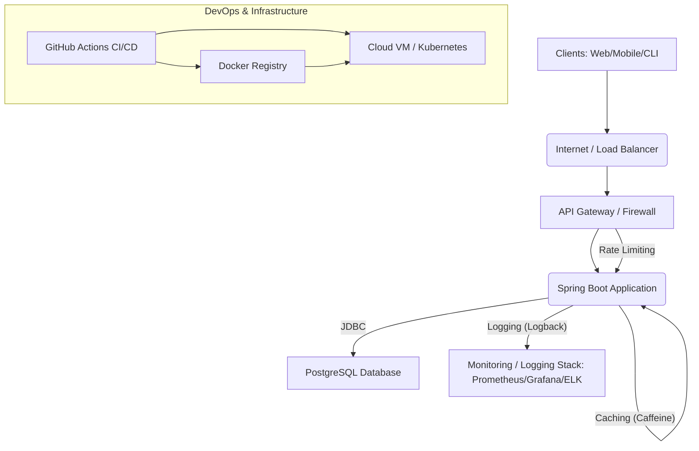

# Architecture Documentation: Task Management Platform

## 1. System Overview

The Task Management Platform is a multi-layered, API-driven application designed to be scalable, secure, and maintainable. It follows a traditional N-tier architecture pattern, specifically a backend service that exposes a RESTful API and interacts with a persistent data store.

## 2. High-Level Architecture Diagram

## 3. Component Breakdown

### 3.1. Clients
*   **Role:** Users interact with the platform through various client applications (e.g., web frontend, mobile app, command-line interface). These clients consume the RESTful API.
*   **Technology:** Not part of this repository, but typically built with frameworks like React, Angular, Vue.js, or native mobile technologies.

### 3.2. Load Balancer / API Gateway (Conceptual)
*   **Role:** Distributes incoming traffic across multiple instances of the Spring Boot application, provides SSL termination, and potentially implements API management features like rate limiting (though some basic rate limiting is also in the application).
*   **Technology:** Nginx, AWS ALB, GCP Load Balancer, Spring Cloud Gateway (if multiple microservices).

### 3.3. Spring Boot Application
*   **Role:** The core backend service. It handles business logic, authentication, authorization, data validation, and exposes RESTful API endpoints.
*   **Technology:** Java 17, Spring Boot 3.2.x, Spring Web, Spring Data JPA, Spring Security, Lombok, Springdoc-openapi.
*   **Internal Layers:**
    *   **Controllers:** Handle incoming HTTP requests, map them to appropriate service methods, and return HTTP responses. Responsible for API endpoint definition and input validation.
    *   **Services:** Contain the core business logic. They orchestrate data flow between controllers and repositories, apply business rules, and manage transactions.
    *   **Repositories:** Abstractions over the data persistence layer, providing CRUD (Create, Read, Update, Delete) operations using Spring Data JPA.
    *   **Models (Entities):** JPA entities representing the domain objects (User, Project, Task) and their relationships.
    *   **DTOs (Data Transfer Objects):** Used to transfer data between layers (e.g., between controller and service, or API request/response payloads), decoupling the API from internal data models.
    *   **Security:** Spring Security module for authentication (JWT) and authorization (role-based, method-level `@PreAuthorize`).
    *   **Error Handling:** Global `@ControllerAdvice` for consistent error responses across the API.
    *   **Caching:** Spring Cache with Caffeine for in-memory caching of frequently accessed data (e.g., user details, project lists) to reduce database load and improve response times.
    *   **Rate Limiting:** A custom `OncePerRequestFilter` to limit the number of requests per IP address over a time window, protecting against brute-force attacks and abuse.
    *   **Logging:** SLF4J with Logback for structured logging, configured to write to console and file.
    *   **Actuator:** Spring Boot Actuator endpoints for monitoring, health checks, and metrics collection.

### 3.4. PostgreSQL Database
*   **Role:** Relational database for persistent storage of application data (users, roles, projects, tasks).
*   **Technology:** PostgreSQL 15.
*   **Schema Management:** Flyway for version-controlled database migrations, ensuring schema evolution is managed systematically and reproducibly.

## 4. Data Flow

1.  A client sends an HTTP request (e.g., `GET /api/projects`) to the application.
2.  The request first passes through the `RateLimitingFilter` to check if the client has exceeded their request limit.
3.  Then, the `AuthTokenFilter` extracts the JWT token from the `Authorization` header, validates it, and sets the authenticated user in the Spring Security context.
4.  Spring Security's `FilterChain` checks if the user is authorized to access the requested endpoint (using method-level `@PreAuthorize` annotations).
5.  If authorized, the request is dispatched to the appropriate `Controller` method.
6.  The `Controller` validates input `DTOs` and calls the relevant `Service` method.
7.  The `Service` layer executes business logic. It might:
    *   Check the cache (e.g., `@Cacheable`) for data before hitting the database.
    *   Interact with `Repositories` to perform CRUD operations on `Entities`.
    *   Perform complex queries or data manipulations.
8.  `Repositories` interact with the `PostgreSQL` database via JDBC and Hibernate (JPA).
9.  Data retrieved from the database is mapped to `DTOs` by `MapperUtil` before being returned to the `Controller`.
10. The `Controller` wraps the `DTO` in an `ResponseEntity` and sends it back to the client.
11. If an error occurs at any layer, the `GlobalExceptionHandler` catches the exception and returns a consistent error `ErrorDetails` response.

## 5. DevOps & Infrastructure

### 5.1. Dockerization
*   **Role:** Package the Spring Boot application and its dependencies into a lightweight, portable container image. Also, containerize the PostgreSQL database.
*   **Technology:** `Dockerfile` for the application, `docker-compose.yml` for orchestrating the application and database containers in local development and potentially staging environments.
*   **Benefits:** Consistent environment across development, testing, and production; simplified deployment.

### 5.2. CI/CD with GitHub Actions
*   **Role:** Automate the build, test, and deployment process.
*   **Workflow:**
    *   **Continuous Integration (CI):** On every push/pull request to `main`, code is built, unit/integration/API tests are run, and code coverage is checked (`jacoco-maven-plugin`). Artifacts (test reports, coverage reports) are generated.
    *   **Continuous Delivery/Deployment (CD):** On successful merge/push to `main`:
        *   The Docker image is built and pushed to a Docker Registry (e.g., Docker Hub).
        *   The latest image is pulled and deployed to a target environment (e.g., an EC2 instance) using SSH and Docker Compose.
*   **Technology:** `.github/workflows/ci-cd.yml` utilizing various GitHub Actions.

### 5.3. Monitoring & Logging
*   **Role:** Observe system health, performance, and diagnose issues.
*   **Technology:**
    *   **Spring Boot Actuator:** Provides endpoints (`/health`, `/metrics`, `/info`, etc.) for real-time monitoring of the application's internal state.
    *   **Logback:** Configured for structured logging to console and file, enabling easier parsing and analysis by logging aggregation tools.
    *   **Conceptual Integration:** In a production setting, these logs and metrics would typically be fed into a centralized monitoring system like Prometheus for metrics collection and Grafana for visualization, or an ELK stack (Elasticsearch, Logstash, Kibana) for log aggregation and analysis.

## 6. Scalability and High Availability (Future Considerations)

*   **Load Balancing:** Deploying multiple instances of the Spring Boot application behind a load balancer.
*   **Database Clustering:** PostgreSQL replication (master-replica setup) for read scaling and high availability.
*   **External Caching:** Replacing Caffeine (in-memory) with a distributed cache like Redis or Memcached for cluster-wide caching and greater scale.
*   **Microservices:** As the system grows, consider breaking down the monolithic application into smaller, independently deployable microservices based on domain boundaries (e.g., User Service, Project Service, Task Service).
*   **Kubernetes:** Orchestrating Docker containers using Kubernetes for advanced deployment strategies, self-healing, and dynamic scaling.

## 7. Security Considerations

*   **JWT Security:** Strong secret key, appropriate expiration times, secure token storage on the client side.
*   **Password Hashing:** BCrypt used for strong password hashing.
*   **Input Validation:** Extensive use of `jakarta.validation` annotations to prevent common injection attacks and ensure data integrity.
*   **Role-Based Access Control (RBAC):** Granular permissions using Spring Security's `@PreAuthorize`.
*   **Rate Limiting:** Prevents brute-force login attempts and API abuse.
*   **HTTPS:** Essential for all production communication to encrypt data in transit. (Assumed at Load Balancer level).
*   **Dependency Scanning:** Regular scanning of `pom.xml` dependencies for known vulnerabilities.
*   **Least Privilege:** Application runs with minimal necessary database permissions.

This architecture provides a solid foundation for a robust and scalable Task Management Platform, keeping production readiness and ALX software engineering principles in mind.