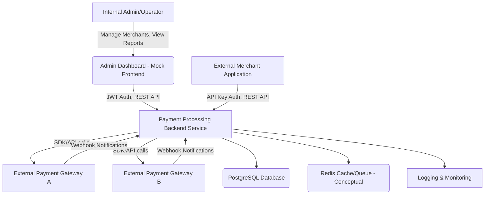

```markdown
# Payment Processing System Architecture

This document outlines the high-level architecture, core components, data flow, and design considerations for the Payment Processing System.

## 1. High-Level Overview

The Payment Processing System is designed as a service-oriented backend application, primarily exposing a RESTful API. It acts as an intermediary between merchants and various external payment gateways, managing the full lifecycle of payment transactions.



## 2. Core Components

### 2.1. Backend Service (Node.js/Express)

This is the heart of the system, responsible for handling all API requests, business logic, and interactions with other services.

*   **API Layer (Controllers/Routes):**
    *   **Auth Routes:** Handles internal user registration and login (JWT generation).
    *   **Merchant Routes:** CRUD operations for merchant accounts, API key generation (internal admin access).
    *   **Transaction Routes:** Merchant-facing endpoints for processing payments (authorize, capture, refund), requiring API key authentication.
    *   **Webhook Routes:** Endpoints to receive asynchronous event notifications from external payment gateways.
*   **Business Logic Layer (Services):**
    *   **Auth Service:** User authentication, token management.
    *   **User Service:** CRUD for internal users.
    *   **Merchant Service:** Merchant creation, API key management, validation.
    *   **Transaction Service:**
        *   Core payment orchestration: Initiates calls to external payment gateways, handles responses.
        *   Manages transaction state transitions (pending, authorized, captured, refunded, failed, disputed).
        *   Ensures data consistency using database transactions.
    *   **Idempotency Service:** Manages `IdempotencyKey` records to ensure that repeated identical requests are processed only once.
    *   **Webhook Service:** Dispatches outbound webhook notifications to merchants about transaction events.
*   **Data Access Layer (Models/ORM):**
    *   Sequelize ORM for interacting with PostgreSQL.
    *   Models for `User`, `Merchant`, `Transaction`, `Token`, `WebhookConfig`, `WebhookEvent`, `IdempotencyKey`.
    *   Includes plugins for pagination and JSON serialization (`toJSON`) to filter sensitive data.
*   **Middleware:**
    *   **Authentication Middleware:** JWT verification for internal users, API Key verification for merchants.
    *   **Authorization Middleware:** Role-based access control (RBAC) for internal users.
    *   **Validation Middleware:** Joi-based schema validation for incoming request payloads.
    *   **Error Handling Middleware:** Centralized error catching and standardized error responses.
    *   **Security Middleware:** `helmet`, `cors`, `xss-clean`, `hpp` for robust API security.
    *   **Rate Limiting Middleware:** Protects against abuse and DDoS attacks.
*   **Utilities:**
    *   **Logger:** Winston for structured logging.
    *   **ApiError:** Custom error class for consistent error messaging.
    *   **catchAsync:** Wrapper for async Express route handlers.
*   **Configuration:** Centralized `config` module for environment-dependent settings.

### 2.2. Database (PostgreSQL)

*   **Data Persistence:** Stores all core business data including users, merchants, transactions, tokens, webhook configurations, and idempotency keys.
*   **Schema:** Defined via Sequelize models and managed with migration scripts.
*   **Data Integrity:** Enforced through foreign keys, unique constraints, and validation.
*   **Performance:** Indexed columns for frequently queried fields (e.g., `merchantId`, `status`, `email`, `apiKey`).

### 2.3. External Payment Gateways

*   The system integrates with abstract "Payment Gateways" (simulated in this project).
*   Interaction involves outbound API calls (e.g., for `authorize`, `capture`) and inbound webhook notifications (e.g., for transaction status changes).

### 2.4. Frontend (Conceptual/Mock)

*   A simple static HTML/JS frontend (`public/`) is provided for demonstration purposes.
*   In a real-world scenario, this would be a full-fledged Single Page Application (SPA) dashboard for merchants and/or internal operators.

### 2.5. Caching Layer (Conceptual - Redis)

*   While not fully implemented, a Redis instance (`docker-compose.yml`) is included conceptually.
*   **Purpose:** Could be used for:
    *   Caching frequently accessed, non-critical data (e.g., merchant configurations).
    *   Storing rate limit counters.
    *   Implementing an asynchronous job queue.

### 2.6. Logging and Monitoring

*   **Winston:** Used for structured logging of application events, errors, and debugging information.
*   **Morgan:** Integrates with Express to log HTTP requests.
*   **Conceptual Monitoring:** In a production environment, logs would be aggregated (e.g., ELK stack, Splunk, cloud-native services), and metrics (Prometheus/Grafana) would be collected to monitor system health and performance.

## 3. Data Flow Example: Processing a New Transaction

1.  **Merchant Request:** An external merchant application sends a `POST /api/v1/transactions/process` request to the backend.
    *   Request includes `X-Api-Key` (for authentication) and `X-Idempotency-Key` (for idempotency).
    *   Request body contains `amount`, `currency`, `paymentMethodType`, `