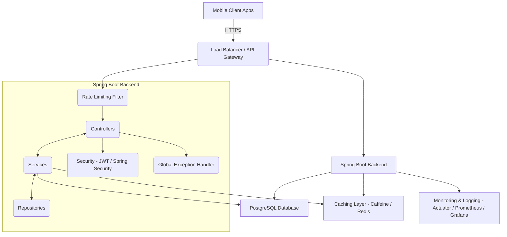

```markdown
# ALX Mobile Backend Architecture Documentation

## 1. Introduction

This document provides a high-level overview of the architecture of the ALX Mobile Backend System. It outlines the key components, their responsibilities, and how they interact to form a comprehensive and robust mobile application backend.

## 2. Goals and Principles

The architecture is designed with the following goals and principles in mind:

*   **Scalability:** Components are designed to be horizontally scalable to handle increasing load.
*   **Reliability:** Redundancy, fault tolerance, and robust error handling are integrated.
*   **Security:** Authentication, authorization, and data protection are core concerns.
*   **Maintainability:** Clear separation of concerns, modular design, and adherence to established patterns.
*   **Performance:** Optimization for low latency and high throughput.
*   **Observability:** Comprehensive logging, monitoring, and tracing capabilities.
*   **Extensibility:** Easy to add new features or modules without significant refactoring.

## 3. High-Level Architecture Diagram


```mermaid
graph TD
    A[Mobile Client Apps] -- HTTPS --> B(Load Balancer / API Gateway)
    B --> C[Spring Boot Backend]
    C --> D[PostgreSQL Database]
    C --> E[Caching Layer - Caffeine / Redis]
    C --> F[Monitoring & Logging - Actuator / Prometheus / Grafana]

    subgraph Spring Boot Backend
        C1(Controllers)
        C2(Services)
        C3(Repositories)
        C4(Security - JWT / Spring Security)
        C5(Rate Limiting Filter)
        C6(Global Exception Handler)
    end

    C1 <--> C2
    C2 <--> C3
    C2 --> E
    C2 --> D
    C1 --> C4
    B --> C5 --> C1
    C1 --> C6
```

## 4. Component Breakdown

### 4.1. Mobile Client Applications

*   **Responsibility:** The consumer of the backend API. Handles UI, user interaction, and data presentation.
*   **Interaction:** Communicates with the backend via RESTful HTTP/HTTPS requests. Authenticates using JWT tokens obtained from the backend.

### 4.2. Load Balancer / API Gateway

*   **Responsibility:** Distributes incoming client requests across multiple backend instances, provides SSL/TLS termination, request routing, and potentially API versioning or basic rate limiting.
*   **Examples:** Nginx, AWS ALB, Google Cloud Load Balancer, Azure Application Gateway, Spring Cloud Gateway.

### 4.3. Spring Boot Backend Application

This is the core of the system, implementing the business logic and providing APIs.

#### 4.3.1. Controllers (Presentation Layer)

*   **Technology:** Spring Web MVC (`@RestController`).
*   **Responsibility:**
    *   Define API endpoints (e.g., `/api/v1/users`, `/api/v1/products`).
    *   Receive HTTP requests.
    *   Perform input validation (using JSR-303 annotations like `@Valid`).
    *   Marshal/unmarshal JSON data (using Jackson).
    *   Delegate business logic to the `Service` layer.
    *   Return HTTP responses.

#### 4.3.2. Services (Business Logic Layer)

*   **Technology:** Spring `@Service` components.
*   **Responsibility:**
    *   Encapsulate the core business rules and workflows.
    *   Orchestrate interactions between different repositories.
    *   Apply transactional boundaries (`@Transactional`).
    *   Implement caching logic (`@Cacheable`, `@CachePut`, `@CacheEvict`).
    *   Perform complex data processing.
    *   Handle cross-cutting concerns (e.g., invoking external services, sending notifications).

#### 4.3.3. Repositories (Data Access Layer)

*   **Technology:** Spring Data JPA (`JpaRepository`).
*   **Responsibility:**
    *   Provide an abstraction over the database.
    *   Perform CRUD (Create, Read, Update, Delete) operations on entities.
    *   Execute custom queries.
    *   Map Java objects to database tables and vice-versa (ORM - Hibernate).

#### 4.3.4. Models (Domain Layer)

*   **Technology:** JPA Entities (e.g., `@Entity`, `@Table`).
*   **Responsibility:**
    *   Represent the core business objects and their relationships (e.g., `User`, `Product`, `Order`, `OrderItem`).
    *   Define the database schema through annotations.

#### 4.3.5. DTOs (Data Transfer Objects)

*   **Responsibility:**
    *   Define the contract for data exchange between the client and the server.
    *   Prevent exposing internal domain models directly to the API.
    *   Can be tailored for specific request or response scenarios.

#### 4.3.6. Security Module

*   **Technology:** Spring Security, JSON Web Tokens (JWT).
*   **Responsibility:**
    *   **Authentication:** Verify user identity (username/password login) and issue JWTs.
    *   **Authorization:** Control access to API endpoints based on roles (`ROLE_USER`, `ROLE_ADMIN`) and resource ownership (`@PreAuthorize`).
    *   **JWT Management:** Generate, validate, and parse JWT tokens.

#### 4.3.7. Rate Limiting Filter

*   **Technology:** Spring `OncePerRequestFilter`, Google Guava `RateLimiter`.
*   **Responsibility:**
    *   Protects API endpoints from excessive requests from a single source (IP address or authenticated user).
    *   Prevents abuse, DDoS attacks, and ensures fair resource utilization.

#### 4.3.8. Global Exception Handler

*   **Technology:** Spring `@ControllerAdvice`, `@ExceptionHandler`.
*   **Responsibility:**
    *   Provides a centralized mechanism to handle exceptions thrown anywhere in the application.
    *   Maps exceptions to consistent HTTP status codes and error response formats (e.g., JSON with `message` and `errors` fields).

### 4.4. PostgreSQL Database

*   **Technology:** PostgreSQL relational database.
*   **Responsibility:**
    *   Persistent storage for all application data (users, products, orders, etc.).
    *   Ensures data integrity and ACID properties.
*   **Migration:** Flyway is used for managing database schema evolution and applying seed data.

### 4.5. Caching Layer

*   **Technology:** Spring Cache abstraction with Caffeine (in-memory) or Redis (distributed).
*   **Responsibility:**
    *   Stores frequently accessed data in memory to reduce database load and improve response times.
    *   Implemented via annotations (`@Cacheable`, `@CachePut`, `@CacheEvict`) in the Service layer.

### 4.6. Monitoring & Logging

*   **Technology:** SLF4J/Logback, Spring Boot Actuator, Prometheus, Grafana.
*   **Responsibility:**
    *   **Logging:** Record application events, errors, and debugging information. Configured for structured logging.
    *   **Monitoring:** Collect metrics (CPU usage, memory, request rates, error rates, custom business metrics) and expose them via Actuator endpoints.
    *   **Alerting:** Notify administrators of critical issues (e.g., high error rates, low disk space).

## 5. Deployment Considerations

*   **Containerization:** The application is packaged as a Docker image for consistent deployment across environments.
*   **Orchestration:** Kubernetes or AWS ECS/Fargate can be used to manage container deployments, scaling, and self-healing.
*   **CI/CD:** GitHub Actions automates the build, test, and deployment process.
*   **Scalability:** The stateless nature of the backend (session management via JWT) allows for easy horizontal scaling of application instances. The database can be scaled vertically or horizontally (read replicas, sharding) as needed.
*   **Security:** Use of environment variables for sensitive configurations, HTTPS, and robust access controls for the database.

## 6. Future Enhancements

*   **Asynchronous Processing:** Integrate a message queue (e.g., Kafka, RabbitMQ) for background tasks (e.g., email notifications, complex report generation).
*   **API Gateway:** Implement a dedicated API Gateway (e.g., Spring Cloud Gateway, Kong, Apigee) for advanced routing, security, and traffic management.
*   **Distributed Caching:** Replace Caffeine with a distributed cache like Redis for multi-instance deployments.
*   **Observability:** Implement distributed tracing (e.g., Jaeger, Zipkin) for complex microservices architectures.
*   **External Services:** Integration with payment gateways, notification services (SMS/Email), image storage (AWS S3).

This architectural overview provides a foundation for understanding the backend system. Each component is designed to be robust and work together seamlessly to deliver a high-performance and secure mobile experience.
```