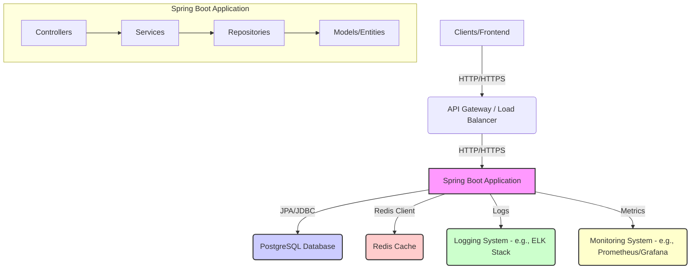

```markdown
# ALX E-commerce System - Architecture Documentation

## Table of Contents

1.  [Overview](#1-overview)
2.  [Architectural Style](#2-architectural-style)
3.  [Core Components and Layers](#3-core-components-and-layers)
    *   [Presentation Layer (API Gateway / Frontend)](#31-presentation-layer-api-gateway--frontend)
    *   [Application Layer (Controllers)](#32-application-layer-controllers)
    *   [Domain/Business Logic Layer (Services)](#33-domainbusiness-logic-layer-services)
    *   [Data Access Layer (Repositories)](#34-data-access-layer-repositories)
    *   [Database Layer](#35-database-layer)
4.  [Data Flow and Interactions](#4-data-flow-and-interactions)
5.  [Key Design Decisions](#5-key-design-decisions)
    *   [Technology Choices](#51-technology-choices)
    *   [Authentication & Authorization (JWT)](#52-authentication--authorization-jwt)
    *   [Caching (Redis)](#53-caching-redis)
    *   [Database Migrations (Flyway)](#54-database-migrations-flyway)
    *   [Error Handling](#55-error-handling)
    *   [Rate Limiting](#56-rate-limiting)
    *   [Logging & Monitoring](#57-logging--monitoring)
6.  [Scalability and Performance Considerations](#6-scalability-and-performance-considerations)
7.  [Security Considerations](#7-security-considerations)
8.  [Future Enhancements](#8-future-enhancements)

---

## 1. Overview

The ALX E-commerce System is a robust, scalable, and secure backend solution for an online store. It's built with modern Java (Spring Boot) technologies, designed to handle typical e-commerce workflows from user authentication to order processing. The architecture emphasizes modularity, clean separation of concerns, and ease of deployment.

## 2. Architectural Style

The system primarily adopts a **Layered Architecture** (also known as N-tier architecture) with elements of **Domain-Driven Design (DDD)** in its service and model layers.

*   **Monolithic (Modular) Application:** For simplicity and ease of initial development/deployment, it's structured as a single Spring Boot application. However, within this monolith, modules are logically separated (e.g., `controller`, `service`, `repository`, `model`) to prepare for potential future microservices decomposition.
*   **RESTful API:** All external communication is via a RESTful API, adhering to principles like statelessness, resource-based URLs, and standard HTTP methods.

### High-Level Diagram


```mermaid
graph TD
    A[Clients/Frontend] -->|HTTP/HTTPS| B(API Gateway / Load Balancer)
    B -->|HTTP/HTTPS| C[Spring Boot Application]
    C -->|JPA/JDBC| D(PostgreSQL Database)
    C -->|Redis Client| E(Redis Cache)
    C -->|Logs| F(Logging System - e.g., ELK Stack)
    C -->|Metrics| G(Monitoring System - e.g., Prometheus/Grafana)

    subgraph Spring Boot Application
        C1[Controllers] --> C2[Services]
        C2 --> C3[Repositories]
        C3 --> C4[Models/Entities]
    end

    style C fill:#f9f,stroke:#333,stroke-width:2px
    style D fill:#ccf,stroke:#333,stroke-width:2px
    style E fill:#fcc,stroke:#333,stroke-width:2px
    style F fill:#cfc,stroke:#333,stroke-width:2px
    style G fill:#ffc,stroke:#333,stroke-width:2px
```

## 3. Core Components and Layers

### 3.1. Presentation Layer (API Gateway / Frontend)

*   **Role:** Exposes the REST API to clients (web browsers, mobile apps). In a production setup, an API Gateway (e.g., Nginx, Spring Cloud Gateway, AWS API Gateway) would sit in front of the Spring Boot application for routing, load balancing, SSL termination, and possibly initial authentication/rate limiting.
*   **Implementation:** Not directly implemented in this backend project, but assumed to exist. The backend's `/api/v1` prefix is intended to be behind such a gateway.
*   **Frontend:** A separate application (e.g., React, Angular, Vue.js) would consume this API.

### 3.2. Application Layer (Controllers)

*   **Location:** `com.alx.ecommerce.controller` package.
*   **Role:**
    *   Receives incoming HTTP requests.
    *   Performs input validation (using `@Valid` and JSR-303 annotations).
    *   Delegates business logic execution to the Service layer.
    *   Constructs HTTP responses.
    *   Handles authentication and authorization at the endpoint level (`@PreAuthorize`).
*   **Technologies:** Spring Web (RestController), OpenAPI annotations, Jakarta Validation.
*   **Key Design:** Keeps controllers thin, focusing on request/response handling and delegating complex logic.

### 3.3. Domain/Business Logic Layer (Services)

*   **Location:** `com.alx.ecommerce.service` package.
*   **Role:**
    *   Contains the core business rules and logic.
    *   Coordinates multiple repository calls to fulfill complex transactions.
    *   Applies transaction management (`@Transactional`).
    *   Manages caching operations (`@Cacheable`, `@CacheEvict`).
    *   Performs data transformations between DTOs and Entities (using MapStruct mappers).
    *   Handles domain-specific exceptions.
*   **Technologies:** Spring `@Service`, `@Transactional`, Spring Cache, MapStruct.
*   **Key Design:** This is the heart of the application, ensuring data consistency and implementing business flows.

### 3.4. Data Access Layer (Repositories)

*   **Location:** `com.alx.ecommerce.repository` package.
*   **Role:**
    *   Provides an abstraction over the persistence store.
    *   Handles CRUD operations for entities.
    *   Defines custom query methods (Spring Data JPA).
*   **Technologies:** Spring Data JPA, Hibernate.
*   **Key Design:** Follows the Repository pattern, insulating the business logic from persistence technology details.

### 3.5. Database Layer

*   **Technology:** PostgreSQL (Relational Database).
*   **Role:** Stores all persistent data for the e-commerce system (users, products, orders, etc.).
*   **Schema:** Defined in Flyway migration scripts (`db/migration`). Utilizes UUIDs for primary keys where appropriate and `BIGSERIAL` for others for scalability and collision avoidance. Includes `created_at` and `updated_at` timestamps for auditing.
*   **Migration:** Flyway is used for version control of database schema, ensuring smooth updates across environments.
*   **Query Optimization:** Includes basic indexing (e.g., `idx_products_category_id`, `idx_users_email`) in migration scripts. Further optimization would involve analyzing query plans in production.

## 4. Data Flow and Interactions

1.  **Client Request:** A client (e.g., web frontend) sends an HTTP request to the API Gateway.
2.  **API Gateway:** Routes the request to the Spring Boot application (e.g., to `/api/v1/products`).
3.  **Rate Limiting Filter:** `RateLimitFilter` checks if the client's IP has exceeded the allowed request rate. If so, it returns `429 Too Many Requests`.
4.  **JWT Authentication Filter:** `JwtAuthFilter` extracts the JWT token from the `Authorization` header, validates it, and sets the `SecurityContext` with the authenticated user's details.
5.  **Spring Security:** Checks if the authenticated user has the necessary roles/permissions (`@PreAuthorize`) to access the requested endpoint.
6.  **Controller:** Receives the request, validates input DTOs, and calls the appropriate service method.
7.  **Service:**
    *   May check the Redis cache first (`@Cacheable`).
    *   Performs business logic (e.g., validate product availability, calculate order total).
    *   Interacts with one or more repositories to fetch or persist data.
    *   If data is modified, it might evict relevant cache entries (`@CacheEvict`).
    *   Uses MapStruct mappers to convert JPA entities to DTOs for the response.
8.  **Repository:** Executes database operations (e.g., `productRepository.findById()`, `orderRepository.save()`).
9.  **Database:** Processes SQL queries, stores/retrieves data.
10. **Response:** The service returns a DTO to the controller, which then constructs an HTTP response back to the client.

## 5. Key Design Decisions

### 5.1. Technology Choices

*   **Spring Boot:** Chosen for its rapid development, convention-over-configuration, and robust ecosystem for building enterprise-grade applications.
*   **Java 17:** Current LTS version, offering modern language features and performance improvements.
*   **PostgreSQL:** A powerful, open-source, and highly reliable relational database, suitable for complex transactional workloads.
*   **Redis:** Excellent choice for a fast, in-memory data store for caching, session management, and rate limiting.
*   **Lombok:** Reduces boilerplate code (getters, setters, constructors, builders), improving code readability and maintainability.
*   **MapStruct:** Compile-time safe and efficient object mapping, reducing manual mapping errors and improving performance compared to reflection-based mappers.

### 5.2. Authentication & Authorization (JWT)

*   **Stateless Authentication:** JWT (JSON Web Tokens) are used for stateless authentication. This is crucial for scalability, as the server does not need to store session information. Each request contains the necessary authentication credentials.
*   **Spring Security:** Provides comprehensive security features, integrating JWT validation and role-based access control seamlessly. `JwtAuthFilter` intercepts requests to validate tokens.
*   **`@PreAuthorize`:** Used at the service and controller levels to enforce fine-grained authorization rules based on user roles (e.g., only `ADMIN` can create products).

### 5.3. Caching (Redis)

*   **Spring Cache Abstraction:** Used with Redis as the caching provider.
*   **`@Cacheable`:** Improves read performance by storing method results in Redis, avoiding repeated database calls for frequently accessed, immutable, or slowly changing data (e.g., product details, category lists).
*   **`@CacheEvict`:** Ensures data consistency by removing stale cache entries when underlying data is modified (e.g., after product update/delete).
*   **Configuration:** Configured with specific TTL (Time-To-Live) and JSON serialization for values.

### 5.4. Database Migrations (Flyway)

*   **Version Control for Database Schema:** Flyway manages database schema evolution. Each change to the database is recorded in a versioned SQL script.
*   **Automated Updates:** Migrations run automatically on application startup, ensuring the database schema matches the application code across all environments.
*   **Baseline:** `baseline-on-migrate` is enabled for easy initial setup, but should be used with caution in production.

### 5.5. Error Handling

*   **Global Exception Handler:** `@ControllerAdvice` (`GlobalExceptionHandler`) provides a centralized mechanism to handle exceptions across all controllers.
*   **Meaningful Responses:** Catches common exceptions (e.g., `ResourceNotFoundException`, `MethodArgumentNotValidException`, `DataIntegrityViolationException`, `AccessDeniedException`, JWT-related exceptions) and returns consistent, descriptive error responses with appropriate HTTP status codes.
*   **Logging:** Errors are logged with relevant details, including stack traces for critical errors.

### 5.6. Rate Limiting

*   **Purpose:** Protects the API from abuse, brute-force attacks, and ensures fair usage by limiting the number of requests a client (identified by IP address) can make within a specified time window.
*   **Implementation:** A custom `OncePerRequestFilter` (`RateLimitFilter`) uses the Bucket4j library, which is a token-bucket algorithm implementation, backed by a `ConcurrentHashMap` for storing client buckets. In a distributed environment, this would be backed by Redis or another distributed cache.
*   **Configuration:** Configurable window and max requests in `application.yml`.

### 5.7. Logging & Monitoring

*   **Structured Logging:** SLF4J and Logback are used for flexible and structured logging. `logback-spring.xml` defines console and rolling file appenders. Log levels are configurable per package.
*   **Spring Boot Actuator:** Provides production-ready features like `/health` (application health), `/info` (custom application info), and `/prometheus` (metrics in Prometheus format).
*   **Monitoring Integration (Conceptual):** The exposed Prometheus endpoint allows integration with Prometheus for scraping metrics and Grafana for visualization, providing insights into application performance and health.

## 6. Scalability and Performance Considerations

*   **Statelessness:** JWT-based authentication means the application can be scaled horizontally by simply adding more instances without session affinity issues.
*   **Caching:** Redis caching reduces database load for read-heavy operations.
*   **Database Scaling:** PostgreSQL supports various scaling strategies (read replicas, sharding) for future growth.
*   **Load Balancing:** Deployment behind a load balancer (e.g., Nginx, cloud load balancers) is assumed to distribute traffic across multiple application instances.
*   **Asynchronous Processing:** For very heavy tasks (e.g., large data imports, complex reporting), offloading to message queues (e.g., Kafka, RabbitMQ) and separate worker services could be introduced. (Not implemented, but a future consideration).
*   **Connection Pooling:** HikariCP (default in Spring Boot) is used for efficient database connection management.

## 7. Security Considerations

*   **Input Validation:** Extensive use of `@Valid` and JSR-303 annotations on DTOs to prevent injection attacks and ensure data integrity.
*   **Password Hashing:** BCrypt is used for strong, one-way password hashing.
*   **HTTPS:** Assumed to be enforced at the API Gateway/Load Balancer layer.
*   **JWT Security:** Tokens are signed to prevent tampering. Expiration is enforced. Secret key is managed via environment variables.
*   **SQL Injection Prevention:** Spring Data JPA's parameterized queries inherently prevent SQL injection.
*   **Access Control:** Robust RBAC with `ADMIN` and `CUSTOMER` roles, enforced at both API gateway (if applicable) and application levels (`@PreAuthorize`).
*   **Dependency Security:** Regular dependency updates (managed by Maven) help mitigate known vulnerabilities.
*   **Environment Variables:** Sensitive information (database credentials, JWT secret) is externalized into environment variables.

## 8. Future Enhancements

*   **Frontend Application:** Develop a UI using React, Angular, or Vue.js to consume the backend API.
*   **Shopping Cart Logic:** Implement a persistent shopping cart, potentially leveraging Redis for temporary storage and PostgreSQL for user-saved carts.
*   **Payment Gateway Integration:** Integrate with external payment providers (e.g., Stripe, PayPal).
*   **Search Engine:** Implement a dedicated search engine (e.g., Elasticsearch) for advanced product search and filtering.
*   **Image Management:** Integrate with cloud storage solutions (e.g., AWS S3) for product images.
*   **Email Notifications:** Implement email services for order confirmations, password resets, etc.
*   **Distributed Tracing:** Integrate with OpenTelemetry or Zipkin for better observability in distributed systems.
*   **Advanced Analytics:** Collect and analyze user behavior data.
*   **Container Orchestration:** Deploy to Kubernetes for advanced scalability, self-healing, and management.
*   **GraphQL API:** Consider a GraphQL layer for more flexible data fetching by clients.
```