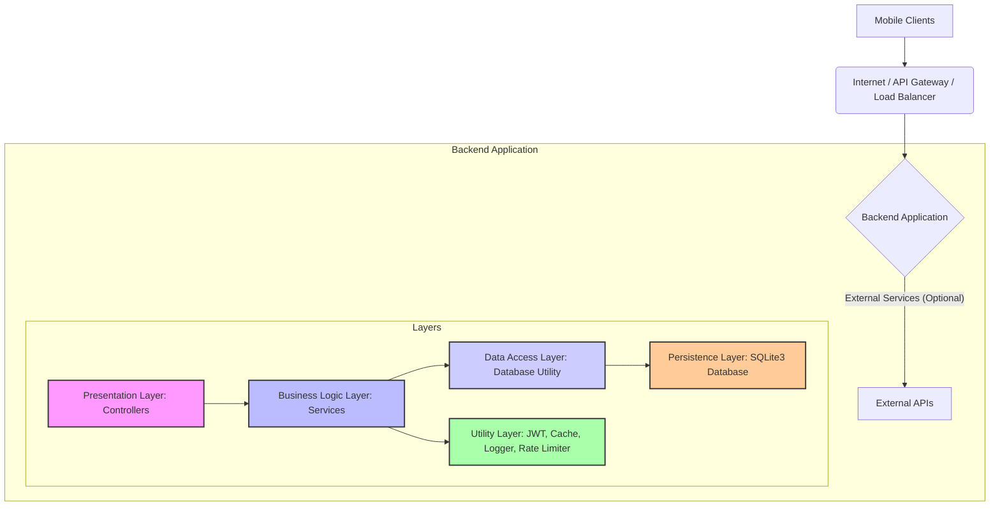

```markdown
# Mobile Backend System Architecture

This document provides an overview of the architecture of the C++ mobile backend application.

## 1. High-Level Design

The backend system is designed using a **Layered Architecture** pattern, which promotes separation of concerns, modularity, and maintainability. It consists of distinct layers, each with specific responsibilities, interacting in a controlled manner.


```mermaid
graph TD
    A[Mobile Clients] --> B(Internet / API Gateway / Load Balancer)
    B --> C{Backend Application}

    subgraph Backend Application
        subgraph Layers
            C1[Presentation Layer: Controllers] --> C2[Business Logic Layer: Services]
            C2 --> C3[Data Access Layer: Database Utility]
            C2 --> C4[Utility Layer: JWT, Cache, Logger, Rate Limiter]
            C3 --> D[Persistence Layer: SQLite3 Database]
        end
        C -- External Services (Optional) --> E[External APIs]
    end

    style C1 fill:#f9f,stroke:#333,stroke-width:2px
    style C2 fill:#bbf,stroke:#333,stroke-width:2px
    style C3 fill:#ccf,stroke:#333,stroke-width:2px
    style C4 fill:#afa,stroke:#333,stroke-width:2px
    style D fill:#fc9,stroke:#333,stroke-width:2px
```

## 2. Detailed Layer Breakdown

### 2.1. Presentation Layer (Controllers)

*   **Technology**: [Crow](https://github.com/ipkn/crow) microframework.
*   **Location**: `src/controllers/`
*   **Responsibilities**:
    *   Receives HTTP requests from clients.
    *   Parses incoming request bodies (JSON) and URL parameters.
    *   Validates basic request structure and data types.
    *   Delegates complex business logic to the **Services Layer**.
    *   Constructs HTTP responses (status codes, JSON payloads).
    *   Manages middleware integration (Authentication, Error Handling, Rate Limiting).
    *   Catches `AppException` from services and converts them into structured JSON error responses.
*   **Components**: `AuthController`, `UserController`, `TaskController`. Each controller groups related API endpoints.

### 2.2. Business Logic Layer (Services)

*   **Location**: `src/services/`
*   **Responsibilities**:
    *   Implements the core business rules and workflows.
    *   Acts as an orchestrator, calling methods from the **Data Access Layer** and **Utility Layer**.
    *   Performs domain-specific validation (e.g., password strength, uniqueness of username/email).
    *   Handles data transformation between models and database structures.
    *   Manages transactions (though simplified with SQLite).
    *   Throws custom exceptions (`AuthException`, `UserServiceException`, `TaskServiceException`) for business rule violations.
*   **Components**: `AuthService`, `UserService`, `TaskService`.

### 2.3. Data Access Layer (Database Utility)

*   **Technology**: Native `sqlite3` C API.
*   **Location**: `src/utils/database.h`, `src/utils/database.cpp`
*   **Responsibilities**:
    *   Provides an abstraction layer over the raw database operations.
    *   Manages database connection and lifecycle (singleton pattern).
    *   Initializes database schema (creates tables if they don't exist).
    *   Executes SQL queries (prepared statements for security and performance).
    *   Maps raw database results (`DbRow`) to business-specific models where appropriate.
    *   Ensures thread-safe access to SQLite using a mutex.
*   **Schema**:
    *   `users`: `id`, `username` (unique), `email` (unique), `password_hash`, `created_at`.
    *   `tasks`: `id`, `user_id` (foreign key to `users`), `title`, `description`, `completed`, `created_at`, `updated_at`.
        *   `ON DELETE CASCADE` is set for `user_id` in `tasks` to automatically delete tasks when a user is deleted.

### 2.4. Utility Layer

*   **Location**: `src/utils/`
*   **Responsibilities**: Provides cross-cutting functionalities that support various layers.
*   **Components**:
    *   **Logger (`Logger`)**: Centralized logging using `spdlog`. Configured for console and rotating file output.
    *   **JWT Manager (`JwtManager`)**: Handles creation, signing, and verification of JWT tokens using `jwt-cpp`.
    *   **Auth Middleware (`AuthMiddleware`)**: A Crow middleware that intercepts requests, validates JWT tokens, and injects the `user_id` into the request context for subsequent handlers.
    *   **Error Middleware (`ErrorMiddleware`)**: Crow middleware and custom exception classes (`AppException`, `BadRequestException`, etc.) to provide structured and consistent error responses across the API.
    *   **Cache (`Cache`)**: A generic in-memory, thread-safe key-value store with Time-To-Live (TTL) functionality. Used by services to cache frequently accessed data (e.g., user profiles, specific tasks).
    *   **Rate Limiter (`RateLimiter`)**: An IP-based, in-memory rate limiting mechanism to protect endpoints from abuse, allowing a configurable number of requests within a time window.

### 2.5. Persistence Layer

*   **Technology**: **SQLite3**.
*   **Location**: The `.db` file (e.g., `data/mobile_backend.db`).
*   **Characteristics**:
    *   File-based, embedded database, simplifying deployment for smaller scale backends.
    *   Transactional, providing ACID properties.
    *   Though single-writer, the `WAL` (Write-Ahead Logging) journal mode is enabled for better read concurrency.
    *   Foreign key constraints are enforced (`PRAGMA foreign_keys = ON;`).

## 3. Data Models

*   **Location**: `src/models/`
*   **Responsibilities**: Define the structure of data objects used throughout the application.
*   **Components**:
    *   `User`: Represents a user with `id`, `username`, `email`, `password_hash`, `created_at`.
    *   `Task`: Represents a task with `id`, `user_id`, `title`, `description`, `completed`, `created_at`, `updated_at`.

## 4. Dependencies

*   **Crow**: C++ Web Framework
*   **SQLite3**: Embedded Database
*   **spdlog**: Logging Library
*   **nlohmann/json**: JSON Library (often bundled/used by Crow)
*   **jwt-cpp**: JWT implementation
*   **Crypto++**: For stronger password hashing (demonstrated with SHA256, but production would use KDFs like Argon2/bcrypt)
*   **Google Test**: Testing Framework

## 5. Build System (CMake)

*   **Location**: `CMakeLists.txt`
*   **Responsibilities**:
    *   Manages project compilation.
    *   Defines source files, header paths, and link libraries.
    *   Configures build types (Debug/Release).
    *   Integrates Google Test for automated testing.
    *   Handles external library paths.

## 6. Development & Deployment Environment

*   **Environment Variables**: Configuration values (ports, database paths, secrets, etc.) are loaded from environment variables (e.g., via `.env` file for local development, or Docker environment variables for deployment).
*   **Docker**: Provides a consistent, containerized environment for building and running the application, abstracting away host-specific setup complexities.
*   **CI/CD (GitHub Actions)**: Automates building, testing, and Docker image publishing, ensuring code quality and rapid deployment.

This architecture provides a solid foundation for a scalable and maintainable mobile backend system, adhering to best practices in software engineering.
```