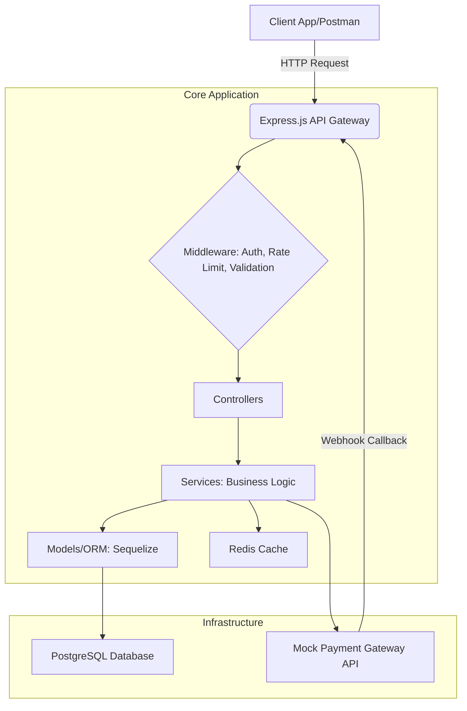

```markdown
# Comprehensive Payment Processing System (Enterprise-Grade)

This project provides a full-scale, production-ready payment processing system built with Node.js (Express), PostgreSQL, and Redis. It's designed for scalability, security, and maintainability, incorporating best practices for modern web development and financial applications.

## Table of Contents

1.  [Features](#features)
2.  [Architecture Overview](#architecture-overview)
3.  [Technology Stack](#technology-stack)
4.  [Setup and Installation](#setup-and-installation)
    *   [Prerequisites](#prerequisites)
    *   [Local Setup (without Docker)](#local-setup-without-docker)
    *   [Local Setup (with Docker)](#local-setup-with-docker)
    *   [Database Initialization](#database-initialization)
5.  [Running the Application](#running-the-application)
6.  [API Endpoints](#api-endpoints)
7.  [Testing](#testing)
    *   [Unit Tests](#unit-tests)
    *   [Integration Tests](#integration-tests)
    *   [API Tests](#api-tests)
    *   [Performance Tests](#performance-tests)
8.  [CI/CD](#ci-cd)
9.  [Deployment](#deployment)
10. [Future Enhancements](#future-enhancements)
11. [License](#license)

---

## 1. Features

*   **User Management**: Registration, login, user profiles, role-based access control (User, Admin).
*   **Account Management**: Create, view, update, delete (with balance check) financial accounts. Deposit and withdraw funds.
*   **Transaction Processing**:
    *   Initiate payments between accounts.
    *   Real-time balance updates (atomically).
    *   Simulated external payment gateway integration.
    *   Webhook handling for payment status updates (success/failure).
    *   Idempotency for transaction processing.
    *   Transaction history.
*   **Security**: JWT authentication, password hashing (bcrypt), input validation (Joi), Helmet for HTTP headers, CORS, XSS protection, HTTP Parameter Pollution prevention.
*   **Logging & Monitoring**: Structured logging with Winston.
*   **Error Handling**: Centralized API error handling with custom `ApiError` class.
*   **Caching**: Redis integration (e.g., for sessions, rate limiting).
*   **Rate Limiting**: Prevent abuse on authentication endpoints.
*   **Containerization**: Docker and Docker Compose for easy setup and deployment.
*   **Database**: PostgreSQL with Sequelize ORM, migrations, and seeders.
*   **Testing**: Comprehensive suite including unit, integration, and API tests.
*   **Documentation**: Detailed setup, API, and architecture documentation.
*   **CI/CD**: GitHub Actions workflow for automated testing and deployment.

## 2. Architecture Overview

The system follows a layered, modular architecture:

*   **Client Layer (Implicit/Placeholder)**: A simple static `index.html` is provided. In a full-scale project, this would be a separate Single Page Application (SPA) built with React, Vue, or Angular.
*   **API Gateway (Express.js)**: Handles incoming HTTP requests, routing, authentication, rate limiting, and basic validation.
*   **Controllers**: Receive requests from routes, orchestrate business logic by calling services, and send back responses.
*   **Services**: Encapsulate business logic, interact with the database (via models), and communicate with external services (e.g., payment gateways). This is where core transaction processing, balance updates, and fraud checks reside.
*   **Models (Sequelize)**: Define the structure of the database tables and provide an interface for database operations.
*   **Middleware**: Handles cross-cutting concerns like authentication, error handling, logging, and request validation before/after reaching controllers.
*   **Utilities**: Helper functions, constants, custom error classes, and logging configurations.
*   **Database (PostgreSQL)**: The primary data store for all application data.
*   **Cache (Redis)**: Used for high-speed data access, such as storing session tokens, rate limit counters, or frequently accessed data.
*   **External Payment Gateway (Mocked)**: Simulates interaction with third-party payment providers for processing actual funds.



## 3. Technology Stack

*   **Backend**: Node.js, Express.js
*   **Database**: PostgreSQL
*   **ORM**: Sequelize
*   **Caching/Messaging**: Redis
*   **Authentication**: JWT (JSON Web Tokens), Bcrypt (password hashing)
*   **Validation**: Joi
*   **Logging**: Winston
*   **Testing**: Jest, Supertest
*   **Containerization**: Docker, Docker Compose
*   **CI/CD**: GitHub Actions

## 4. Setup and Installation

### Prerequisites

*   Node.js (v20 or higher)
*   npm (v10 or higher)
*   PostgreSQL (if not using Docker)
*   Redis (if not using Docker)
*   Docker and Docker Compose (recommended)

### Local Setup (without Docker)

1.  **Clone the repository:**
    ```bash
    git clone https://github.com/your-username/payment-processing-system.git
    cd payment-processing-system
    ```

2.  **Install dependencies:**
    ```bash
    npm install
    ```

3.  **Create `.env` file:**
    Copy `.env.example` to `.env` and fill in your database, JWT, and Redis credentials.
    ```bash
    cp .env.example .env
    ```
    Make sure your PostgreSQL and Redis servers are running locally and accessible.

4.  **Configure `config/config.js` and `config/database.js`**
    Ensure these files correctly point to your local PostgreSQL and Redis instances. The `config/config.js` reads from `.env`.

### Local Setup (with Docker - Recommended)

This is the easiest way to get the entire environment running.

1.  **Clone the repository:**
    ```bash
    git clone https://github.com/your-username/payment-processing-system.git
    cd payment-processing-system
    ```

2.  **Create `.env` file:**
    Copy `.env.example` to `.env`. The `docker-compose.yml` will pick up these environment variables. You can leave `DB_HOST` as `db` and `REDIS_HOST` as `redis` as these are the service names within the Docker network.
    ```bash
    cp .env.example .env
    # You might want to set NODE_ENV=development in .env for development
    ```

3.  **Build and run containers:**
    ```bash
    docker-compose up --build -d
    ```
    This command will:
    *   Build the Node.js application Docker image.
    *   Start PostgreSQL and Redis containers.
    *   Wait for PostgreSQL and Redis to be healthy.
    *   Run database migrations and seeders (as configured in `docker-compose.yml` for development).
    *   Start the Node.js application container.

    You can check the logs with `docker-compose logs -f`.

### Database Initialization

If running without Docker, or if you need to manually run migrations/seeders:

1.  **Run migrations:**
    ```bash
    npm run migrate
    ```

2.  **Seed initial data:**
    ```bash
    npm run seed
    ```

3.  **Convenience script for full DB setup (migrate + seed):**
    ```bash
    npm run db:setup
    ```

## 5. Running the Application

*   **Development mode (without Docker):**
    ```bash
    npm run dev
    ```
    This uses `nodemon` for auto-reloading on file changes.

*   **Production mode (without Docker):**
    ```bash
    npm start
    ```

*   **With Docker Compose:**
    The `docker-compose up -d` command already starts the application.
    The `command` in `docker-compose.yml` runs `npm run dev` by default in development.
    For production, you'd typically change the command to `npm start` and handle migrations/seeding in your CI/CD or deployment scripts.

The API will be accessible at `http://localhost:3000/v1` (or your configured port).
A simple static HTML page can be accessed at `http://localhost:3000/`.

## 6. API Endpoints

Refer to the [API Documentation](#api-documentation) for detailed endpoint specifications, request/response formats, and authentication requirements.

## 7. Testing

The project includes a comprehensive suite of tests using `Jest` and `Supertest`.

To run all tests:
```bash
npm test
```
To run tests in watch mode:
```bash
npm run test:watch
```

### Unit Tests
Located in `tests/unit/`. These tests focus on individual functions, services, and modules in isolation.

### Integration Tests
Located in `tests/integration/`. These tests verify the interaction between different components, especially the application and the database.

### API Tests
Located in `tests/api/`. These tests use `supertest` to make HTTP requests to the actual API endpoints, covering full request-response cycles, authentication, and validation.

### Performance Tests
For performance testing, tools like `k6`, `JMeter`, or `Artillery` are recommended. A sample `k6` script demonstrating a basic load test flow is provided conceptually in `tests/performance/k6-load-test.js`. To run this:

1.  Install `k6` (e.g., `brew install k6` on macOS).
2.  Ensure your application is running.
3.  Prepare a `users.json` file at the root containing pre-registered user credentials like:
    ```json
    {
      "users": [
        {"email": "test@example.com", "password": "Password123!"},
        {"email": "john.doe@example.com", "password": "password123"}
      ]
    }
    ```
4.  Run the test:
    ```bash
    k6 run tests/performance/k6-load-test.js
    ```

## 8. CI/CD

A basic GitHub Actions workflow (`.github/workflows/main.yml`) is provided:

*   **`build-and-test` job**: Triggered on pushes and pull requests to `main` and `develop` branches.
    *   Sets up Node.js.
    *   Starts PostgreSQL and Redis services (isolated for testing).
    *   Installs dependencies.
    *   Runs database migrations and seeders for the test environment.
    *   Runs ESLint for code quality checks.
    *   Executes all unit, integration, and API tests.
*   **`deploy` job**: Triggered only on pushes to the `main` branch, *after* `build-and-test` passes.
    *   (Example) Configures AWS credentials.
    *   Logs into Amazon ECR.
    *   Builds and pushes the Docker image to ECR.
    *   (Placeholder) Deploys the new image to an Amazon ECS cluster. This section would require detailed configuration for your specific deployment strategy (e.g., using a task definition file).

## 9. Deployment

The application is containerized with Docker, making it highly portable. For production deployment, you would typically:

1.  **Build the Docker image in CI**:
    ```bash
    docker build -t payment-processor:latest .
    ```
2.  **Push the image to a container registry**: (e.g., Docker Hub, AWS ECR, Google Container Registry)
    ```bash
    docker tag payment-processor:latest your-registry/payment-processor:latest
    docker push your-registry/payment-processor:latest
    ```
3.  **Deploy to a cloud platform**:
    *   **Kubernetes (EKS, GKE, AKS)**: Use `kubectl` to deploy to a Kubernetes cluster, defining your deployments, services, ingress controllers, etc.
    *   **AWS ECS/Fargate**: Define a Task Definition and Service.
    *   **Google Cloud Run**: Serverless container deployment.
    *   **Heroku**: Connect to your GitHub repository and enable automatic deploys.
    *   **Virtual Private Server (VPS)**: Use `docker-compose` directly on the server (less scalable but simple).

    **Key considerations for production deployment:**
    *   **Environment Variables**: Securely manage sensitive data (DB credentials, JWT secrets) using secrets management services (e.g., AWS Secrets Manager, Kubernetes Secrets, Vault).
    *   **Database Migrations**: Run migrations as part of your deployment process, *before* deploying the new application version. Ensure graceful handling of schema changes.
    *   **Scalability**: Configure your cloud platform to auto-scale the application (e.g., based on CPU usage, request rate).
    *   **Load Balancers**: Distribute traffic across multiple instances of your application.
    *   **Monitoring & Alerting**: Set up comprehensive monitoring for application metrics, logs, and database performance.
    *   **Security**: Implement firewalls, network security groups, and regularly scan for vulnerabilities.

## 10. Future Enhancements

*   **Full-fledged Frontend**: A dedicated SPA using React/Vue/Angular for a rich user experience.
*   **Real Payment Gateway Integration**: Integrate with actual providers like Stripe, PayPal, Braintree.
*   **Advanced Fraud Detection**: Implement machine learning models, rule engines, 3D Secure, etc.
*   **Reporting & Analytics**: Dashboards for transaction volumes, user activity, revenue.
*   **Admin Dashboard**: Dedicated interface for managing users, accounts, and transactions.
*   **Notification System**: Email/SMS notifications for transactions, account activities.
*   **Refunds & Chargebacks**: Comprehensive flow for handling these financial operations.
*   **Multi-currency Support**: More robust handling of different currencies and exchange rates.
*   **Idempotency Key Handling**: Implement a more explicit system for idempotent API requests.
*   **Background Jobs/Queueing**: Use Redis Queues (BullMQ) or similar for asynchronous tasks like sending notifications, batch processing.
*   **Audit Logging**: Detailed immutable logs of all sensitive actions.
*   **GraphQL API**: Offer a GraphQL interface for more flexible data fetching.

## 11. License

This project is licensed under the MIT License. See the `LICENSE` file for details.
```