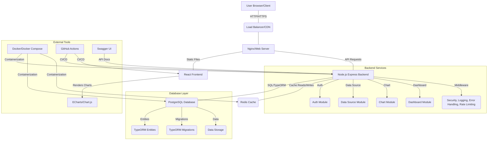

# Data Visualization Platform - Architecture Documentation

## 1. System Overview

The Data Visualization Platform is a full-stack web application designed to allow users to connect to various data sources, create interactive charts, and build customizable dashboards. It follows a client-server architecture, with a React frontend and a Node.js/Express backend, interacting with a PostgreSQL database and a Redis cache.

## 2. Key Architectural Decisions

### 2.1. Technology Stack Choices

*   **TypeScript**: Chosen for both frontend and backend for type safety, improved code quality, and better maintainability, especially in larger enterprise-grade projects.
*   **Node.js (Express)**: Provides a fast, scalable, and non-blocking I/O server environment for the backend. Express offers a minimalist web framework.
*   **React**: A popular, component-based library for building interactive user interfaces, known for its strong ecosystem and performance.
*   **PostgreSQL**: A robust, reliable, and feature-rich open-source relational database. Ideal for structured data, complex queries, and data integrity.
*   **TypeORM**: An ORM (Object-Relational Mapper) for TypeScript and JavaScript that supports PostgreSQL. It simplifies database interactions by mapping database entities to TypeScript classes and provides strong typing for queries and migrations.
*   **Redis**: Used as an in-memory data store for caching frequently accessed query results and dashboard layouts, significantly improving response times and reducing database load.
*   **ECharts**: A powerful and flexible charting library for building a wide variety of interactive data visualizations. Its JSON-based option system integrates well with dynamic configuration.
*   **Docker/Docker Compose**: For containerization, ensuring consistent development, testing, and production environments. Simplifies setup and deployment.

### 2.2. Security

*   **Authentication**: JWT (JSON Web Tokens) are used for stateless authentication. Tokens are stored client-side (e.g., in `localStorage` or `sessionStorage` with appropriate security considerations like `httpOnly` cookies for XSS protection, though for simplicity in this example, it's `localStorage`).
*   **Authorization**: Role-Based Access Control (RBAC) is implemented, with roles like `ADMIN`, `EDITOR`, and `VIEWER`. Middleware (`authorizeRole`) enforces permissions on API routes.
*   **Data Encryption**: Sensitive connection details for data sources are encrypted at rest in the database using AES-256-CBC symmetric encryption, ensuring that credentials are not stored in plaintext. An `ENCRYPTION_KEY` is required.
*   **Input Validation & Sanitization**: Basic validation is performed on user inputs (e.g., required fields). For SQL queries, a critical part of a data viz tool, basic checks prevent DDL/DML operations, but a full SQL parser or parameterized queries are recommended for true robustness against SQL injection.
*   **HTTPS**: Assumed for production environments via a Load Balancer/CDN to encrypt data in transit.
*   **Helmet**: Express middleware to set various HTTP headers for security (e.g., XSS protection, MIME-type sniffing prevention).
*   **CORS**: Configured to allow requests only from the frontend domain.

### 2.3. Performance & Scalability

*   **Caching with Redis**: Reduces database load for repeated queries and frequently accessed data (e.g., dashboard layouts, chart data).
*   **Compression (Gzip)**: `compression` middleware reduces the size of HTTP response bodies, speeding up data transfer.
*   **Rate Limiting**: `express-rate-limit` protects API endpoints from brute-force attacks and abuse, ensuring fair resource usage.
*   **Efficient Database Queries**: TypeORM's `createQueryBuilder` and `find` methods are used with `relations` to optimize data retrieval and avoid N+1 query problems. Database indexes are crucial.
*   **Stateless Backend**: JWTs enable a stateless backend, making it easier to scale horizontally by adding more server instances behind a load balancer.

### 2.4. Maintainability & Extensibility

*   **Modular Design**: The backend is organized into modules (Auth, Users, Data Sources, Charts, Dashboards), each with its own routes, controllers, and services. This promotes separation of concerns.
*   **Service Layer**: Business logic resides in services, keeping controllers thin and focused on request/response handling.
*   **TypeORM Migrations**: Managed database schema changes ensure consistency across environments.
*   **Clear Folder Structure**: A well-defined folder structure for both client and server improves navigability and onboarding for new developers.
*   **Frontend Componentization**: React's component-based architecture allows for reusable UI elements.
*   **Context API**: Used for global state management (Auth, Data), simplifying state sharing across components without prop drilling.

### 2.5. Error Handling & Logging

*   **Centralized Error Handling**: A dedicated Express middleware (`errorHandler`) catches all errors, standardizes their format (`AppError`), and sends appropriate HTTP responses, preventing sensitive information leakage.
*   **Structured Logging**: `Winston` is used for logging, providing different log levels (info, error, debug, etc.) and allowing for easy integration with external monitoring systems. Request logging provides insights into API usage.

## 3. Data Flow

1.  **User Interaction (Client)**: User logs in, navigates to a dashboard, creates a data source, or configures a chart.
2.  **API Request (Client -> Backend)**: The React frontend uses Axios to send authenticated API requests to the Node.js/Express backend.
3.  **Middleware Processing (Backend)**: Requests pass through middleware for:
    *   Rate limiting
    *   CORS checks
    *   Security headers (Helmet)
    *   Request logging
    *   JWT authentication (`authenticateToken`)
    *   Authorization (`authorizeRole`)
4.  **Controller Handoff (Backend)**: If authorized, the request is routed to the appropriate controller method.
5.  **Service Layer (Backend)**: The controller calls a service method, which encapsulates the core business logic.
    *   Services interact with the TypeORM repositories to perform CRUD operations on entities (Users, Data Sources, Charts, Dashboards).
    *   For data source queries, the `DataSourceService` decrypts connection details, connects to the external database (e.g., PostgreSQL), executes the query, and returns raw data. It also leverages Redis for caching.
6.  **Database/Cache Interaction**:
    *   TypeORM translates service calls into SQL queries executed against PostgreSQL.
    *   Redis is checked for cached query results before hitting the database. If data is not in cache, it's fetched from DB and stored in Redis.
7.  **Response Generation (Backend -> Client)**: The service returns data to the controller, which formats the HTTP response (JSON) and sends it back to the client.
8.  **Data Visualization (Client)**: The frontend receives the data, updates its state, and uses ECharts to render interactive visualizations within the dashboard layout.

## 4. Environment and Deployment

*   **Development**: Uses Docker Compose for easy local setup, providing isolated environments for the database, cache, backend, and frontend. Hot-reloading is configured for efficient development.
*   **Testing**: Dedicated test database setup (within `jest-setup`) ensures isolated and repeatable tests for backend. Frontend tests use React Testing Library. GitHub Actions automate CI/CD, running tests on every push/PR.
*   **Production**: Docker images are built and pushed to a registry. Deployment to cloud platforms (like Render, AWS ECS, Google Cloud Run) would involve orchestrating these Docker containers, managing environment variables securely, and setting up HTTPS and domain mapping.

This architecture aims for a balance between simplicity for rapid development and the robustness required for an enterprise-grade application.