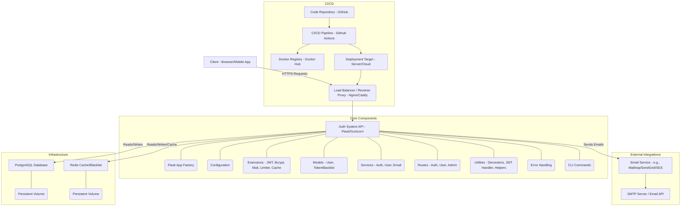

# Architecture Documentation

This document provides a high-level overview of the architecture for the Enterprise-Grade Authentication System.

## 1. System Overview

The authentication system is built as a RESTful API service using Flask, designed to be stateless and scalable. It provides all core functionalities required for user management, secure authentication, and role-based authorization. The system leverages Docker for containerization, PostgreSQL as the primary database, and Redis for caching and token blacklisting.

## 2. Architectural Diagram

## 3. Key Architectural Decisions

*   **Microservice vs. Monolith**: Started as a monolithic Flask application for simplicity and rapid development of core authentication features. This allows for easier management of shared resources (DB, Redis) and a single deployment unit. However, the modular structure (blueprints, services) facilitates a future transition to a microservices architecture if specific functionalities (e.g., email service, notification service) need to scale independently.
*   **RESTful API**: Uses a standard RESTful approach for API design, ensuring statelessness and predictable resource-oriented URLs. JSON is used for request and response bodies.
*   **JWT for Authentication**:
    *   **Statelessness**: JWTs enable stateless authentication, reducing server load by removing the need for session storage on the server-side.
    *   **Access & Refresh Tokens**: Separating access (short-lived) and refresh (long-lived) tokens enhances security. Access tokens are used for API calls, while refresh tokens are used to obtain new access tokens.
    *   **Token Blacklisting**: Implemented using Redis to immediately invalidate tokens upon logout or revocation, mitigating the risk of stolen tokens.
*   **Role-Based Access Control (RBAC)**: Simplistic RBAC with `user` and `admin` roles, enforced through custom Flask decorators (`@roles_required`). This allows for clear separation of permissions.
*   **Database Choice (PostgreSQL)**: Selected for its robustness, reliability, ACID compliance, and extensive feature set, suitable for production environments.
*   **ORM (SQLAlchemy)**: Provides an object-relational mapping layer, abstracting raw SQL queries and promoting a Pythonic way of interacting with the database, while also preventing SQL injection vulnerabilities.
*   **Database Migrations (Alembic/Flask-Migrate)**: Essential for managing schema changes in a controlled and versioned manner, crucial for team development and production deployments.
*   **Caching (Redis)**: Used for high-speed lookups for JWT blacklisting and general caching needs. Redis is an in-memory data store, providing low-latency access.
*   **Rate Limiting (Flask-Limiter)**: Implemented to protect against various forms of abuse (e.g., brute-force attacks, excessive API calls), enhancing system stability and security.
*   **Containerization (Docker & Docker Compose)**:
    *   **Portability**: Ensures the application runs consistently across different environments (development, testing, production).
    *   **Isolation**: Each service (app, db, redis) runs in its own isolated container.
    *   **Ease of Setup**: Docker Compose simplifies local development by orchestrating multiple services.
*   **Structured Logging**: Utilizes Python's `logging` module with JSON formatting in production, making logs easily consumable by log aggregation systems (e.g., ELK stack).
*   **Centralized Error Handling**: Custom error handlers ensure consistent, informative JSON error responses across the API.
*   **Modularity**: Code is organized into blueprints, services, and utilities to improve maintainability, testability, and separation of concerns.

## 4. Components Breakdown

### 4.1. `app` Directory
*   **`__init__.py`**: The application factory, responsible for creating the Flask app, loading configurations, initializing extensions, registering blueprints, and setting up error handlers.
*   **`config.py`**: Defines environment-specific configuration classes (Development, Testing, Production) inherited from a base `Config` class.
*   **`extensions.py`**: Centralizes the initialization and configuration of Flask extensions (SQLAlchemy, JWTManager, Bcrypt, Mail, Limiter, Cache). Also contains JWT callbacks for token blacklisting.
*   **`models.py`**: Defines the SQLAlchemy ORM models, including `User` (with password hashing and role management) and `TokenBlacklist` (for JWT revocation).
*   **`routes/`**: Contains Flask Blueprints, grouping API endpoints by resource type:
    *   `auth.py`: User registration, login, logout, refresh token, password reset, email verification.
    *   `user.py`: Authenticated user profile management (view, update).
    *   `admin.py`: Admin-specific user management (view all, view by ID, update, delete).
*   **`services/`**: Implements the business logic for each domain, decoupling it from the route handlers:
    *   `auth_service.py`: Handles user authentication workflows, token generation, password resets.
    *   `user_service.py`: Manages user profile operations.
    *   `email_service.py`: Abstraction for sending emails (verification, password reset).
*   **`utils/`**: Helper modules:
    *   `decorators.py`: Custom decorators for JWT authentication (`@jwt_required`) and role-based authorization (`@roles_required`).
    *   `jwt_handler.py`: Functions for managing JWT (blacklisting, decoding).
    *   `helpers.py`: General utility functions (e.g., UUID generation).
*   **`errors.py`**: Defines custom exception classes and registers error handlers to provide consistent JSON error responses.
*   **`cli.py`**: Registers custom Flask CLI commands for database seeding and creating admin users.

### 4.2. Database Layer
*   **PostgreSQL**: The relational database used for persistent storage of user data, token blacklist entries, etc.
*   **Redis**: An in-memory data store used for fast lookups of blacklisted JWTs and for rate limiting storage.
*   **Flask-Migrate**: Integrates Alembic with Flask to manage database migrations, allowing for schema evolution.

### 4.3. Testing
*   **Pytest**: The chosen testing framework.
*   **`tests/conftest.py`**: Defines pytest fixtures for setting up the Flask app, test client, and a clean database session for each test.
*   **`tests/unit/`**: Contains tests for individual functions and models in isolation.
*   **`tests/integration/`**: Tests the interaction between multiple components (e.g., a full user journey).
*   **`tests/api/`**: Tests the API endpoints end-to-end, simulating HTTP requests.

### 4.4. CI/CD
*   **GitHub Actions**: Configured to automate the build, test, and deployment process.
*   **`main.yml`**: Defines workflows for running tests on push/pull request and deploying to production from the `main` branch.
*   **Docker Registry**: Docker Hub (or a private registry) used to store built Docker images.

## 5. Scalability Considerations

*   **Stateless API**: JWTs facilitate horizontal scaling of the Flask application instances, as no session data needs to be shared between them.
*   **Database Scaling**: PostgreSQL can be scaled vertically (more powerful server) or horizontally (read replicas, sharding for very large datasets).
*   **Redis Scaling**: Redis can be clustered for high availability and sharded for larger datasets.
*   **Load Balancing**: A load balancer (Nginx, AWS ELB, etc.) is essential in production to distribute requests across multiple Flask application instances.
*   **Asynchronous Tasks**: For long-running operations (e.g., sending emails), an asynchronous task queue (e.g., Celery with RabbitMQ/Redis backend) would be integrated to offload work from the main web server, improving responsiveness.

## 6. Security Considerations (Architectural)

*   **HTTPS Everywhere**: All communication between clients and the API (and ideally between internal services) should be encrypted using HTTPS.
*   **Environment Variables for Secrets**: Sensitive information (API keys, database credentials, JWT secrets) is never hardcoded but injected via environment variables.
*   **Input Validation**: Strict validation of all incoming API request data prevents common vulnerabilities like injection attacks and malformed data.
*   **Rate Limiting**: Protects against brute-force attacks and resource exhaustion.
*   **Cross-Origin Resource Sharing (CORS)**: If the frontend is hosted on a different domain, explicit CORS configuration will be necessary to control which origins can access the API.
*   **Principle of Least Privilege**: Services and users are granted only the minimum necessary permissions to perform their functions.
*   **Auditing and Logging**: Comprehensive logging provides an audit trail for security investigations.

This architecture provides a solid, secure, and maintainable foundation for building modern web applications requiring robust authentication and authorization.