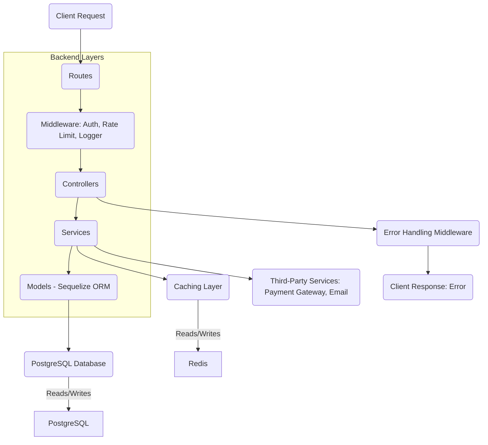

```markdown
# E-commerce Solution: Architecture Document

## 1. Introduction

This document outlines the architectural design of the enterprise-grade E-commerce Solution. The system is designed to be robust, scalable, maintainable, and secure, leveraging a microservices-inspired approach with a clear separation of concerns between frontend and backend.

## 2. High-Level Architecture

The E-commerce solution follows a **Monolithic (Modular) Backend with a Separate Frontend (SPA)** architecture, often referred to as a "decoupled" or "hybrid" approach.

```mermaid
graph TD
    User(Browser / Mobile App) -->|HTTP/HTTPS| CDN(CDN)
    CDN -->|HTTP/HTTPS| Nginx(Nginx - Frontend Server)
    Nginx -->|Static Files| ReactApp(React.js Single Page Application)
    ReactApp -->|AJAX/REST APIs| Nginx
    Nginx -->|API Proxy| Backend(Node.js/Express Backend API)

    Backend -->|Database Queries| PostgreSQL(PostgreSQL Database)
    Backend -- Cache --> Redis(Redis Cache - Optional, Production)
    Backend -- Logs --> ELK(ELK Stack - Optional, Production Logging)
    Backend -- Monitoring --> PrometheusGrafana(Prometheus/Grafana - Optional, Production Monitoring)

    SubGraph Ops
        CI/CD(CI/CD Pipeline) --> DockerRegistry(Docker Registry)
        DockerRegistry --> Orchestration(Docker Compose / Kubernetes)
        Orchestration --> Backend
        Orchestration --> Nginx
        Orchestration --> PostgreSQL
        Orchestration --> Redis
    End

    Developer(Developer) --> Git(Git Repository)
    Git --> CI/CD
```

### Key Components:

*   **Client (Frontend)**: A Single Page Application (SPA) built with React.js, responsible for rendering the UI and interacting with the backend API. Served statically, often via Nginx.
*   **API Gateway / Reverse Proxy (Nginx)**: Forwards requests to the appropriate backend service. In this setup, it primarily serves the static frontend assets and proxies API calls to the Node.js backend.
*   **Backend (Node.js/Express)**: A RESTful API that handles all business logic, data processing, authentication, authorization, and interacts with the database. It is structured in a modular fashion to maintain separation of concerns.
*   **Database (PostgreSQL)**: A robust relational database for persistent storage of application data.
*   **Caching Layer (Redis/Node-Cache)**: Improves performance by storing frequently accessed data, reducing database load.
*   **Logging & Monitoring (Winston, ELK, Prometheus/Grafana)**: Essential for observing system health, performance, and diagnosing issues in production.
*   **CI/CD Pipeline (GitHub Actions)**: Automates the build, test, and deployment process.
*   **Containerization (Docker & Docker Compose/Kubernetes)**: Ensures consistent environments and facilitates scalable deployment.

## 3. Backend Architecture (Node.js/Express)

The backend follows a layered, modular architecture:



### Layers:

*   **Routes**: Define API endpoints and map them to controller functions. Encapsulate path definitions (e.g., `/api/v1/products`).
*   **Middleware**: Functions executed before/after route handlers. This includes authentication (`authMiddleware`), error handling (`errorMiddleware`), logging (`loggerMiddleware`), rate limiting (`rateLimitMiddleware`), and security headers (`helmet`, `hpp`, `cors`).
*   **Controllers**: Handle incoming HTTP requests, perform input validation, extract data from `req` object, and delegate business logic to services. They orchestrate the flow and prepare responses. They should be thin.
*   **Services**: Encapsulate the core business logic of the application. They interact with models, perform complex calculations, enforce rules, and can integrate with external services or the caching layer. Services should be decoupled from HTTP specifics.
*   **Models**: Represent the data structure and handle database interactions through Sequelize ORM. They define schema, relationships, and lifecycle hooks (e.g., password hashing before save).
*   **Utilities**: Helper functions for common tasks like logging (`logger`), JWT generation (`jwt`), custom error handling (`appError`), and caching (`cache`).
*   **Configuration**: Manages environment variables and application settings (`config`).

### Data Flow for a typical request (e.g., Get Product):

1.  **Client Request**: Frontend sends `GET /api/v1/products/:id`.
2.  **Nginx**: Forwards the request to the `backend` service.
3.  **Routes**: `productRoutes` matches the path to `ProductController.getProductById`.
4.  **Middleware**: `requestLogger` logs the incoming request. `limiter` checks for rate limits. (No `protect` middleware needed for public product viewing).
5.  **Controller (`ProductController.getProductById`)**: Extracts `id` from `req.params`. Calls `ProductService.getProductById(id)`.
6.  **Service (`ProductService.getProductById`)**:
    *   Checks the cache for `product_${id}`.
    *   If found, returns cached data.
    *   If not found, queries the `Product` model to fetch the product and its related `Category` and `Reviews`.
    *   Stores the fetched product in the cache.
7.  **Models (`Product`, `Category`, `Review`)**: Sequelize converts the query into SQL, interacts with PostgreSQL, and returns data.
8.  **Service**: Returns the product data to the controller.
9.  **Controller**: Formats the response and sends it back to the client with `200 OK`.
10. **Error Handling**: If any layer throws an `AppError` or a system error occurs, the `errorMiddleware` catches it, logs it, and sends a standardized error response.

## 4. Database Schema Design (PostgreSQL)

The database schema is designed for an e-commerce platform, focusing on normalized data and clear relationships.

```mermaid
erDiagram
    USERS {
        UUID id PK
        VARCHAR username UK
        VARCHAR email UK
        VARCHAR password
        ENUM role
        DATETIME createdAt
        DATETIME updatedAt
    }

    CATEGORIES {
        UUID id PK
        VARCHAR name UK
        TEXT description
        DATETIME createdAt
        DATETIME updatedAt
    }

    PRODUCTS {
        UUID id PK
        VARCHAR name UK
        TEXT description
        DECIMAL price
        VARCHAR imageUrl
        INTEGER stock
        UUID categoryId FK
        DATETIME createdAt
        DATETIME updatedAt
    }

    CARTS {
        UUID id PK
        UUID userId FK UK
        DATETIME createdAt
        DATETIME updatedAt
    }

    CART_ITEMS {
        UUID id PK
        UUID cartId FK
        UUID productId FK
        INTEGER quantity
        DECIMAL priceAtAddition
        DATETIME createdAt
        DATETIME updatedAt
    }

    ORDERS {
        UUID id PK
        UUID userId FK
        DECIMAL totalAmount
        ENUM status
        VARCHAR shippingAddress
        ENUM paymentStatus
        DATETIME createdAt
        DATETIME updatedAt
    }

    ORDER_ITEMS {
        UUID id PK
        UUID orderId FK
        UUID productId FK
        INTEGER quantity
        DECIMAL price
        DATETIME createdAt
        DATETIME updatedAt
    }

    REVIEWS {
        UUID id PK
        UUID userId FK
        UUID productId FK
        INTEGER rating
        TEXT comment
        DATETIME createdAt
        DATETIME updatedAt
    }

    PAYMENTS {
        UUID id PK
        UUID orderId FK UK
        DECIMAL amount
        ENUM paymentMethod
        VARCHAR transactionId UK
        ENUM status
        DATETIME createdAt
        DATETIME updatedAt
    }

    USERS ||--o{ CARTS : "has"
    USERS ||--o{ ORDERS : "places"
    USERS ||--o{ REVIEWS : "writes"
    CATEGORIES ||--o{ PRODUCTS : "contains"
    PRODUCTS ||--o{ REVIEWS : "receives"
    PRODUCTS ||--o{ CART_ITEMS : "is_in"
    PRODUCTS ||--o{ ORDER_ITEMS : "is_part_of"
    CARTS ||--o{ CART_ITEMS : "contains"
    ORDERS ||--o{ ORDER_ITEMS : "contains"
    ORDERS ||--o| PAYMENTS : "has"

    CART_ITEMS }|..| PRODUCTS : "includes_product"
    ORDER_ITEMS }|..| PRODUCTS : "includes_product"
```

## 5. Security Considerations

*   **Authentication**: JWT for secure, stateless user sessions.
*   **Authorization**: Role-based access control (RBAC) enforced via middleware.
*   **Password Security**: `bcrypt.js` for hashing passwords, preventing plaintext storage.
*   **Input Validation**: Should be implemented in controllers/services to prevent SQL injection, XSS, etc. (Leveraging Sequelize model validations as well).
*   **Middleware**:
    *   `helmet`: Sets various HTTP headers to secure the app.
    *   `cors`: Configured to allow specific origins.
    *   `hpp`: Protects against HTTP Parameter Pollution.
    *   `express-rate-limit`: Prevents brute-force and DoS attacks.
*   **Environment Variables**: Sensitive information stored in `.env` files and not committed to version control.
*   **HTTPS**: Essential for production deployment to encrypt traffic. (Handled by reverse proxy/load balancer).

## 6. Scalability and Performance

*   **Stateless Backend**: JWTs make the backend stateless, allowing for easy horizontal scaling of Node.js instances.
*   **Database Scaling**: PostgreSQL can be scaled vertically (more powerful server) or horizontally (read replicas, sharding for very large scale). ORM (Sequelize) usage does not inherently prevent this.
*   **Caching**: `node-cache` (in-memory) provides immediate performance gains. For multi-instance deployments, transitioning to a distributed cache like **Redis** is crucial to avoid stale data and ensure consistency across instances.
*   **Load Balancing**: Essential in production to distribute traffic across multiple backend instances.
*   **CDN**: For serving frontend static assets and product images, reducing load on the origin server and improving global response times.
*   **Optimized Queries**: Eager loading in Sequelize to reduce N+1 queries. Proper indexing on frequently queried columns.
*   **Background Jobs**: For non-critical, time-consuming tasks (e.g., sending emails, processing large data imports), a separate worker service (e.g., using RabbitMQ, Kafka, or AWS SQS/Lambda) would be implemented to offload from the main API.

## 7. Error Handling and Logging

*   **Centralized Error Handling**: A global `errorMiddleware` catches all errors, distinguishes between operational (`AppError`) and programming errors, logs them, and sends standardized JSON responses to the client.
*   **Structured Logging**: `Winston` is used to create structured, searchable logs. Logs are written to console (for dev), files (for local persistence), and can be easily extended to cloud logging services (e.g., AWS CloudWatch, Google Cloud Logging, or ELK stack for enterprise).
*   **Monitoring**: Integration with tools like Prometheus for metrics collection and Grafana for visualization is critical in production to track system health, performance trends, and alerts.

## 8. Development Workflow

*   **Docker Compose**: Provides a consistent development environment, allowing developers to spin up all services (DB, backend, frontend) with a single command.
*   **Hot-reloading**: `nodemon` for backend and React's dev server for frontend enable rapid iteration.
*   **Linting & Formatting**: ESLint and Prettier ensure code quality and consistency across the team.

## 9. Future Enhancements

*   **Microservices**: Breaking down the monolithic backend into smaller, independently deployable services (e.g., User Service, Product Catalog Service, Order Service, Payment Service).
*   **Asynchronous Processing**: Introduce message queues (RabbitMQ, Kafka) for event-driven architecture and background job processing.
*   **Payment Gateway Integration**: Integrate with real payment providers (Stripe, PayPal) instead of simulation.
*   **Search Engine**: Implement a dedicated search engine (Elasticsearch, Algolia) for advanced product search capabilities.
*   **Real-time Features**: WebSockets for real-time order updates, chat support, etc.
*   **Advanced Analytics**: Integrate with analytics platforms for business intelligence.
*   **Admin Dashboard**: A richer, dedicated admin interface for managing products, users, orders, etc.
*   **Image Optimization/CDN Integration**: For product images.
*   **Email Notifications**: For order confirmations, shipping updates, etc.
```