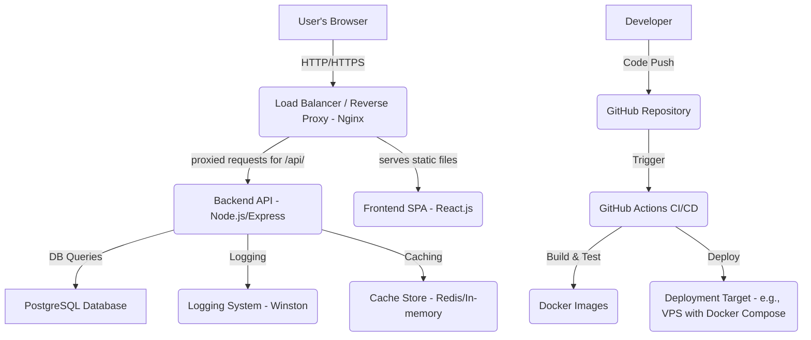

# Architecture Document for Data Visualization Platform

## 1. Introduction

This document outlines the architectural design of the Data Visualization Platform. The system is designed to be scalable, maintainable, and robust, following best practices for modern web applications.

## 2. High-Level Architecture

The platform follows a **Client-Server (3-Tier) Architecture**:

*   **Client Layer (Frontend):** A React.js single-page application (SPA) responsible for user interaction, data visualization rendering, and communicating with the backend API.
*   **Application Layer (Backend):** A Node.js (Express.js) RESTful API that handles business logic, data processing, authentication, authorization, and database interactions.
*   **Data Layer (Database):** A PostgreSQL relational database for persistent storage of user data, data source configurations, visualization settings, and dashboard layouts.

Additionally, **Docker** and **Docker Compose** are used for containerization, providing consistency across development, testing, and production environments. **GitHub Actions** are configured for CI/CD.



## 3. Detailed Component Breakdown

### 3.1. Frontend (React.js)

*   **Entry Point:** `index.js` renders the root `App` component.
*   **Routing:** `react-router-dom` manages client-side navigation.
*   **State Management:** Primarily `useState` and `useEffect` hooks, with `React Context API` for global concerns like authentication.
*   **API Client:** `axios` for making HTTP requests to the backend. Encapsulated in `src/api/api.js`.
*   **Components:**
    *   **Auth:** `Login`, `Register` forms.
    *   **Common:** `Header`, `PrivateRoute` for navigation and access control.
    *   **Data Sources:** Forms for defining data sources, data preview.
    *   **Visualizations:** Creator interface, configuration forms for different chart types.
    *   **Charts:** Reusable components wrapping `Recharts` for Bar, Line, Pie charts.
    *   **Dashboards:** Components for displaying dashboard lists and an editor for arranging visualizations.
*   **Styling:** Modular CSS or a CSS-in-JS solution (e.g., styled-components, not implemented for brevity).
*   **Error Handling:** UI-level error messages, graceful degradation.

### 3.2. Backend (Node.js/Express.js)

*   **Framework:** Express.js for routing and middleware management.
*   **Project Structure (Modular):**
    *   `src/app.js`: Main Express application setup, middleware, and route registration.
    *   `src/server.js`: Server entry point, database connection test.
    *   `src/config/`: Environment variables (`.env`), database connection (`database.js`), Sequelize CLI config.
    *   `src/models/`: Sequelize ORM model definitions (`User`, `DataSource`, `Visualization`, `Dashboard`).
    *   `src/services/`: **Core Business Logic**. Contains functions for interacting with models, performing complex operations (e.g., `dataProcessor.service.js` for data transformation and aggregation, `auth.service.js` for user authentication logic).
    *   `src/controllers/`: Handles incoming HTTP requests. Parses request body/params, calls appropriate service methods, and sends responses. Minimal logic, primarily orchestrates service calls.
    *   `src/routes/`: Defines API endpoints and maps them to controller functions.
    *   `src/middleware/`:
        *   `auth.middleware.js`: JWT token verification, user authentication, role-based authorization.
        *   `errorHandler.js`: Centralized error handling for consistent API error responses.
        *   `logger.js`: Winston for structured application logging.
        *   `rateLimit.js`: `express-rate-limit` for API rate limiting.
    *   `src/utils/`: Helper functions (e.g., `cache.js` for simple in-memory caching).
*   **Database Interaction:** `Sequelize` ORM for PostgreSQL. Manages models, migrations, and queries.
*   **Authentication:** JSON Web Tokens (JWT) for stateless authentication. Passports.js could be integrated for more complex strategies, but raw JWT is sufficient.
*   **Logging:** `Winston` for comprehensive, configurable logging (console, file, levels). `Morgan` for HTTP access logs.
*   **Caching:** A simple in-memory cache is provided (`src/utils/cache.js`), expandable to Redis for production.
*   **Error Handling:** Custom middleware `errorHandler.js` ensures all unhandled errors result in consistent JSON error responses.

### 3.3. Database (PostgreSQL)

*   **Type:** Relational Database.
*   **Tables:**
    *   `users`: Stores user credentials and roles.
    *   `data_sources`: Stores metadata, configuration, and actual data (for file uploads/JSON) of various data sources.
    *   `visualizations`: Stores configuration for individual charts (type, data source link, axes, filters, aggregations).
    *   `dashboards`: Stores dashboard layouts and references to visualizations.
*   **Schema Management:** `Sequelize-CLI` for migrations to manage schema changes and `seeders` for initial data population.
*   **Query Optimization:** Use of proper indexing on foreign keys and frequently queried columns (`users.email`, `data_sources.userId`, `visualizations.dataSourceId`) is crucial.

## 4. Security Considerations

*   **Authentication:** JWT with `httpOnly` and `secure` cookies to prevent XSS attacks on tokens.
*   **Authorization:** Role-based access control (RBAC) (e.g., `admin` vs `user`).
*   **Input Validation:** Basic validation in controllers/services to prevent common injection attacks (though full schema validation is recommended for production).
*   **Rate Limiting:** Protects against brute-force attacks and resource exhaustion.
*   **CORS:** Explicitly configured to allow requests only from the frontend domain.
*   **Helmet:** Adds various HTTP headers to improve application security (XSS, CSRF, etc.).
*   **Password Hashing:** `bcryptjs` for secure password storage.
*   **Sensitive Data:** Environment variables (`.env`) for secrets, never hardcoded.

## 5. Scalability

*   **Stateless Backend:** JWT makes the backend stateless, allowing horizontal scaling of Node.js instances.
*   **Database:** PostgreSQL can be scaled vertically (more powerful server) or horizontally (read replicas, sharding) as needed.
*   **Caching:** Introduction of Redis can offload database reads for frequently accessed data.
*   **Microservices (Future):** While currently monolithic, the modular `services` layer facilitates extraction into microservices if complexity or scale demands it (e.g., a dedicated "Data Processing Service").
*   **Containerization:** Docker allows easy deployment to cloud platforms with auto-scaling capabilities (Kubernetes).

## 6. Maintainability

*   **Modular Codebase:** Clear separation of concerns (models, services, controllers, middleware).
*   **Consistent Code Style:** Linting and formatting (e.g., ESLint, Prettier - not explicitly configured in this output but highly recommended).
*   **Comprehensive Testing:** Unit, Integration, and API tests to ensure functionality and prevent regressions.
*   **Documentation:** `README.md`, `ARCHITECTURE.md`, `API.md`, and in-code comments.
*   **Logging:** Structured logs aid in debugging and monitoring.

## 7. Performance

*   **Caching:** Reduces database load and improves response times for repeated requests.
*   **Efficient Data Processing:** `dataProcessor.service.js` designed for efficient in-memory operations. For very large datasets, streaming and external processing engines would be considered.
*   **Database Indexing:** Improves query performance.
*   **Asynchronous Operations:** Node.js's non-blocking I/O model ensures efficient handling of concurrent requests.

## 8. CI/CD

*   **GitHub Actions:** Automates the build, test, and deployment process.
*   **Stages:**
    *   **Build:** Docker image creation.
    *   **Test:** Run unit, integration, and potentially E2E tests.
    *   **Deploy:** Push Docker images to a registry and deploy to a target environment (e.g., a cloud VPS, Kubernetes).

## 9. Future Enhancements

*   **Real-time Data:** WebSockets for live dashboard updates.
*   **More Data Connectors:** Support for SQL databases (MySQL, MSSQL), NoSQL databases (MongoDB), cloud storage (S3), Google Sheets.
*   **Advanced Chart Types:** D3.js for custom/complex visualizations.
*   **User Roles & Permissions:** More granular control over what users can create, edit, or view.
*   **Data Governance:** Data lineage, auditing, data quality checks.
*   **Theming/Customization:** Allow users to customize dashboard appearance.
*   **Server-Side Rendering (SSR) for Frontend:** Improve initial load performance and SEO.
*   **GraphQL API:** Alternative API design for more efficient data fetching.
```