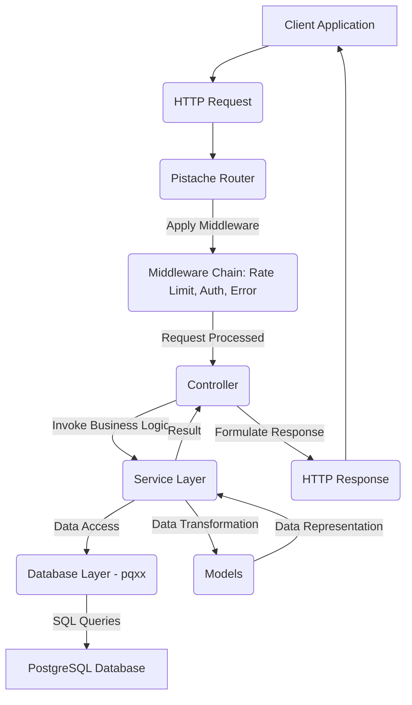

```markdown
# Comprehensive C++ REST API Development System (Task Management)

This project provides a full-scale, production-ready API development system implemented primarily in C++. It features a RESTful API for task management, a PostgreSQL database, Docker for containerization, and a comprehensive set of development practices including testing, logging, authentication, and error handling.

## Table of Contents

1.  [Project Overview](#1-project-overview)
2.  [Features](#2-features)
3.  [Architecture](#3-architecture)
4.  [Technology Stack](#4-technology-stack)
5.  [Setup and Installation](#5-setup-and-installation)
    *   [Prerequisites](#prerequisites)
    *   [Local Development (without Docker)](#local-development-without-docker)
    *   [Using Docker (Recommended)](#using-docker-recommended)
6.  [Configuration](#6-configuration)
7.  [API Documentation](#7-api-documentation)
8.  [Testing](#8-testing)
    *   [Unit Tests](#unit-tests)
    *   [Integration Tests](#integration-tests)
    *   [API Tests](#api-tests)
    *   [Performance Tests](#performance-tests)
9.  [CI/CD](#9-cicd)
10. [Logging and Monitoring](#10-logging-and-monitoring)
11. [Error Handling](#11-error-handling)
12. [Authentication and Authorization](#12-authentication-and-authorization)
13. [Caching](#13-caching)
14. [Rate Limiting](#14-rate-limiting)
15. [Deployment Guide](#15-deployment-guide)
16. [Future Enhancements](#16-future-enhancements)
17. [Contributing](#17-contributing)
18. [License](#18-license)

---

## 1. Project Overview

This project is designed to demonstrate best practices in building a robust, scalable, and maintainable API system using C++. It implements a simple Task Management API where users can register, log in, and manage their tasks. The emphasis is on the backend system, following ALX Software Engineering principles for programming logic, algorithm design, and technical problem-solving.

## 2. Features

*   **Core Application (C++)**:
    *   RESTful API for Task Management (Users & Tasks).
    *   Full CRUD operations for Tasks.
    *   Business logic for user registration, login, and task management.
    *   Modular design using Controller-Service-Model pattern.
*   **Database Layer**:
    *   PostgreSQL database.
    *   Database connection pooling (`pqxx`).
    *   SQL-based schema definitions and migrations.
    *   Basic indexing for query optimization.
*   **Configuration & Setup**:
    *   Environment-based configuration (`.env` files).
    *   Containerization using Docker and Docker Compose.
    *   Build system with CMake.
    *   CI/CD pipeline configuration (GitLab CI example).
*   **Testing & Quality**:
    *   Unit tests with Google Test (for `Config`, `JwtManager`, `PasswordHasher`, `JsonUtils`).
    *   Integration tests with Google Test (for `TaskService` against a real DB).
    *   API tests with Python `requests` (for end-to-end API validation).
    *   Mention of performance testing tools.
*   **Additional Features**:
    *   **Authentication/Authorization**: JWT-based authentication.
    *   **Logging**: Structured logging with `spdlog`.
    *   **Error Handling**: Centralized HTTP error handling middleware.
    *   **Caching**: In-memory caching example (illustrative).
    *   **Rate Limiting**: Simple request rate limiting middleware.

## 3. Architecture

The system follows a layered, MVC-like (Model-View-Controller) architecture, adapted for an API-only backend:

*   **Controllers**: Handle incoming HTTP requests, parse inputs, delegate to services, and format HTTP responses. They act as the "API surface."
*   **Services**: Encapsulate the business logic. They interact with the database layer (or other external services) to perform operations and apply business rules.
*   **Models**: Represent the data structures (e.g., `User`, `Task`). They define how data is structured and often include serialization/deserialization logic.
*   **Database Layer**: Manages interactions with the PostgreSQL database, including connection pooling, migrations, and raw query execution.
*   **Middleware**: Intercepts requests/responses for cross-cutting concerns like authentication, authorization, logging, error handling, and rate limiting.
*   **Utilities**: Common helper functions and classes (JSON parsing, JWT management, password hashing, logging).



## 4. Technology Stack

*   **Backend**: C++17
    *   **Web Framework**: [Pistache](https://github.com/oktal/pistache)
    *   **Database Driver**: [pqxx](https://github.com/jtv/libpqxx) (PostgreSQL C++ client)
    *   **JSON Handling**: [jsoncpp](https://github.com/open-source-parsers/jsoncpp)
    *   **Logging**: [spdlog](https://github.com/gabime/spdlog)
    *   **JWT**: [jwt-cpp](https://github.com/Thalhammer/jwt-cpp)
    *   **Password Hashing**: [argon2_cpp](https://github.com/emilengler/argon2_cpp) (wrapper for Argon2)
    *   **Build System**: CMake
*   **Database**: PostgreSQL
*   **Containerization**: Docker, Docker Compose
*   **CI/CD**: GitLab CI (example configuration)
*   **Testing**:
    *   C++: [Google Test](https://github.com/google/googletest)
    *   API: Python with `requests`

## 5. Setup and Installation

### Prerequisites

*   Git
*   Docker and Docker Compose (recommended)
*   (Optional, for local development) C++ Toolchain (g++/clang++), CMake, and development libraries for Pistache, pqxx, jsoncpp, spdlog, jwt-cpp, argon2.

### Local Development (without Docker)

This method requires manually installing all C++ dependencies.

1.  **Clone the repository**:
    ```bash
    git clone https://github.com/your-username/task-api-cpp.git
    cd task-api-cpp
    ```

2.  **Install C++ Dependencies (Ubuntu/Debian example)**:
    ```bash
    sudo apt update
    sudo apt install build-essential cmake libpistache-dev libpqxx-dev libjsoncpp-dev libspdlog-dev libjwt-dev libargon2-dev libssl-dev
    ```
    *Note: `libjwt-dev` and `libargon2-dev` might require building from source if not available in your distribution's repositories or if specific versions are needed.*

3.  **Set up PostgreSQL**:
    *   Install PostgreSQL: `sudo apt install postgresql postgresql-contrib`
    *   Create a user and database as specified in `.env.example`.
        ```bash
        sudo -u postgres psql
        CREATE USER task_user WITH PASSWORD 'secret_password';
        CREATE DATABASE task_db OWNER task_user;
        \q
        ```

4.  **Configure Environment Variables**:
    *   Create a `.env` file in the project root:
        ```bash
        cp .env.example .env
        ```
    *   Edit `.env` with your desired settings (especially `DB_HOST` if not `localhost`).

5.  **Build and Run**:
    ```bash
    mkdir build && cd build
    cmake ..
    make
    ./TaskAPI
    ```
    The API server should start on the port defined in your `.env` (default 9080).

### Using Docker (Recommended)

This is the easiest and most consistent way to get the application running.

1.  **Clone the repository**:
    ```bash
    git clone https://github.com/your-username/task-api-cpp.git
    cd task-api-cpp
    ```

2.  **Configure Environment Variables**:
    *   Create a `.env` file in the project root:
        ```bash
        cp .env.example .env
        ```
    *   Edit `.env` with your desired settings. Ensure `DB_HOST` is `db` (the service name in `docker-compose.yml`).

3.  **Build and Run with Docker Compose**:
    ```bash
    docker-compose up --build -d
    ```
    *   `--build`: Builds the Docker image for the `app` service.
    *   `-d`: Runs the services in detached mode (in the background).

4.  **Verify Services**:
    ```bash
    docker-compose ps
    ```
    You should see `app` and `db` services running.

    The API will be available at `http://localhost:9080`.

## 6. Configuration

The application uses environment variables for configuration. A `.env` file is used for local development, which is then loaded into the `Config` utility. In production, these variables should be managed by your deployment environment (e.g., Docker secrets, Kubernetes ConfigMaps/Secrets).

Key configuration parameters (from `.env.example`):

*   `SERVER_PORT`: Port the API server listens on.
*   `SERVER_THREADS`: Number of threads Pistache uses.
*   `DB_HOST`, `DB_PORT`, `DB_USER`, `DB_PASSWORD`, `DB_NAME`: PostgreSQL connection details.
*   `JWT_SECRET`: Secret key for signing and verifying JWTs. **CRITICAL: Change this in production.**
*   `JWT_EXPIRATION_SECONDS`: Token expiration time.
*   `LOG_LEVEL`: Logging verbosity (`trace`, `debug`, `info`, `warn`, `error`, `critical`, `off`).
*   `RATE_LIMIT_ENABLED`, `RATE_LIMIT_WINDOW_SECONDS`, `RATE_LIMIT_MAX_REQUESTS`: Rate limiting parameters.

## 7. API Documentation

The Task Management API provides endpoints for user authentication and task CRUD operations. All requests and responses are in JSON format.

### Base URL

`http://localhost:9080` (or `http://your-domain.com:9080` in production)

### Authentication

JWT (JSON Web Token) is used for authentication.
*   After `/users/login`, you receive a `token`.
*   Include this token in the `Authorization` header for protected routes: `Authorization: Bearer <YOUR_JWT_TOKEN>`

### Endpoints

#### User Management

*   **`POST /users/register`**
    *   **Description**: Register a new user.
    *   **Request Body**:
        ```json
        {
          "username": "newuser",
          "email": "newuser@example.com",
          "password": "StrongPassword123"
        }
        ```
    *   **Response (201 Created)**:
        ```json
        {
          "id": 1,
          "username": "newuser",
          "email": "newuser@example.com",
          "created_at": "ISO_DATE_STRING"
        }
        ```
    *   **Error (400 Bad Request)**: If username/email already exists or invalid input.

*   **`POST /users/login`**
    *   **Description**: Authenticate a user and receive a JWT.
    *   **Request Body**:
        ```json
        {
          "username": "newuser",
          "password": "StrongPassword123"
        }
        ```
    *   **Response (200 OK)**:
        ```json
        {
          "token": "eyJhbGciOiJIUzI1Ni...",
          "user_id": 1,
          "username": "newuser"
        }
        ```
    *   **Error (401 Unauthorized)**: Invalid credentials.

#### Task Management (Requires Authentication)

*   **`GET /tasks`**
    *   **Description**: Retrieve all tasks for the authenticated user.
    *   **Response (200 OK)**:
        ```json
        [
          {
            "id": 101,
            "user_id": 1,
            "title": "Buy groceries",
            "description": "Milk, eggs, bread",
            "status": "TODO",
            "due_date": "2024-03-25T10:00:00Z",
            "created_at": "ISO_DATE_STRING",
            "updated_at": "ISO_DATE_STRING"
          },
          {
            "id": 102,
            "user_id": 1,
            "title": "Finish report",
            "status": "IN_PROGRESS",
            "created_at": "ISO_DATE_STRING",
            "updated_at": "ISO_DATE_STRING"
          }
        ]
        ```

*   **`POST /tasks`**
    *   **Description**: Create a new task for the authenticated user.
    *   **Request Body**:
        ```json
        {
          "title": "New Task Title",
          "description": "Optional description",
          "status": "TODO", // "TODO", "IN_PROGRESS", "DONE"
          "due_date": "2024-04-01T17:00:00Z" // Optional, ISO 8601 format
        }
        ```
    *   **Response (201 Created)**:
        ```json
        {
          "id": 103,
          "user_id": 1,
          "title": "New Task Title",
          "description": "Optional description",
          "status": "TODO",
          "due_date": "2024-04-01T17:00:00Z",
          "created_at": "ISO_DATE_STRING",
          "updated_at": "ISO_DATE_STRING"
        }
        ```
    *   **Error (400 Bad Request)**: Invalid input.

*   **`GET /tasks/:id`**
    *   **Description**: Retrieve a specific task by ID for the authenticated user.
    *   **Response (200 OK)**:
        ```json
        {
          "id": 101,
          "user_id": 1,
          "title": "Buy groceries",
          "description": "Milk, eggs, bread",
          "status": "TODO",
          "due_date": "2024-03-25T10:00:00Z",
          "created_at": "ISO_DATE_STRING",
          "updated_at": "ISO_DATE_STRING"
        }
        ```
    *   **Error (404 Not Found)**: Task not found or does not belong to the user.

*   **`PUT /tasks/:id`**
    *   **Description**: Update an existing task by ID for the authenticated user.
    *   **Request Body**: (All fields are optional, only provided fields will be updated)
        ```json
        {
          "title": "Updated Task Title",
          "status": "DONE"
        }
        ```
    *   **Response (200 OK)**: The updated task object.
    *   **Error (404 Not Found)**: Task not found or does not belong to the user.
    *   **Error (400 Bad Request)**: Invalid input.

*   **`DELETE /tasks/:id`**
    *   **Description**: Delete a task by ID for the authenticated user.
    *   **Response (204 No Content)**: Empty response on successful deletion.
    *   **Error (404 Not Found)**: Task not found or does not belong to the user.

## 8. Testing

The project emphasizes quality through a multi-layered testing strategy.

### Unit Tests

*   **Framework**: Google Test
*   **Location**: `tests/unit/`
*   **Coverage**: Aims for 80%+ coverage on critical utility and individual service functions (e.g., `Config`, `JwtManager`, `PasswordHasher`, `JsonUtils`).
*   **How to run (with Docker)**:
    ```bash
    docker-compose run --rm app bash -c "cd build && cmake .. -DBUILD_TESTS=ON && cmake --build . --target TaskAPI_unit_tests && ./TaskAPI_unit_tests"
    ```
    *Note: The GitLab CI config demonstrates running all C++ tests.*

### Integration Tests

*   **Framework**: Google Test
*   **Location**: `tests/integration/`
*   **Purpose**: Test interactions between components (e.g., a service layer interacting with the actual database). These tests require a running PostgreSQL instance.
*   **How to run (with Docker)**:
    ```bash
    docker-compose run --rm app bash -c "cd build && cmake .. -DBUILD_TESTS=ON && cmake --build . --target TaskAPI_integration_tests && ./TaskAPI_integration_tests"
    ```
    *Ensure your `docker-compose.yml` has the `db` service running and accessible for these tests.*

### API Tests

*   **Framework**: Python `requests`
*   **Location**: `tests/api/api_tests.py`
*   **Purpose**: End-to-end tests that hit the actual API endpoints to verify functionality, authentication, and error responses.
*   **How to run (with Docker Compose)**:
    ```bash
    docker-compose exec app sh -c "pip install -r tests/api/requirements.txt && python tests/api/api_tests.py http://localhost:9080"
    # Or, if you want to run from your host machine against the dockerized app:
    # (Ensure you have python and requests installed on host)
    # pip install -r tests/api/requirements.txt
    # python tests/api/api_tests.py http://localhost:9080
    ```

### Performance Tests

While not fully implemented, performance testing is crucial for production systems.

*   **Tools**:
    *   `ApacheBench (ab)`: Simple tool for benchmarking HTTP servers.
    *   `wrk`: Modern HTTP benchmarking tool capable of generating significant load.
    *   `JMeter`: More comprehensive tool for load and performance testing.
*   **Example (using `ab`)**:
    ```bash
    # Test 1000 requests with 10 concurrent connections
    ab -n 1000 -c 10 -H "Authorization: Bearer <YOUR_JWT_TOKEN>" http://localhost:9080/tasks
    ```
*   **Metrics to monitor**: Latency, throughput, error rates, resource utilization (CPU, memory) of the application and database.

## 9. CI/CD

The project includes an example `.gitlab-ci.yml` configuration. This pipeline demonstrates:

1.  **Build Stage**: Builds the Docker image for the C++ application.
2.  **Test Stage**:
    *   Runs C++ unit and integration tests within a container.
    *   Runs Python API tests against a running Dockerized instance of the application and database.
3.  **Deploy Stage**:
    *   Placeholder for deployment to staging and production environments (e.g., using Helm for Kubernetes).

This setup ensures that code changes are automatically tested and validated before deployment, promoting rapid and reliable releases.

## 10. Logging and Monitoring

*   **Logging Library**: `spdlog`
*   **Configuration**: Log level is configurable via `LOG_LEVEL` environment variable.
*   **Output**: Logs are currently directed to `stdout`, which is ideal for containerized environments where logs are collected by Docker's logging driver or a log aggregator (e.g., ELK stack, Grafana Loki).
*   **Structured Logging**: `spdlog` allows for structured logging, making it easier to parse and analyze logs with tools like Logstash.
*   **Monitoring**: For production, integrate with monitoring tools like Prometheus and Grafana to track application metrics (CPU, memory, request rates, error rates, database connection usage, query performance). C++ libraries like `Prometheus-cpp` can expose custom metrics.

## 11. Error Handling

*   **Centralized Error Handling**: The `ErrorHandlingMiddleware` intercepts exceptions thrown during request processing.
*   **Consistent Responses**: It ensures consistent JSON error responses, including an HTTP status code and a descriptive message.
*   **Custom Exceptions**: The application uses custom exceptions (e.g., `HttpError`, `DbException`) to clearly categorize and handle different types of errors.
*   **404 Not Found**: A custom handler is provided for unmatched routes.
*   **Logging**: All errors are logged with relevant details for debugging.

## 12. Authentication and Authorization

*   **Mechanism**: JSON Web Tokens (JWT)
*   **Workflow**:
    1.  User registers or logs in by sending credentials to `/users/register` or `/users/login`.
    2.  Upon successful login, the server generates a JWT containing the user ID and username, signed with a secret key.
    3.  The client stores this JWT and sends it in the `Authorization: Bearer <token>` header for subsequent requests to protected routes.
    4.  The `AuthMiddleware` intercepts protected requests, validates the JWT's signature, checks its expiration, and extracts user information.
    5.  If validation fails, a `401 Unauthorized` response is returned. If successful, the user ID is made available to the controller.
*   **Authorization**: Currently, authorization is simple: a user can only access their own tasks. More complex role-based access control (RBAC) would involve adding roles/permissions to the JWT claims or querying them from the database.

## 13. Caching Layer

*   **Implementation**: A basic in-memory cache is demonstrated in the `TaskService` (using `std::unordered_map`).
*   **Purpose**: Reduce database load and improve response times for frequently accessed data.
*   **Strategy**:
    *   **Read-Through**: If data is not in cache, fetch from DB, store in cache, then return.
    *   **Write-Through/Write-Back**: When data is updated/deleted, invalidate or update the cache.
*   **Production Caching**: For distributed and robust caching, consider external solutions like Redis or Memcached.

## 14. Rate Limiting

*   **Implementation**: A simple, in-memory rate limiter using `std::map` in `RateLimitMiddleware`.
*   **Mechanism**: Tracks the number of requests per client IP address within a defined time window.
*   **Configuration**: Configurable via `RATE_LIMIT_ENABLED`, `RATE_LIMIT_WINDOW_SECONDS`, and `RATE_LIMIT_MAX_REQUESTS` environment variables.
*   **Response**: Returns `429 Too Many Requests` with `Retry-After` header if limits are exceeded.
*   **Production Rate Limiting**: For distributed applications, a shared store like Redis is necessary for accurate rate limiting across multiple instances. API Gateways (e.g., Nginx, Envoy, Kong) often provide robust rate limiting features.

## 15. Deployment Guide

This project is designed for containerized deployment, typically using Docker and Kubernetes.

1.  **Container Image**:
    *   The `Dockerfile` creates a lean multi-stage Docker image for the C++ application.
    *   The `docker-compose.yml` is suitable for local development or small-scale single-host deployments.

2.  **Kubernetes (Helm suggested)**:
    *   For production, use a container orchestration platform like Kubernetes.
    *   Create Helm charts (e.g., in a `helm/` directory) to define Kubernetes deployments, services, ingress, and persistent volumes for PostgreSQL.
    *   Manage sensitive data (like `JWT_SECRET`, database credentials) using Kubernetes Secrets.
    *   Use the `gitlab-ci.yml` example to automate image building and deployment to various environments (staging, production).

3.  **Environment Variables**:
    *   Ensure all necessary environment variables from `.env.example` are correctly configured in your deployment environment.
    *   **Security**: Never hardcode secrets. Use environment variables, Docker secrets, or Kubernetes secrets.

4.  **Database Management**:
    *   Ensure your PostgreSQL instance is managed externally or within Kubernetes with persistent storage.
    *   The application automatically runs migrations on startup, which is convenient but might need more control in complex multi-instance production setups (e.g., running migrations as a separate init container or job).

## 16. Future Enhancements

*   **Advanced Database**:
    *   Implement proper prepared statements with `pqxx` for better security and performance.
    *   More sophisticated query optimization and indexing.
    *   ORM layer for C++ (e.g., ODB, SOCI) if `pqxx` becomes too verbose for complex schemas.
*   **Microservices**: Break down the monolithic API into smaller, independent services.
*   **Asynchronous Operations**: Implement non-blocking I/O where appropriate (Pistache provides some async capabilities).
*   **Real-time Capabilities**: Add WebSocket support for real-time task updates.
*   **OpenAPI/Swagger**: Generate API documentation automatically using tools like Doxygen with OpenAPI extensions.
*   **Advanced Authorization**: Implement RBAC (Role-Based Access Control) or ABAC (Attribute-Based Access Control).
*   **Observability**: Integrate with OpenTelemetry for distributed tracing.
*   **Frontend**: Develop a simple frontend application to consume this API (e.g., using React, Vue, or Angular).

## 17. Contributing

Feel free to fork the repository, make improvements, and submit pull requests. Please adhere to the existing code style and include tests for new features.

## 18. License

This project is licensed under the MIT License. See the `LICENSE` file for details.
```