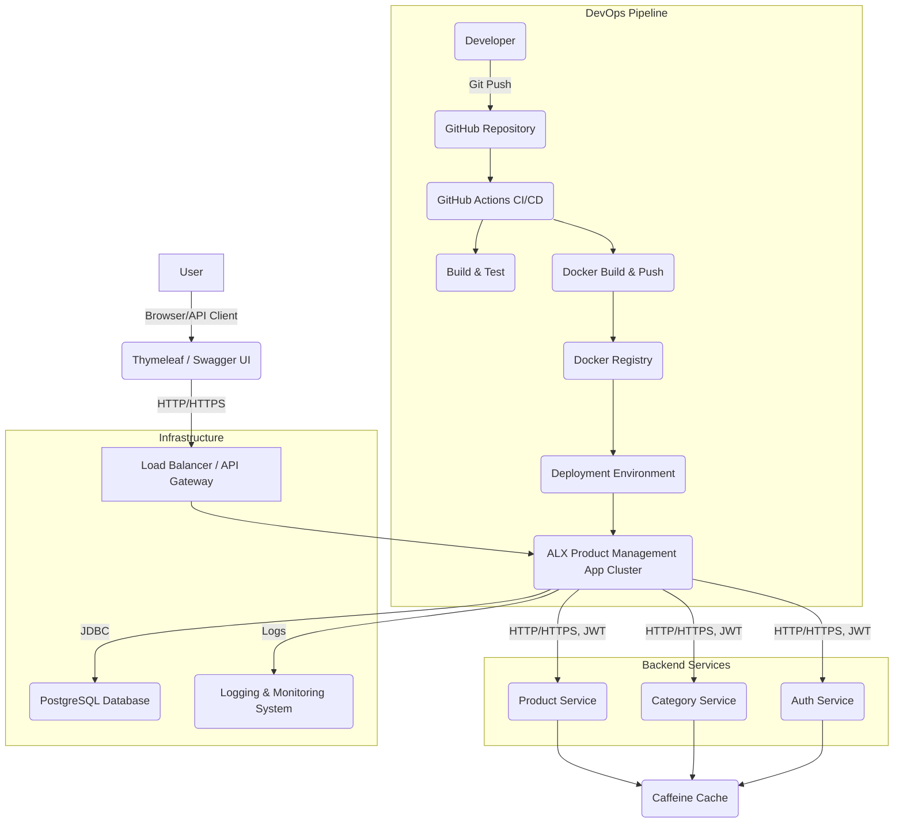

```markdown
# ALX Product Management System - Production-Ready DevOps Automation

This project demonstrates a comprehensive, production-ready DevOps automation system for a **Product Management Application**. It features a Java Spring Boot backend, PostgreSQL database, robust testing, authentication, caching, logging, Dockerization, and a full CI/CD pipeline using GitHub Actions.

## Table of Contents
1.  [Core Application Features](#1-core-application-features)
2.  [Technology Stack](#2-technology-stack)
3.  [Setup and Local Development](#3-setup-and-local-development)
    *   [Prerequisites](#prerequisites)
    *   [Running with Docker Compose (Recommended)](#running-with-docker-compose-recommended)
    *   [Running Natively (IDE)](#running-natively-ide)
4.  [API Documentation (Swagger UI)](#4-api-documentation-swagger-ui)
5.  [Authentication & Authorization](#5-authentication--authorization)
6.  [Testing](#6-testing)
7.  [Database](#7-database)
8.  [Configuration](#8-configuration)
9.  [Logging and Monitoring](#9-logging-and-monitoring)
10. [Caching and Rate Limiting](#10-caching-and-rate-limiting)
11. [CI/CD Pipeline (GitHub Actions)](#11-cicd-pipeline-github-actions)
12. [Architecture](#12-architecture)
13. [Deployment Guide](#13-deployment-guide)
14. [Code Coverage](#14-code-coverage)

---

## 1. Core Application Features

The application provides a RESTful API for managing products and categories, with user management for authentication and authorization. A minimal Thymeleaf-based frontend is provided for demonstration purposes.

*   **Product Management**:
    *   Create, Read, Update, Delete (CRUD) products.
    *   Each product is associated with a category.
    *   Endpoints: `/api/products`
*   **Category Management**:
    *   CRUD categories.
    *   Endpoints: `/api/categories`
*   **User Management**:
    *   User registration (`/api/auth/register`).
    *   User login (`/api/auth/login`) returning a JWT token.
    *   Endpoints: `/api/users` (ADMIN only)

## 2. Technology Stack

*   **Backend**: Java 17, Spring Boot 3.x
*   **Database**: PostgreSQL
*   **Build Tool**: Apache Maven
*   **Containerization**: Docker, Docker Compose
*   **CI/CD**: GitHub Actions
*   **Security**: Spring Security, JWT (JSON Web Tokens)
*   **ORM**: Spring Data JPA, Hibernate
*   **Database Migrations**: Flyway
*   **Caching**: Spring Cache with Caffeine (in-memory)
*   **API Documentation**: SpringDoc OpenAPI (Swagger UI)
*   **Testing**: JUnit 5, Mockito, Testcontainers
*   **Logging**: SLF4J + Logback
*   **Frontend (Demo)**: Thymeleaf, Bootstrap (server-side rendering)

## 3. Setup and Local Development

### Prerequisites

*   Java Development Kit (JDK) 17 or higher
*   Apache Maven 3.x
*   Docker and Docker Compose
*   Git

### Running with Docker Compose (Recommended)

This method simplifies setup by running both the application and the PostgreSQL database in Docker containers.

1.  **Clone the repository**:
    ```bash
    git clone https://github.com/your-username/alx-product-management.git
    cd alx-product-management
    ```

2.  **Build the Docker image**:
    ```bash
    docker build -t alx-product-management-app .
    ```
    *(Alternatively, the `docker-compose up --build` command will also build the image if it doesn't exist)*

3.  **Start the application and database**:
    ```bash
    docker-compose up -d
    ```
    This will:
    *   Start a PostgreSQL container named `alx-product-management-db` on port `5432`.
    *   Start the Spring Boot application container named `alx-product-management-app` on port `8080`.
    *   Flyway will automatically apply database migrations and seed data.

4.  **Verify services are running**:
    ```bash
    docker-compose ps
    ```
    You should see both `alx-product-management-app` and `alx-product-management-db` in a healthy state.

5.  **Access the application**:
    *   **Application Home**: `http://localhost:8080`
    *   **Swagger UI (API Docs)**: `http://localhost:8080/swagger-ui.html`
    *   **Spring Boot Actuator (Monitoring)**: `http://localhost:8080/actuator` (requires ADMIN role via API)

6.  **Stop and clean up**:
    ```bash
    docker-compose down
    ```
    To also remove persistent data (volumes):
    ```bash
    docker-compose down -v
    ```

### Running Natively (IDE)

If you prefer to run the application directly from your IDE:

1.  **Start a PostgreSQL database**:
    *   You can use `docker-compose up -d db` to start only the database container.
    *   Ensure your `application.properties` (or `application-dev.properties` if using dev profile) points to the correct database URL, username, and password. By default, `localhost:5432/productdb` with `admin`/`password`.

2.  **Build the project**:
    ```bash
    mvn clean install
    ```

3.  **Run the application**:
    From your IDE, run `ProductManagementApplication.java`.
    Alternatively, from the command line:
    ```bash
    java -jar target/product-management-0.0.1-SNAPSHOT.jar
    ```

    The application will start on `http://localhost:8080`.

## 4. API Documentation (Swagger UI)

Access the interactive API documentation at `http://localhost:8080/swagger-ui.html`.
This allows you to:
*   View all available API endpoints.
*   Understand request/response schemas.
*   Try out API calls directly from the browser.
*   Authenticate using JWT (Bearer Token) for protected endpoints.

## 5. Authentication & Authorization

The application uses **Spring Security** with **JWT (JSON Web Tokens)** for authentication and **Role-Based Access Control (RBAC)**.

*   **Endpoints**:
    *   `POST /api/auth/register`: Register a new user (default role: `ROLE_USER`).
    *   `POST /api/auth/login`: Authenticate an existing user and receive a JWT token.
*   **Roles**:
    *   `ROLE_USER`: Can access read-only product/category endpoints.
    *   `ROLE_ADMIN`: Can perform full CRUD operations on products and categories, manage users, and access actuator endpoints.
*   **Default Users (seeded in `V2__Add_seed_data.sql`)**:
    *   **Admin**: `username: admin`, `password: password`
    *   **User**: `username: user`, `password: password`

**How to use with Swagger UI:**
1.  Go to `http://localhost:8080/swagger-ui.html`.
2.  Click the "Authorize" button (usually a lock icon).
3.  Enter the JWT token obtained from `/api/auth/login` in the format `Bearer <YOUR_JWT_TOKEN>`.
4.  You can then execute protected endpoints. For example, use the `admin` user to get a token and then try creating a product.

## 6. Testing

The project emphasizes quality through a comprehensive testing strategy.

*   **Unit Tests**:
    *   Location: `src/test/java/.../service` and `src/test/java/.../util`
    *   Focus: Individual components (e.g., `AuthService`, `ProductService`) in isolation using Mockito for dependencies.
    *   Coverage Target: 80%+ line coverage (enforced by JaCoCo plugin in `pom.xml`).
*   **Integration Tests**:
    *   Location: `src/test/java/.../repository` and `src/test/java/.../controller`
    *   `@DataJpaTest` with **Testcontainers**: Tests the JPA layer against a real PostgreSQL instance spun up in a Docker container, ensuring repository methods and complex queries work correctly with the actual database.
    *   `@WebMvcTest`: Tests the controller layer by mocking service dependencies and Spring Security filters, verifying HTTP request/response handling.
*   **API Tests**:
    *   Included within `@WebMvcTest` integration tests to simulate HTTP requests and validate API contract.
    *   The `AuthServiceTest` and `CategoryControllerTest` are good examples.
*   **Performance Tests**:
    *   **Placeholder only**: Full performance tests (e.g., using JMeter, Gatling, k6) are outside the scope of direct code implementation for this project, but are crucial for production readiness. A `README.md` section provides guidance.

**Running Tests**:
```bash
mvn clean verify
```
This command will execute all unit and integration tests and generate a JaCoCo code coverage report in `target/site/jacoco/index.html`.

## 7. Database

*   **Database**: PostgreSQL
*   **ORM**: Spring Data JPA with Hibernate.
*   **Schema Definition**: Defined by JPA entities (`Product.java`, `Category.java`, `User.java`).
*   **Migration Scripts**: Handled by **Flyway**.
    *   Located in `src/main/resources/db/migration/`.
    *   `V1__Initial_schema.sql`: Creates initial `categories`, `products`, and `users` tables.
    *   `V2__Add_seed_data.sql`: Populates the database with initial categories, products, and default admin/user accounts.
*   **Query Optimization**:
    *   Examples like `productRepository.findByIdWithCategory()` and `findAllWithCategory()` use `JOIN FETCH` to prevent N+1 select problems.
    *   The `pom.xml` includes `spring.jpa.show-sql=true` and `format_sql=true` to easily inspect generated SQL queries during development.
    *   Indexes are implicitly created by Spring Data JPA on primary keys and unique constraints. For performance-critical columns, explicit `@Column(index = true)` or `CREATE INDEX` in Flyway scripts would be considered.

## 8. Configuration

*   **`pom.xml`**: Manages project dependencies, build plugins (Spring Boot Maven Plugin, JaCoCo, Flyway), and project metadata.
*   **`application.properties`**:
    *   Centralized configuration for database connection, server port, JWT secret, caching, logging, and Actuator settings.
    *   Includes a `dev` profile for local development variations (e.g., different database port, enabling H2 console - though currently configured for external PG even in dev).
*   **Environment Variables**: The `docker-compose.yml` and `ci-cd.yml` demonstrate passing sensitive configurations (like JWT secret) via environment variables, which is a best practice for production.

## 9. Logging and Monitoring

*   **Logging**:
    *   Uses **SLF4J** as the abstraction layer with **Logback** as the concrete implementation (default for Spring Boot).
    *   Configured in `application.properties` to log to console and a file (`application.log`).
    *   Log levels can be adjusted (e.g., `logging.level.com.alx.devops.productmanagement=DEBUG`).
    *   `@Slf4j` Lombok annotation used in classes for convenient logger injection.
*   **Monitoring (Actuator)**:
    *   **Spring Boot Actuator** is included to provide production-ready features for monitoring and managing the application.
    *   Endpoints are exposed via HTTP (e.g., `/actuator/health`, `/actuator/info`, `/actuator/metrics`).
    *   Access to `/actuator/**` endpoints is restricted to `ROLE_ADMIN` by Spring Security.
    *   In a production environment, these metrics would be collected by tools like Prometheus and visualized with Grafana, or sent to a centralized logging system like ELK (Elasticsearch, Logstash, Kibana) stack.

## 10. Caching and Rate Limiting

*   **Caching Layer**:
    *   Implemented using **Spring Cache abstraction** with **Caffeine** (a high-performance, in-memory caching library).
    *   Enabled with `@EnableCaching` in `ProductManagementApplication.java`.
    *   `AppConfig.java` configures Caffeine's eviction policy (10 minutes, max 1000 entries).
    *   `@Cacheable` and `@CacheEvict` annotations are used on service methods (e.g., `CategoryService`, `ProductService`) to cache/evict data.
*   **Rate Limiting**:
    *   A custom `RateLimitingFilter` (using Google Guava's `RateLimiter`) is implemented.
    *   It applies different rate limits based on the request URI (e.g., `/api/products` and `/api/auth`).
    *   Requests exceeding the limit receive a `429 Too Many Requests` response.
    *   This is a basic, in-memory rate limiter. For distributed systems, a solution like Redis or a cloud-provider-specific rate limiting service would be used.

## 11. CI/CD Pipeline (GitHub Actions)

The `.github/workflows/ci-cd.yml` file defines a GitHub Actions pipeline with the following stages:

1.  **Build, Test & Analyze**:
    *   Checks out the code.
    *   Sets up Java 17 and Maven.
    *   **Sets up a PostgreSQL database using Testcontainers for integration tests within the CI environment.**
    *   Builds the project with Maven (`mvn clean verify`), which includes running all unit and integration tests.
    *   Generates a JaCoCo code coverage report and uploads it as an artifact.
    *   *(Optional: Placeholder for SonarQube static code analysis.)*
2.  **Build & Push Docker Image**:
    *   Depends on successful `build-and-test`.
    *   Logs into Docker Hub (using GitHub Secrets).
    *   Builds the Docker image for the Spring Boot application.
    *   Tags the image with `latest`, SHA, branch name, and semantic versioning tags.
    *   Pushes the tagged image to Docker Hub.
3.  **Deploy to Production (Simulated)**:
    *   Depends on successful `docker-build-and-push`.
    *   This step is a **simulation** and prints out typical deployment commands.
    *   In a real-world scenario, this would involve:
        *   Connecting to a target environment (e.g., Kubernetes cluster, AWS ECS, Azure App Service).
        *   Updating deployment manifests or configurations to use the newly built Docker image.
        *   Performing a safe deployment strategy (e.g., rolling update, blue/green, canary).
        *   Monitoring deployment health and rolling back if necessary.

**GitHub Secrets Required**:
*   `DOCKER_USERNAME`: Your Docker Hub username.
*   `DOCKER_PASSWORD`: Your Docker Hub access token/password.
*   `JWT_SECRET_KEY`: A strong, base64-encoded secret key for JWT (should match `application.properties`).

## 12. Architecture

**Conceptual Architecture Diagram:**



**Key Components & Data Flow:**

1.  **Client (Browser/API Client)**: Interacts with the application via a browser (Thymeleaf UI), or directly with the REST API (e.g., Postman, Swagger UI).
2.  **Load Balancer/API Gateway**: (Conceptual, not explicitly implemented in this code but essential in production) Distributes traffic, handles TLS termination, and can provide additional security/rate limiting.
3.  **Spring Boot Application (`AppCluster`)**:
    *   **Controllers**: Handle incoming HTTP requests, perform input validation, and delegate to services.
    *   **Services**: Encapsulate business logic, interact with repositories and external components (like cache), and manage transactions.
    *   **Repositories**: Interface with the database via Spring Data JPA.
    *   **Spring Security**: Handles authentication (JWT) and authorization (role-based).
    *   **Rate Limiting Filter**: Protects API endpoints from abuse.
    *   **Caching**: Improves performance by storing frequently accessed data.
    *   **Actuator**: Provides operational endpoints for monitoring.
4.  **PostgreSQL Database (`DB`)**: Stores application data. Flyway manages schema evolution.
5.  **Logging & Monitoring System**: Logs are generated by Logback and can be collected by external systems (e.g., ELK stack, Splunk) for centralized analysis. Actuator metrics can be scraped by Prometheus and visualized in Grafana.
6.  **CI/CD Pipeline (GitHub Actions)**: Automates the process from code commit to deployment.
    *   **Build & Test**: Ensures code quality and correctness.
    *   **Docker Build & Push**: Creates immutable application artifacts.
    *   **Deployment**: Automates application rollout to production environments.

## 13. Deployment Guide

This section outlines steps for deploying the application to a production-like environment, assuming a Docker-based deployment.

### 1. **Prerequisites for Production Environment:**

*   **Server**: A Linux-based server (e.g., EC2 instance, VM) with Docker and Docker Compose installed.
*   **Network**: Appropriate firewall rules to allow incoming traffic on port 8080 (and 5432 for direct DB access, though not recommended).
*   **Secrets Management**: A secure way to manage sensitive environment variables (e.g., AWS Secrets Manager, Vault, Kubernetes Secrets). The `JWT_SECRET_KEY` is critical.
*   **PostgreSQL Instance**: While `docker-compose.yml` can run a database, for production, a managed database service (e.g., AWS RDS, Azure Database for PostgreSQL) is highly recommended for scalability, backup, and high availability.
*   **Domain and TLS**: A domain name and TLS/SSL certificates for HTTPS.

### 2. **Environment Variables**:

Ensure the following environment variables are set securely in your production environment:

*   `SPRING_DATASOURCE_URL`: JDBC URL for your production PostgreSQL database.
*   `SPRING_DATASOURCE_USERNAME`: Database username.
*   `SPRING_DATASOURCE_PASSWORD`: Database password.
*   `APPLICATION_SECURITY_JWT_SECRET_KEY`: A **strong, unique, and securely generated secret key** for JWT. **Do not use the default in `docker-compose.yml` for production.**
*   `SPRING_PROFILES_ACTIVE`: `prod` (or a specific production profile name).

### 3. **Manual Deployment Steps (Example using Docker Compose on a Server)**

This is a simplified example; actual production deployments often use Kubernetes, ECS, or similar orchestration tools.

1.  **SSH into your production server**:
    ```bash
    ssh user@your-production-server-ip
    ```

2.  **Clone the repository**:
    ```bash
    git clone https://github.com/your-username/alx-product-management.git
    cd alx-product-management
    ```

3.  **Create a `.env` file for secrets (important!)**:
    ```bash
    echo "JWT_SECRET_KEY=YOUR_PRODUCTION_JWT_SECRET_KEY_HERE" > .env
    # Add other production environment specific variables if not using managed DB.
    # If using a managed database, update docker-compose.yml to remove the 'db' service
    # and adjust the 'app' service's SPRING_DATASOURCE_URL to point to the external DB.
    ```
    Make sure to replace `YOUR_PRODUCTION_JWT_SECRET_KEY_HERE` with a truly random and strong key (e.g., generated with `head /dev/urandom | tr -dc A-Za-z0-9_ | head -c 64 | base64`).

4.  **Edit `docker-compose.yml` for Production**:
    *   **Database**:
        *   If using an external managed PostgreSQL (recommended), remove the `db` service block entirely.
        *   Update `SPRING_DATASOURCE_URL` in the `app` service's environment to point to your managed database.
    *   **Image**:
        *   Instead of `build: .`, use the pre-built image from Docker Hub:
            ```yaml
            image: your_docker_username/alx-product-management:latest # or a specific SHA tag from CI/CD
            ```
    *   **Volumes**: Consider mounting volumes for persistent logs if needed.

5.  **Pull the latest Docker image**:
    (If you updated `docker-compose.yml` to use a pre-built image)
    ```bash
    docker-compose pull
    ```

6.  **Run the application**:
    ```bash
    docker-compose up -d
    ```

7.  **Verify deployment**:
    *   Check container status: `docker-compose ps`
    *   View application logs: `docker-compose logs -f app`
    *   Access the application/Swagger UI via your server's public IP or domain name.

### 4. **CI/CD Driven Deployment (Recommended for Production)**

The `deploy` job in `.github/workflows/ci-cd.yml` outlines the steps. For a real deployment:

1.  **Kubernetes**:
    *   Use `kubectl` commands or a Kubernetes Operator to update your deployment manifest (e.g., `image: your_docker_username/alx-product-management:${{ github.sha }}`).
    *   Apply the changes: `kubectl apply -f deployment.yaml`.
    *   Integrate with Helm charts for parameterization and versioning.
    *   Configure `ingress` for external access, `Service` for internal load balancing, and `PersistentVolume` for data storage (if not using managed DB).
2.  **AWS ECS/EC2**:
    *   Push Docker image to Amazon ECR.
    *   Update ECS task definition and service to deploy the new image.
    *   For EC2, use AWS CodeDeploy or user data scripts to pull and run the new image on instances.
3.  **Monitoring**: Integrate with cloud-native monitoring (CloudWatch, Azure Monitor) or third-party tools (Prometheus, Grafana, Datadog) to track application health, performance, and logs.
4.  **Rollback**: Implement automated rollback mechanisms in your CI/CD pipeline in case of deployment failures or critical errors.

## 14. Code Coverage

The `pom.xml` includes the `jacoco-maven-plugin` which enforces a minimum of **80% line coverage** and 70% branch coverage during the `verify` phase.

To generate the report locally:
```bash
mvn clean verify
```
The report will be available at `target/site/jacoco/index.html`.
The CI/CD pipeline also uploads this report as an artifact.
```bash
```