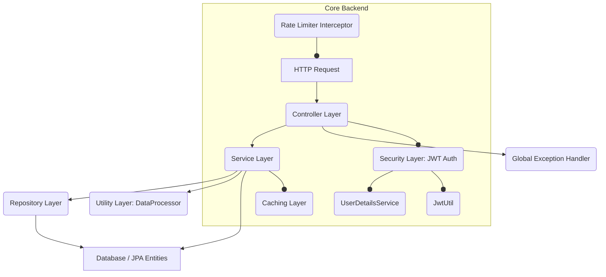

# ML Utilities System: Architecture Documentation

This document outlines the architectural design of the ML Utilities System, focusing on its components, their interactions, and the underlying infrastructure.

## 1. High-Level Architecture

The system follows a typical **client-server architecture** with a **microservices-oriented approach** (though implemented as a monolith for simplicity in this example, it's designed with modularity in mind for potential future decomposition).

```mermaid
graph TD
    A[User/Client] -->|HTTP/HTTPS| B(Frontend: HTML/JS)
    B -->|REST API (HTTP/HTTPS)| C(Backend: Spring Boot Application)
    C -->|JDBC| D(Database: PostgreSQL)
    C -->|Filesystem I/O| E(File Storage: Local/NFS/S3)
    C --o|Logs| F(Logging System)
    C --o|Cache Read/Write| G(Caching Layer: Caffeine)

    subgraph Infrastructure
        D
        E
        F
        G
    end
```

### Components:

*   **User/Client:** Interacts with the system via a web browser.
*   **Frontend:** A lightweight HTML/CSS/JavaScript client that consumes the backend REST APIs. In a production environment, this would typically be a more robust Single Page Application (SPA) built with frameworks like React, Angular, or Vue.js.
*   **Backend (Spring Boot Application):** The core of the system. A Java-based RESTful API server responsible for business logic, data processing, security, and interaction with persistent storage.
*   **Database (PostgreSQL):** Relational database for storing metadata about users, datasets, and configuration.
*   **File Storage:** A local file system (or network file system / cloud storage like S3 in production) used to store the actual uploaded dataset CSV files.
*   **Logging System:** Integrated logging (SLF4J + Logback) for monitoring application behavior and debugging.
*   **Caching Layer (Caffeine):** In-memory cache to improve performance by reducing database load for frequently accessed data.

## 2. Backend Architecture (Spring Boot)

The Spring Boot application is structured into several logical layers, adhering to principles of separation of concerns.



### Layers and Their Responsibilities:

1.  **Controller Layer (`com.mlutil.ml_utilities_system.controller`)**:
    *   Handles incoming HTTP requests and routes them to appropriate services.
    *   Performs basic request validation (e.g., using `@Valid` with DTOs).
    *   Translates Java objects to JSON/XML responses.
    *   Utilizes Spring Security annotations (`@PreAuthorize`) for method-level authorization.
    *   **Examples:** `AuthController`, `DatasetController`, `PreprocessingController`, `EvaluationController`.

2.  **Service Layer (`com.mlutil.ml_utilities_system.service`)**:
    *   Contains the core business logic.
    *   Orchestrates operations across multiple repositories and utility classes.
    *   Manages transactions.
    *   **Examples:** `AuthService`, `DatasetService`, `PreprocessingService`, `EvaluationService`.

3.  **Repository Layer (`com.mlutil.ml_utilities_system.repository`)**:
    *   Interacts directly with the database.
    *   Uses Spring Data JPA for data access operations (CRUD).
    *   Translates entity objects to database records and vice-versa.
    *   **Examples:** `UserRepository`, `DatasetRepository`, `RoleRepository`.

4.  **Model Layer (`com.mlutil.ml_utilities_system.model`)**:
    *   Defines JPA Entities, representing the structure of database tables.
    *   Defines DTOs (Data Transfer Objects) for clean API request/response structures (`com.mlutil.ml_utilities_system.dto`).
    *   **Examples:** `User`, `Dataset`, `Role`, `AuthRequest`, `DatasetMetadataDTO`.

5.  **Utility Layer (`com.mlutil.ml_utilities_system.util`)**:
    *   Contains generic helper classes that perform specific tasks, particularly the core ML algorithms.
    *   `DataProcessor.java` is a stateless component holding all the raw ML logic (scaling, encoding, metrics).
    *   `RateLimiterInterceptor.java` for API rate limiting.

6.  **Security Layer (`com.mlutil.ml_utilities_system.security`, `com.mlutil.ml_utilities_system.config.SecurityConfig`)**:
    *   Manages user authentication and authorization.
    *   Implements JWT (JSON Web Token) for stateless authentication.
    *   `JwtAuthFilter` intercepts requests to validate JWTs.
    *   `UserDetailsServiceImpl` loads user details for Spring Security.
    *   `JwtUtil` handles JWT creation and validation.

7.  **Configuration Layer (`com.mlutil.ml_utilities_system.config`)**:
    *   Houses Spring configuration classes.
    *   Configures security (`SecurityConfig`), OpenAPI/Swagger (`OpenApiConfig`), and caching (`CachingConfig`).

8.  **Error Handling (`com.mlutil.ml_utilities_system.exception`)**:
    *   `GlobalExceptionHandler` centrally processes exceptions thrown by the application and returns standardized JSON error responses to the client.
    *   Custom exceptions like `ResourceNotFoundException`, `InvalidDataException`, `UserAlreadyExistsException` enhance error clarity.

## 3. Data Flow Example: Dataset Upload

1.  **Frontend:** User selects a CSV file and clicks "Upload Dataset". `script.js` sends a `POST /api/datasets` request with `MultipartFile` and JWT.
2.  **Rate Limiter:** `RateLimiterInterceptor` checks if the user/IP has exceeded their request limit. If so, request is rejected with `429 Too Many Requests`.
3.  **Security Filter:** `JwtAuthFilter` intercepts the request, validates the JWT, and sets `SecurityContextHolder` with authenticated user details.
4.  **Controller:** `DatasetController.uploadDataset()` receives the request. `@PreAuthorize` verifies user role.
5.  **Service:** `DatasetService.saveDataset()` is called.
    *   It generates a unique filename (UUID + original name).
    *   Saves the `MultipartFile` content to the configured `upload-dir` on the file system.
    *   Creates a `Dataset` entity with metadata (original filename, file path, size, type, owner, upload date).
    *   Persists the `Dataset` entity to PostgreSQL via `DatasetRepository`.
    *   `@CacheEvict` annotation ensures the cache for this user's datasets is cleared to reflect the new addition.
6.  **Response:** The controller returns a `201 Created` status with the `DatasetMetadataDTO` of the newly uploaded dataset.

## 4. Database Schema

The database is PostgreSQL, and its schema is managed by Flyway.

*   **`users`**: Stores user authentication details (`username`, `email`, `password`, `registration_date`).
*   **`roles`**: Stores defined roles (`ROLE_USER`, `ROLE_ADMIN`).
*   **`user_roles`**: A many-to-many join table linking users to roles.
*   **`datasets`**: Stores metadata about uploaded datasets (`id`, `filename`, `file_path`, `file_size`, `file_type`, `owner_username`, `upload_date`). `file_path` points to the physical location of the CSV.

## 5. Scalability Considerations

*   **Stateless Backend:** The use of JWTs makes the backend stateless, allowing for easy horizontal scaling of the Spring Boot application instances.
*   **Database:** PostgreSQL can be scaled vertically (more powerful server) or horizontally (read replicas, sharding) depending on load.
*   **File Storage:** While local filesystem is used in this example, a production system would integrate with distributed file storage solutions like AWS S3, Google Cloud Storage, or a Network File System (NFS) for scalability and reliability.
*   **Caching:** Caffeine is an in-memory cache, suitable for single-instance applications or sticky sessions. For distributed scaling, a distributed cache (e.g., Redis, Memcached) would be necessary.
*   **Rate Limiting:** The current rate limiter is in-memory. For a multi-instance deployment, a distributed rate limiter (e.g., using Redis) would be required.

## 6. Security Considerations

*   **Authentication:** JWTs ensure secure user identity verification.
*   **Authorization:** Role-based access control restricts access to resources.
*   **Password Hashing:** Passwords are never stored in plain text; BCrypt hashing is used.
*   **Input Validation:** `jakarta.validation` annotations are used on DTOs to prevent malicious input and ensure data integrity.
*   **CORS:** Configured to allow requests from specified frontend origins.
*   **Environment Variables:** Sensitive configurations (like JWT secret key, database credentials) are externalized and should be managed via environment variables in production.

## 7. Observability

*   **Structured Logging:** Application logs provide insights into runtime behavior, errors, and performance. Configured to output to console and file, with level control.
*   **API Documentation:** Swagger UI provides a clear contract of the API, aiding debugging and integration.
*   **Health Checks:** Docker Compose includes a health check for the database. Spring Boot Actuator can be added for application health endpoints (not explicitly added in this example but highly recommended).

This architecture provides a solid foundation for a robust and maintainable ML utilities system, with clear pathways for future enhancements and scaling.
```