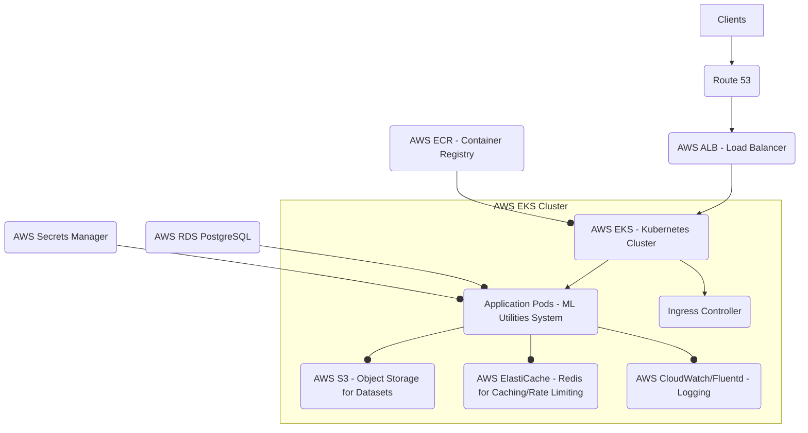

# ML Utilities System: Deployment Guide

This document provides instructions for deploying the ML Utilities System using Docker and Docker Compose for local environments, and outlines considerations for production deployment.

## 1. Local Deployment with Docker Compose

The easiest way to run the entire system (backend and PostgreSQL database) locally is using Docker Compose.

### Prerequisites:

*   **Docker Desktop** (or Docker Engine and Docker Compose installed separately)
*   **Maven** (to build the Java backend JAR)

### Steps:

1.  **Clone the repository:**
    ```bash
    git clone https://github.com/your-username/ml-utilities-system.git
    cd ml-utilities-system
    ```

2.  **Build the Spring Boot Backend JAR:**
    Navigate to the `backend` directory and build the executable JAR. This JAR will be copied into the Docker image.
    ```bash
    cd backend
    mvn clean install -DskipTests # -DskipTests to skip running tests during build
    ```
    Ensure the JAR file `ml_utilities_system-0.0.1-SNAPSHOT.jar` is created in `backend/target/`.

3.  **Navigate to the Docker directory:**
    ```bash
    cd ../docker
    ```

4.  **Start the services using Docker Compose:**
    ```bash
    docker-compose up --build -d
    ```
    *   `--build`: Rebuilds the `app` Docker image. This is important if you made changes to the Java code.
    *   `-d`: Runs the containers in detached mode (in the background).

### What `docker-compose up` does:

*   **`db` service:**
    *   Pulls the `postgres:15-alpine` Docker image.
    *   Creates a container named `ml-utilities-db`.
    *   Sets up environment variables for the PostgreSQL database (`POSTGRES_DB`, `POSTGRES_USER`, `POSTGRES_PASSWORD`).
    *   Maps port `5432` from the host to the container.
    *   Creates a named volume `ml-utilities-db-data` for persistent database storage.
    *   Includes a `healthcheck` to ensure the database is ready before the application tries to connect.
*   **`app` service:**
    *   Builds the Docker image for the Spring Boot application using the `Dockerfile` in the `docker` directory. The build context is set to the project root (`..`) to access the `backend/target/` directory.
    *   Creates a container named `ml-utilities-app`.
    *   Maps port `8080` from the host to the container.
    *   Passes essential Spring Boot and application-specific environment variables (`SPRING_DATASOURCE_URL`, `APPLICATION_SECURITY_JWT_SECRET_KEY`, etc.) to override values in `application.properties`.
        *   **Important:** The `SPRING_DATASOURCE_URL` uses `db` as the hostname, which is the service name defined in `docker-compose.yml`, allowing containers to communicate by service name within the Docker network.
    *   Creates named volumes for `/app/data/datasets`, `/app/data/temp`, and `/app/logs` to ensure persistent storage for uploaded datasets, temporary files, and application logs even if the container is removed.
    *   `depends_on: db: { condition: service_healthy }` ensures the application container only starts once the `db` container reports healthy.

### Verify Deployment:

1.  **Check running containers:**
    ```bash
    docker-compose ps
    ```
    You should see `ml-utilities-db` and `ml-utilities-app` in a healthy state.

2.  **Access the application:**
    *   Swagger UI: `http://localhost:8080/swagger-ui.html`
    *   Frontend (basic): Open `frontend/index.html` in your browser.

3.  **View logs:**
    ```bash
    docker-compose logs -f app
    ```

### Stop and Clean Up:

To stop and remove the containers, networks, and volumes created by Docker Compose:
```bash
docker-compose down -v
```
*   `-v`: Removes named volumes, which is useful for starting fresh. Be cautious if you have important data in `ml-utilities-db-data`.

## 2. Production Deployment Considerations

Deploying to production requires more robust strategies than local Docker Compose. Here are key considerations:

### Infrastructure:

*   **Container Orchestration:** Use a container orchestration platform like **Kubernetes (AWS EKS, GCP GKE, Azure AKS)**, Docker Swarm, or HashiCorp Nomad for managing containerized applications at scale.
*   **Managed Database:** Use a managed database service (e.g., AWS RDS PostgreSQL, Google Cloud SQL, Azure Database for PostgreSQL) for high availability, backups, and easier management. Avoid running the database directly in a container orchestrator for production.
*   **Object Storage for Datasets:** Store uploaded datasets in cloud object storage (e.g., **AWS S3, Google Cloud Storage, Azure Blob Storage**) instead of local filesystem volumes. This provides scalability, durability, and easier access from multiple application instances. Update `application.dataset.upload-dir` to use appropriate cloud storage configurations or libraries.
*   **Centralized Logging:** Integrate with a centralized logging solution (e.g., **ELK Stack (Elasticsearch, Logstash, Kibana)**, Splunk, Datadog) to aggregate logs from multiple application instances.
*   **Monitoring & Alerting:** Implement robust monitoring for application performance, resource utilization, and error rates (e.g., Prometheus, Grafana, CloudWatch, Stackdriver). Set up alerts for critical issues.
*   **Distributed Caching & Rate Limiting:** For multiple application instances, replace in-memory Caffeine cache and Guava RateLimiter with distributed solutions like **Redis** or Memcached.
*   **Load Balancing:** Place a load balancer (e.g., AWS ALB, Nginx, HAProxy) in front of your application instances to distribute traffic and provide high availability.

### Security:

*   **Network Security:** Implement strict firewall rules, security groups, and Network ACLs to limit access to your application and database.
*   **Secrets Management:** Use a secrets management service (e.g., **AWS Secrets Manager, HashiCorp Vault, Kubernetes Secrets**) for sensitive information like API keys, database credentials, and JWT secret key. Never hardcode them.
*   **HTTPS:** Always use HTTPS for all communication between clients, load balancers, and the application.
*   **Vulnerability Scanning:** Regularly scan your Docker images and application dependencies for known vulnerabilities.
*   **Principle of Least Privilege:** Configure IAM roles/service accounts with the minimum necessary permissions for your application to interact with cloud services.

### CI/CD:

*   **Automated Pipelines:** Leverage the provided `cicd/github-actions-ci.yml` (or similar for Jenkins, GitLab CI, Azure DevOps) to automate:
    *   Code build and testing.
    *   Docker image building and pushing to a container registry (e.g., Docker Hub, AWS ECR, GCP Container Registry).
    *   Deployment to staging and production environments (e.g., using Kubernetes manifests, Helm charts, Terraform, Ansible).
*   **Deployment Strategies:** Implement blue/green deployments or canary releases to minimize downtime and risk during updates.

### Scalability:

*   **Horizontal Scaling:** Configure your container orchestrator to automatically scale the number of application instances based on CPU utilization, request load, or custom metrics.
*   **Database Scaling:** Utilize database read replicas for read-heavy workloads. Consider sharding if your data volume becomes extremely large.

### Example Production Architecture (Kubernetes with AWS):



This guide provides a starting point for deploying the ML Utilities System. Adapting it to a full production environment will involve choosing specific cloud providers and services, and implementing robust operations best practices.
```