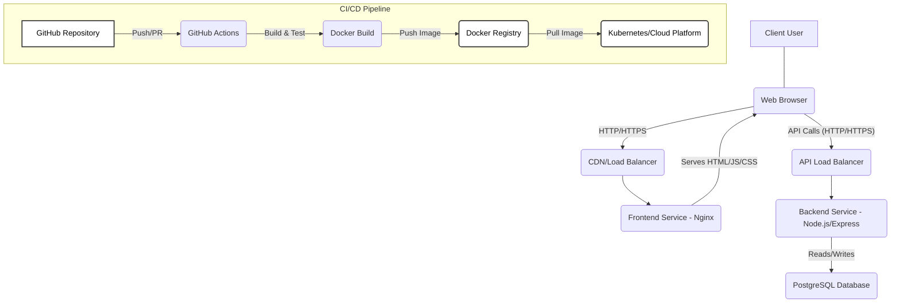

```markdown
# Architecture Documentation

This document describes the architectural overview of the "My DevOps Project" application, outlining its components, their interactions, and the design principles guiding its development.

## Table of Contents

1.  [Architectural Style](#1-architectural-style)
2.  [High-Level Diagram](#2-high-level-diagram)
3.  [Component Deep Dive](#3-component-deep-dive)
    *   [Frontend Service](#frontend-service)
    *   [Backend API Service](#backend-api-service)
    *   [Database Service](#database-service)
4.  [Data Flow and Interactions](#4-data-flow-and-interactions)
5.  [Key Architectural Decisions & Principles](#5-key-architectural-decisions--principles)
6.  [Scalability and High Availability](#6-scalability-and-high-availability)
7.  [Security Considerations](#7-security-considerations)
8.  [Observability](#8-observability)

---

## 1. Architectural Style

The application loosely follows a **Monolithic Service with Layered Architecture** for the backend, combined with a **Single-Page Application (SPA)** for the frontend. For deployment, it utilizes **Containerization** (Docker) and **Orchestration** (Docker Compose for local development, with readiness for Kubernetes in production), making it a **Microservices-ready** application.

While currently contained within a single backend service, the layered and modular design (controllers, services, repositories) facilitates future decomposition into true microservices if specific domains (e.g., user management, product catalog) require independent scaling or development teams.

---

## 2. High-Level Diagram



---

## 3. Component Deep Dive

### Frontend Service

*   **Technology**: React.js with TypeScript, Styled Components, Axios, React Router.
*   **Purpose**: Provides the interactive user interface. Handles user input, displays data, and navigates between views.
*   **Structure**: Component-based architecture (pages, components, context for state management).
*   **Deployment**: A production build of the React application generates static HTML, CSS, and JavaScript files. These are then served by an **Nginx** web server, encapsulated within a Docker container.
*   **Communication**: Communicates with the Backend API exclusively via RESTful HTTP calls using Axios.
*   **Authentication**: Manages JWT tokens (`localStorage`) for authenticated requests.

### Backend API Service

*   **Technology**: Node.js with Express.js, TypeScript, TypeORM (ORM), PostgreSQL driver (`pg`).
*   **Purpose**: Exposes RESTful API endpoints for the frontend, enforces business logic, handles data persistence, and manages security concerns like authentication and authorization.
*   **Layers**:
    *   **`config`**: Centralized configuration management for environment variables (database connection, JWT secret, cache TTL, rate limits).
    *   **`entities`**: TypeORM data models (User, Product) representing database tables.
    *   **`repositories`**: Custom TypeORM repositories extending standard CRUD with domain-specific query methods.
    *   **`services`**: Encapsulates business logic. Services are responsible for orchestrating data operations, applying business rules, and interacting with repositories. They are designed to be framework-agnostic and highly testable.
    *   **`controllers`**: Act as the entry point for API requests. They receive requests, validate input, invoke corresponding service methods, and construct HTTP responses.
    *   **`routes`**: Defines API endpoints and maps them to controller methods, applying middleware as needed.
    *   **`middleware`**:
        *   **Authentication (`authenticateToken`)**: Validates JWT tokens and attaches authenticated user information to the request.
        *   **Authorization (`authorizeRoles`)**: Checks user roles against required permissions for specific routes.
        *   **Error Handling (`errorHandler`, `notFoundHandler`)**: Catches and standardizes API error responses.
        *   **Rate Limiting (`apiRateLimiter`)**: Protects against API abuse by limiting request frequency.
        *   **Security (`helmet`, `cors`)**: Sets various HTTP security headers and manages Cross-Origin Resource Sharing.
        *   **Logging (`morgan` + `winston`)**: Logs HTTP requests and application events.
    *   **`utils`**: General-purpose utilities, including a Winston-based logger and an in-memory caching mechanism (`node-cache`).
*   **Deployment**: Dockerized Node.js application, typically run with multiple instances behind a load balancer in production.

### Database Service

*   **Technology**: PostgreSQL.
*   **Purpose**: Relational database for persistent storage of application data (e.g., user credentials, product details).
*   **Schema Management**: Managed through TypeORM migrations, allowing for controlled, versioned updates to the database schema.
*   **Seeding**: Initial data population handled by `seed.ts` script.
*   **Deployment**: Dockerized PostgreSQL container for local development. In production, a managed cloud database service (e.g., AWS RDS, Azure Database for PostgreSQL, Google Cloud SQL) is highly recommended for scalability, backup, and high availability.

---

## 4. Data Flow and Interactions

1.  **Client Request**: A user sends a request (e.g., login, fetch products) from their browser to the Frontend application (served by Nginx).
2.  **Frontend Processing**:
    *   For UI rendering or navigation, the Frontend handles it locally.
    *   For data operations, it constructs an API request using Axios.
    *   If authenticated, the JWT token is retrieved from `localStorage` and attached to the `Authorization` header.
3.  **Backend API Gateway/Load Balancer**: In production, requests hit an API Gateway or Load Balancer (e.g., Nginx, AWS ALB, Kubernetes Ingress) which routes traffic to healthy Backend API instances.
4.  **Backend API Processing**:
    *   **Middleware Chain**: The request passes through global middleware (rate limiting, security headers, logging) and then authentication/authorization middleware.
    *   **Controller**: The appropriate controller method receives the request. It extracts data, performs basic validation, and invokes the relevant service method.
    *   **Service Layer**: Executes business logic. This may involve:
        *   Checking cache (`node-cache`) for read operations.
        *   Calling repository methods for database interactions.
        *   Applying business rules (e.g., uniqueness checks for product names).
    *   **Repository Layer**: Translates service calls into TypeORM queries (which TypeORM converts to SQL).
    *   **Database Interaction**: Queries are executed against the PostgreSQL database.
    *   **Response Construction**: Data is retrieved/modified, and a response (e.g., JSON) is constructed.
5.  **Backend API Response**: The Backend API sends the HTTP response back through the middleware chain (e.g., error handler if an exception occurred) to the client.
6.  **Frontend UI Update**: The Frontend receives the response, processes the data, and updates the user interface.

---

## 5. Key Architectural Decisions & Principles

*   **Separation of Concerns**: Clear distinction between frontend (UI), backend (API, business logic), and database (persistence). Within the backend, layers for controllers, services, and repositories ensure each component has a single responsibility.
*   **Loose Coupling**: Components are designed to be independent. Frontend and backend communicate via a well-defined API contract (REST). Backend layers (`service` -> `repository` -> `entity`) are abstracted using TypeORM.
*   **Scalability**:
    *   Stateless Backend: JWT authentication allows the backend to be stateless, making it easy to scale horizontally by adding more instances.
    *   Containerization: Docker enables consistent deployment across environments and easy scaling with orchestration tools.
    *   Caching: Reduces database load, improving read performance and scalability.
*   **Security by Design**:
    *   Authentication (JWT, bcrypt) and Authorization (RBAC) are core parts of the design.
    *   Rate limiting and security headers (Helmet) protect against common web vulnerabilities.
    *   Environment variables are externalized for secure configuration.
*   **Testability**: Each layer (services, controllers, components) is designed to be independently testable with mocking capabilities, ensuring high test coverage.
*   **Maintainability**: Modular structure, clear naming conventions, TypeScript for type safety, and comprehensive documentation contribute to ease of understanding and maintenance.
*   **Observability**: Integrated logging (`Winston`, `Morgan`) provides visibility into application behavior, crucial for debugging and monitoring in production.
*   **Graceful Degradation/Resilience**: Error handling middleware ensures the application responds gracefully to errors, preventing crashes and providing informative messages.

---

## 6. Scalability and High Availability

*   **Horizontal Scaling**:
    *   **Backend**: The Node.js backend is stateless. Multiple instances can run behind a load balancer to handle increased traffic.
    *   **Frontend**: The Nginx static file server is highly performant and can also be scaled horizontally. A CDN can further distribute static assets globally.
*   **Database**: Production deployments should leverage managed cloud database services (e.g., AWS RDS PostgreSQL) which offer built-in high availability, automatic backups, read replicas, and scaling options.
*   **Caching**: The in-memory `node-cache` is per-instance. For a distributed cache across multiple backend instances, a dedicated caching service like Redis would be integrated.
*   **Load Balancing**: An external load balancer (e.g., Nginx, AWS ALB, Kubernetes Ingress) distributes traffic evenly across multiple instances of frontend and backend services.

---

## 7. Security Considerations

*   **Authentication**: JWTs are signed and verified to ensure token integrity. `bcryptjs` is used for password hashing.
*   **Authorization**: Role-based access control restricts access to sensitive endpoints and actions.
*   **Rate Limiting**: Prevents brute-force attacks and denial-of-service attempts by limiting API request frequency.
*   **Input Validation**: Although not explicitly shown in every controller for brevity, proper input validation (e.g., using libraries like `joi` or `class-validator`) is critical to prevent injection attacks and ensure data integrity.
*   **Environment Variables**: Sensitive configuration data is stored in environment variables, not in code. In production, these should be managed by secure secrets management systems.
*   **CORS**: Configured to explicitly define allowed origins, methods, and headers, preventing cross-site request forgery (CSRF) and other attacks.
*   **HTTP Headers (Helmet)**: Sets various security-related HTTP response headers to mitigate common web vulnerabilities (XSS, clickjacking, etc.).
*   **SQL Injection**: TypeORM, as an ORM, helps prevent SQL injection by parameterizing queries.
*   **Dependencies**: Regular security audits of third-party dependencies are essential. CI/CD pipelines can integrate tools like `Snyk` or `OWASP Dependency-Check`.

---

## 8. Observability

*   **Structured Logging**: `Winston` is used for application logging, `Morgan` for HTTP access logging. Logs are structured (JSON format) for easy parsing by centralized logging systems (e.g., ELK Stack, Splunk, Datadog).
*   **Error Reporting**: The global error handler captures and logs detailed error information, including stack traces, which are critical for debugging.
*   **Health Checks**: `/api/health` endpoint provides a simple way for load balancers and orchestration systems to determine the health and readiness of the backend service.
*   **Metrics (Future)**: For advanced monitoring, integrating a metrics library (e.g., `prom-client` for Prometheus) to expose custom application metrics (e.g., request latency, error rates, cache hit ratios) would be the next step.
```