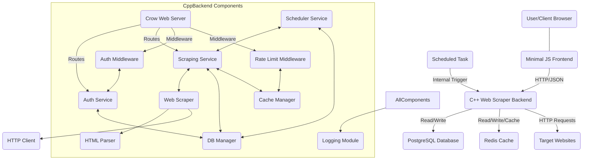

# Architecture Document

This document provides a high-level overview of the Web Scraping Tools System's architecture, describing its main components and their interactions.

## 1. High-Level Overview

The system follows a microservice-like architecture, with a core C++ backend service interacting with external data stores (PostgreSQL, Redis) and a minimal client-side frontend. It's designed for scalability, performance, and maintainability.

## 2. Core Components

### 2.1. C++ Web Scraper Backend

This is the heart of the system, responsible for handling API requests, business logic, and orchestrating the scraping process.

*   **Crow Web Server (`crow::App`)**:
    *   **Purpose**: Provides the RESTful API endpoints.
    *   **Technology**: `Crow` C++ microframework.
    *   **Responsibilities**: Request routing, HTTP request/response handling, integrating middleware.
*   **Authentication Service (`AuthService`)**:
    *   **Purpose**: Manages user registration, login, and JWT token generation/validation.
    *   **Responsibilities**: Hashing passwords (using `cryptopp` SHA256 as placeholder, replace with Argon2/Bcrypt), verifying credentials, encoding/decoding JWTs (`jwt-cpp`).
    *   **Interactions**: `UserRepository` for user data.
*   **Scraping Service (`ScrapingService`)**:
    *   **Purpose**: Orchestrates the entire scraping workflow for a job, including fetching, parsing, storing, and caching.
    *   **Responsibilities**: Managing CRUD operations for `ScrapeJob` and `ScrapedItem` entities, delegating to `WebScraper` for actual data extraction, interacting with `CacheManager`.
    *   **Interactions**: `WebScraper`, `ScrapeJobRepository`, `ScrapedItemRepository`, `CacheManager`.
*   **Scheduler Service (`SchedulerService`)**:
    *   **Purpose**: A background thread that periodically checks for scheduled scrape jobs and triggers them.
    *   **Responsibilities**: Reading `cron_schedule` from `ScrapeJob`s, determining if a job is due, and initiating a scrape via `ScrapingService`.
    *   **Interactions**: `ScrapeJobRepository`, `ScrapingService`.
*   **Web Scraper (`WebScraper`)**:
    *   **Purpose**: Executes a single scraping task for a given `ScrapeJob`.
    *   **Responsibilities**: Making HTTP requests to target URLs, parsing HTML content, extracting data based on defined selectors.
    *   **Interactions**: `HttpUtils`, `HTMLParser`.
*   **HTML Parser (`HTMLParser`)**:
    *   **Purpose**: Parses raw HTML content into a navigable DOM-like structure.
    *   **Technology**: `gumbo-parser` (Google's HTML5 parser).
    *   **Responsibilities**: Converting `Gumbo`'s C-style tree into a C++ object model (`HTMLNode`), providing simplified traversal and selection capabilities.
*   **HTTP Client Utilities (`HttpUtils`)**:
    *   **Purpose**: Handles outgoing HTTP requests to target websites.
    *   **Technology**: `cURLpp` (C++ wrapper for `libcurl`).
    *   **Responsibilities**: Making GET/POST requests, handling response codes, setting headers.
*   **Database Manager (`DatabaseManager`)**:
    *   **Purpose**: Manages database connections and provides session management.
    *   **Technology**: `soci` (C++ Database Access Library) with PostgreSQL backend.
    *   **Responsibilities**: Initializing connection pool, providing `soci::session` objects, handling transaction management (implicitly through `soci`'s session lifecycle).
*   **Repositories (`UserRepository`, `ScrapeJobRepository`, `ScrapedItemRepository`)**:
    *   **Purpose**: Abstract database access for specific data models.
    *   **Responsibilities**: CRUD (Create, Read, Update, Delete) operations, mapping C++ objects to database rows and vice versa.
    *   **Interactions**: `DatabaseManager`.
*   **Cache Manager (`CacheManager`)**:
    *   **Purpose**: Provides an interface for interacting with the Redis caching layer.
    *   **Technology**: `hiredis` (C client for Redis, wrapped in C++).
    *   **Responsibilities**: Storing and retrieving key-value pairs, setting TTLs, managing Redis connection.
*   **Logging Module (`Logger`)**:
    *   **Purpose**: Centralized logging for the entire application.
    *   **Technology**: `spdlog`.
    *   **Responsibilities**: Outputting structured logs to console and file, supporting various log levels.

### 2.2. Middleware

*   **Authentication Middleware (`AuthMiddleware`)**:
    *   **Purpose**: Protects API routes by validating JWT tokens.
    *   **Responsibilities**: Extracts token from `Authorization` header, decodes and verifies it using `AuthService`, injects authenticated user information into the request context.
*   **Error Handling Middleware (`ErrorMiddleware`)**:
    *   **Purpose**: Catches unhandled exceptions and ensures consistent, well-formatted error responses.
    *   **Responsibilities**: Transforms exceptions into appropriate HTTP status codes and JSON error messages.
*   **Rate Limiting Middleware (`RateLimitMiddleware`)**:
    *   **Purpose**: Prevents abuse by limiting the number of requests from a client (IP address) within a time window.
    *   **Technology**: Leverages `CacheManager` (Redis) for storing request counts and expiry.
    *   **Responsibilities**: Counts requests, applies limits, sends `429 Too Many Requests` responses when limits are exceeded.

### 2.3. Database (PostgreSQL)

*   **Purpose**: Persistent storage for all application data.
*   **Data Models**:
    *   `users`: Stores user credentials and roles.
    *   `scrape_jobs`: Stores definitions of scraping tasks (target URL, selectors, schedule).
    *   `scraped_items`: Stores the actual data extracted from target websites.
*   **Features**: Transactions, indexing for query optimization, `updated_at` triggers.

### 2.4. Cache (Redis)

*   **Purpose**: High-speed, in-memory data store for caching frequently accessed data and supporting rate limiting.
*   **Usage**:
    *   Caching results of recent scrapes to reduce redundant scraping of static content.
    *   Storing request counts and timestamps for rate limiting.

### 2.5. Frontend (Minimal JS/HTML)

*   **Purpose**: A basic client-side interface for interacting with the C++ API.
*   **Technology**: HTML, CSS, JavaScript (using `fetch` API).
*   **Responsibilities**: User authentication forms, job creation forms, displaying job lists and scraped data.

## 3. Data Flow Example: Creating and Executing a Scrape Job

1.  **User Interaction**: A user logs into the frontend and submits a form to create a new scrape job (e.g., target URL, selectors, schedule).
2.  **Frontend Request**: The frontend sends a `POST /api/jobs` request to the C++ backend with the job details in JSON, including the user's JWT in the `Authorization` header.
3.  **Authentication Middleware**: `AuthMiddleware` intercepts the request, validates the JWT. If valid, the user's ID and role are added to the request context. If invalid, a `401 Unauthorized` response is sent.
4.  **Scrape Job Controller**: The request is routed to `ScrapeJobController`. It parses the JSON body into a `ScrapeJob` object and calls `ScrapingService::create_job()`.
5.  **Scraping Service**: `ScrapingService` validates the job data and calls `ScrapeJobRepository::create_job()`.
6.  **Scrape Job Repository**: `ScrapeJobRepository` uses `DatabaseManager` to acquire a `soci::session` from the pool, inserts the `ScrapeJob` into the `scrape_jobs` table, and returns the newly created job (with ID).
7.  **Response**: The `ScrapeJobController` formats the new job as JSON and returns a `201 Created` response to the frontend.
8.  **Scheduler Loop**: Periodically (e.g., every 5 minutes), the `SchedulerService` wakes up.
9.  **Job Due Check**: `SchedulerService` retrieves all active jobs from `ScrapeJobRepository` and, for each job, uses its internal cron parser (or a library) to check if `job.cron_schedule` indicates it's `due` based on `job.last_run_at`.
10. **Trigger Scrape**: If a job is due, `SchedulerService` calls `ScrapingService::trigger_scrape()`. This is done asynchronously using `std::async` to avoid blocking the scheduler.
11. **Perform Scrape**: The `ScrapingService`'s background task:
    a.  Updates the job status in the database to `RUNNING`.
    b.  Checks `CacheManager` for a cached result for this job. If found and fresh enough, it might skip actual scraping and retrieve from cache (not fully implemented in this example for item serialization, but conceptually valid).
    c.  Calls `WebScraper::scrape(job)`.
12. **Web Scraping**: `WebScraper`:
    a.  Uses `HttpUtils` to fetch `job.target_url`.
    b.  If successful, `HTMLParser` parses the response body into an `HTMLNode` tree.
    c.  `WebScraper` then traverses the `HTMLNode` tree, applying `job.selectors` to extract data.
13. **Store Scraped Items**: Extracted data is packaged into `ScrapedItem` objects.
14. **Save Items**: `ScrapingService` calls `ScrapedItemRepository::create_item()` for each extracted item. `ScrapedItemRepository` uses `DatabaseManager` to insert these items into the `scraped_items` table.
15. **Update Job Status**: Finally, `ScrapingService` updates the `ScrapeJob`'s status to `COMPLETED` (or `FAILED` if errors occurred), `last_run_at`, and `next_run_at` in the database.

## 4. Scalability Considerations

*   **Horizontal Scaling**: The C++ backend can be scaled horizontally by running multiple instances behind a load balancer. Redis and PostgreSQL are already external, stateful services.
*   **Job Queue**: For very high-volume scraping, a dedicated message queue (e.g., RabbitMQ, Kafka) could be introduced to decouple `ScrapingService` from direct job triggering, allowing workers to pull jobs.
*   **Concurrency**: Crow is multithreaded, handling multiple API requests concurrently. The `SchedulerService` triggers scrapes using `std::async`, running them in separate threads.
*   **Database Scaling**: PostgreSQL can be scaled with replication (read replicas) and sharding for larger datasets.
*   **Redis Cluster**: For high availability and performance, Redis can be deployed as a cluster.

## 5. Security Considerations

*   **Input Validation**: All API inputs must be thoroughly validated to prevent injection attacks (SQL, XSS, etc.).
*   **Password Hashing**: Strong, modern hashing algorithms like Argon2 or Bcrypt should be used for passwords (placeholder SHA256 in current `AuthService` should be replaced).
*   **JWT Security**: JWT secrets must be strong and kept confidential. Tokens should have appropriate expiration times.
*   **Access Control**: Role-Based Access Control (RBAC) is implemented via `AuthMiddleware` and controller logic.
*   **Rate Limiting**: Mitigates brute-force attacks and denial-of-service attempts.
*   **HTTPS**: All communication (frontend-backend, backend-target website if possible) should use HTTPS in production.
*   **Dependency Management**: Regularly update libraries to patch security vulnerabilities.

This architecture provides a solid foundation for an enterprise-grade web scraping system, with clear separation of concerns and extensibility.