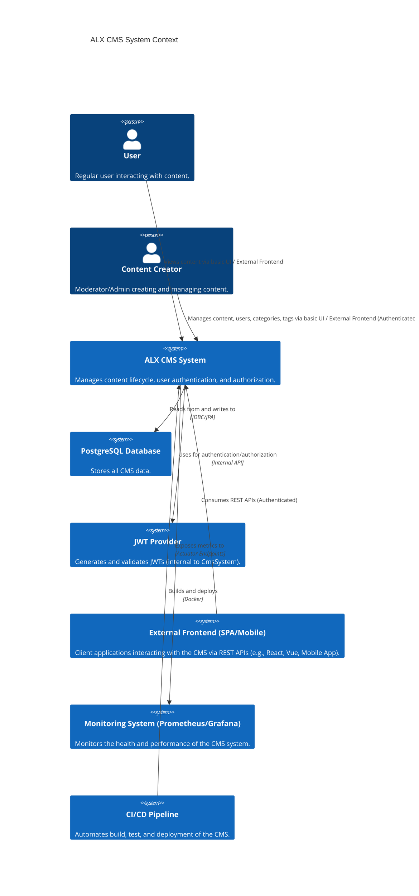

```markdown
# Architecture Document for ALX Production-Ready CMS System

This document outlines the architectural design of the ALX CMS, focusing on its structure, components, interactions, and key design principles.

## 1. Introduction

The ALX CMS is designed as a robust, scalable, and maintainable content management solution. It follows an API-first approach, leveraging the Spring Boot ecosystem for backend development and providing flexibility for various frontend integrations.

## 2. System Overview

The CMS is a monolithic application in terms of deployment (a single JAR/Docker image) but internally follows a layered, modular design. It primarily serves RESTful APIs to clients and includes a basic server-side rendered UI for demonstration and quick administrative access.

**Key Components:**

*   **Backend (Spring Boot):** The core application logic, data management, security, and API exposure.
*   **Database (PostgreSQL):** Persistent storage for all CMS data.
*   **Cache (Caffeine):** In-memory caching for performance optimization.

## 3. High-Level Architecture (C4 Model - System Context)



## 4. Container Diagram (Deployment View)

```mermaid
C4Container
    title ALX CMS Container Diagram
    System_Boundary(CmsDeployment, "ALX CMS Deployment") {
        Container(CmsApp, "CMS Application", "Spring Boot (Java 17)", "Provides REST APIs for content, users, auth; serves basic Thymeleaf UI.")
        Container(PostgresDb, "PostgreSQL Database", "PostgreSQL 15", "Stores all persistent data (content, users, roles, categories, tags).")
    }
    Container(ExternalClient, "External Frontend / Client", "Web Browser, Mobile App, Postman", "Interacts with CMS APIs to display and manage content.")
    Container(Monitoring, "Monitoring Stack", "Prometheus, Grafana", "Collects metrics and visualizes system health and performance.")

    Rel(ExternalClient, CmsApp, "Makes API calls to", "HTTPS/HTTP REST")
    Rel(CmsApp, PostgresDb, "Performs CRUD operations on", "JDBC/JPA")
    Rel(CmsApp, Monitoring, "Exposes metrics for", "HTTP (Actuator)")

    Rel_Neighbor(ExternalClient, CmsApp, "Accesses API and UI")
    Rel_Neighbor(CmsApp, PostgresDb, "Data Persistence")
    Rel_Neighbor(CmsApp, Monitoring, "Operational Visibility")
```

## 5. Component Diagram (Internal Structure of CMS Application)

```mermaid
C4Component
    title ALX CMS Application Component Diagram
    Container(CmsApp, "CMS Application", "Spring Boot (Java 17)", "Handles all backend logic.") {
        Component(AuthModule, "Authentication & Authorization Module", "Spring Security, JWT", "Handles user login, token generation, and access control.")
        Component(UserModule, "User Management Module", "Spring Data JPA, UserService, UserController", "Manages user accounts and roles.")
        Component(ContentModule, "Content Management Module", "Spring Data JPA, ContentService, ContentController", "Manages content lifecycle (CRUD), categories, tags.")
        Component(CommonModule, "Common Utilities & Exception Handling", "GlobalExceptionHandler, SlugUtil, RateLimitInterceptor", "Cross-cutting concerns and helper utilities.")
        Component(ConfigModule, "Configuration & Infrastructure", "Spring Configs, CacheConfig, OpenAPIConfig", "Defines application-wide settings and infrastructure components.")
        Component(ThymeleafUI, "Basic Thymeleaf UI", "Thymeleaf, HomeController", "Simple server-side rendered UI for basic interaction/admin.")
        Component(CacheLayer, "Caching Layer", "Spring Cache, Caffeine", "Optimizes performance by caching frequently accessed data.")
    }
    ContainerDb(PostgreSQL, "PostgreSQL Database", "Relational Database", "Persistent storage.")
    
    Rel(AuthModule, UserModule, "Authenticates and authorizes based on user roles")
    Rel(ContentModule, UserModule, "Associates content with authors")
    Rel(AuthModule, PostgreSQL, "Stores user credentials and roles")
    Rel(UserModule, PostgreSQL, "Performs CRUD on Users/Roles")
    Rel(ContentModule, PostgreSQL, "Performs CRUD on Content/Categories/Tags")
    Rel(ContentModule, CacheLayer, "Caches content data")
    Rel(UserModule, CacheLayer, "Caches user data (optional)")
    Rel(ThymeleafUI, ContentModule, "Displays content to users (via internal calls or API)")
    Rel(ThymeleafUI, AuthModule, "Handles login/logout for UI")
    Rel(AuthModule, ConfigModule, "Uses security configurations")
    Rel(ContentModule, CommonModule, "Uses utilities (slug generation) and handles exceptions")
    Rel(CmsApp, PostgreSQL, "Utilizes for persistent storage")
```

## 6. Data Model

The core entities are:

*   **User:** Represents a system user with authentication credentials and roles.
*   **Role:** Defines access privileges (e.g., ADMIN, MODERATOR, USER).
*   **Content:** The central piece of information (e.g., article, blog post) with title, body, slug, author, category, and tags.
*   **Category:** Hierarchical or flat grouping for content.
*   **Tag:** Keywords associated with content for flexible organization.

Relationships:

*   `User` has `Many-to-Many` `Role`s.
*   `Content` has `Many-to-One` `Author` (`User`).
*   `Content` has `Many-to-One` `Category`.
*   `Content` has `Many-to-Many` `Tag`s.

## 7. Key Design Principles

*   **Separation of Concerns:** Clear distinction between presentation, business logic, and data access layers.
*   **Loose Coupling:** Components interact through well-defined interfaces (e.g., DTOs, services).
*   **High Cohesion:** Related functionalities are grouped within modules.
*   **API-First Design:** Prioritizing API development to support diverse client applications.
*   **Security by Design:** Implementing authentication, authorization, and secure coding practices from the outset.
*   **Testability:** Designing components to be easily unit and integration tested.
*   **Scalability:** Stateless JWT authentication and caching facilitate horizontal scaling.
*   **Maintainability:** Readable code, consistent style, and comprehensive documentation.

## 8. Cross-Cutting Concerns

*   **Security:** Spring Security filters handle authentication, and `@PreAuthorize` handles authorization.
*   **Logging:** Centralized logging with Logback.
*   **Error Handling:** Global exception handler (`@ControllerAdvice`) for consistent API error responses.
*   **Validation:** JSR 303/349 (Bean Validation) annotations ensure data integrity at the API boundary.
*   **Caching:** Spring's caching abstraction with Caffeine improves read performance.
*   **Rate Limiting:** A `HandlerInterceptor` (conceptual) can prevent abuse and ensure fair usage.

## 9. Future Considerations

*   **Microservices:** For very large-scale systems, content management, user management, and other modules could be separated into independent microservices.
*   **CDN Integration:** For serving static assets (images, videos) associated with content.
*   **Full-text Search:** Integration with Elasticsearch or Apache Solr for advanced content search capabilities.
*   **Version Control for Content:** Tracking changes and revisions for content.
*   **Workflow Management:** For content approval processes (draft -> review -> publish).
*   **Internationalization (i18n):** Support for multiple languages.
*   **Cloud Storage:** Storing content assets (images, files) in object storage like AWS S3 or Azure Blob Storage.
```