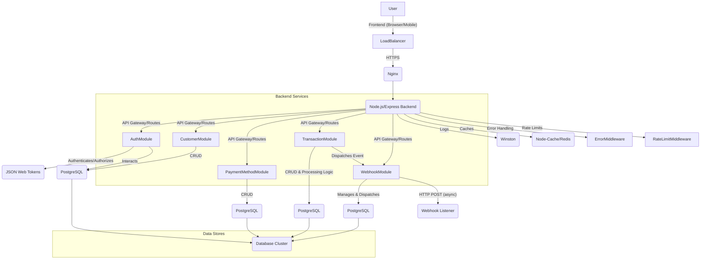

# Payment Processing System Architecture

This document outlines the high-level architecture of the Payment Processing System, detailing its components, their interactions, and the overall design principles.

## 1. High-Level Overview

The system is a modular, API-driven application designed to handle payment-related operations. It consists of a Node.js/Express backend, a PostgreSQL database, and a simple frontend for demonstration. It leverages microservices-like module separation, allowing for eventual scaling of individual components.

## 2. Architectural Layers

### 2.1. Client Layer
*   **Frontend (Browser/Mobile):** A basic HTML/CSS/JavaScript interface provided in `public/` demonstrates interaction with the API. In a real-world scenario, this would be a full-fledged SPA (React, Angular, Vue) or mobile application.
*   **Other Integrations:** Any third-party systems or partner applications consuming the API.

### 2.2. API Gateway / Web Server (Nginx/Load Balancer)
*   Handles incoming requests, potentially performs SSL termination, load balancing, and static file serving.
*   **Implementation:** `docker-compose.yml` includes a simple setup for the Node.js app, but a production deployment would have Nginx in front.

### 2.3. Backend Application (Node.js/Express)
The core logic is built with Node.js and Express. It follows a modular, layered architecture:

#### a. Entry Point (`server.js`, `app.js`)
*   `server.js`: Starts the HTTP server, connects to the database, and handles global process events (unhandled rejections, uncaught exceptions).
*   `app.js`: Configures the Express application, applies global middleware (CORS, JSON parsing, logging, rate limiting), sets up API routes, serves static assets, and defines the global error handler.

#### b. Middleware Layer (`src/middleware/`)
*   **Authentication (`auth.js`):** JWT-based authentication for securing API endpoints. Includes `protect` (verifies token) and `authorize` (checks user roles).
*   **Error Handling (`errorHandler.js`):** Centralized middleware to catch and format operational errors (`AppError`) and programming errors.
*   **Logging (`logger.js`):** Integrates Winston for structured application logging and Morgan for HTTP request logging.
*   **Rate Limiting (`rateLimiter.js`):** Protects against brute-force attacks and API abuse.
*   **Caching (`cache.js`):** An in-memory cache (Node-cache) for reducing database load on frequently accessed static or slowly changing data.

#### c. Modules Layer (`src/modules/`)
Each major functional area is encapsulated in its own module, promoting separation of concerns and maintainability. Each module typically contains:
*   **Controllers (`/controllers`):** Handle incoming requests, validate input, call services, and send responses. Minimal business logic here.
*   **Services (`/services`):** Contain the primary business logic, interact with the database (via models), and orchestrate operations. This is where most algorithms and data processing reside.
*   **Routes (`/routes`):** Define API endpoints and link them to controller methods, applying specific middleware as needed.

**Key Modules:**
*   **Auth:** User signup, login, password management.
*   **Customers:** CRUD operations for managing customer accounts.
*   **Payment Methods:** Storing and retrieving customer payment instrument details (e.g., card last 4 digits, expiry).
*   **Transactions:** Core payment processing logic (initiate, update status, retrieve). Includes simulating external payment gateway interactions.
*   **Webhooks:** Managing webhook subscriptions for customers and dispatching events to their registered URLs.

#### d. Utilities Layer (`src/utils/`)
*   **Validators (`/validators`):** Joi schemas for request body validation.
*   **Helpers (`helpers.js`):** Common utility functions (e.g., ID generation, `catchAsync`).
*   **AppError (`appError.js`):** Custom error class for operational errors.

### 2.4. Database Layer (PostgreSQL with Sequelize)
*   **ORM:** Sequelize is used for interacting with PostgreSQL, providing an abstraction layer over raw SQL queries.
*   **Models (`src/db/models/`):** Define the structure of data entities (Customer, Transaction, PaymentMethod, WebhookEndpoint, WebhookEvent), including associations, validations, and lifecycle hooks (e.g., password hashing).
*   **Migrations (`src/db/migrations/`):** Manage database schema changes over time, ensuring consistency across environments.
*   **Seeders (`src/db/seeders/`):** Populate the database with initial data (e.g., admin user, test data).
*   **Query Optimization:** Models are designed with appropriate data types and relationships. Migrations include adding indexes to frequently queried columns to improve read performance.

## 3. Data Flow (Example: Creating a Transaction)

1.  **Client Request:** A customer (or admin) sends a `POST /api/v1/transactions` request with transaction details (amount, customer ID, payment method ID).
2.  **Middleware:**
    *   `morganMiddleware`: Logs the incoming HTTP request.
    *   `rateLimiter`: Checks if the client has exceeded request limits.
    *   `protect`: Verifies the JWT token in the `Authorization` header.
    *   `authorize`: Checks if the authenticated user has permission to create transactions.
3.  **Controller (`transactionController.createTransaction`):**
    *   Validates the request body using Joi schema.
    *   Calls `transactionService.createTransaction`.
4.  **Service (`transactionService.createTransaction`):**
    *   Fetches `Customer` and `PaymentMethod` records from the database using Sequelize models.
    *   Performs business logic checks (e.g., payment method valid for customer).
    *   Creates a new `Transaction` record in the database with status 'pending'.
    *   **Asynchronous Processing Simulation:** Initiates a `setTimeout` to simulate an external payment gateway processing the transaction. This function later updates the transaction status to 'completed' or 'failed'.
    *   **Webhook Dispatch:** Upon status update, `webhookService.dispatchWebhookEvent` is called.
5.  **Webhook Service (`webhookService.dispatchWebhookEvent`):**
    *   Retrieves all `WebhookEndpoints` subscribed to `transaction.status_updated` for the relevant customer.
    *   Creates `WebhookEvent` records (status 'pending') for each subscribed endpoint.
    *   Asynchronously attempts to send the webhook payload to the registered `url`s. Implements retry logic if delivery fails.
6.  **Response:** The `transactionController` sends a `201 Created` response to the client with the initial 'pending' transaction details.
7.  **Error Handling:** If any step encounters an error, it's caught by `catchAsync` and propagated to `errorHandler.js`, which sends a standardized error response.

## 4. Security Considerations

*   **Authentication:** JWT with secure secret and proper expiration.
*   **Authorization:** Role-based access control (RBAC) enforced by middleware.
*   **Input Validation:** Joi schemas at the controller level to prevent invalid data from reaching business logic.
*   **Password Hashing:** `bcryptjs` for all user passwords.
*   **HTTPS:** Assumed in production (handled by Nginx/Load Balancer).
*   **Environment Variables:** Sensitive configurations loaded from `.env` and not hardcoded.
*   **Webhook Security:** Provision for webhook signing (`secret`) to allow recipients to verify event authenticity.
*   **Rate Limiting:** Prevents abuse.

## 5. Scalability and Reliability

*   **Modular Design:** Facilitates independent development, testing, and potential deployment of modules as microservices.
*   **Stateless API:** Each request contains all information needed, simplifying scaling of the Node.js application.
*   **Database:** PostgreSQL can be scaled vertically (more powerful server) or horizontally (read replicas, sharding) for high availability and performance.
*   **Caching:** Reduces database load for frequently accessed data.
*   **Asynchronous Processing:** Payment processing and webhook dispatch are non-blocking operations, improving responsiveness.
*   **Logging & Monitoring:** Essential for identifying bottlenecks and operational issues.
*   **Containerization:** Docker allows consistent environments from development to production and simplifies scaling with orchestrators like Kubernetes.

This architecture provides a solid foundation for a robust and extensible payment processing system.