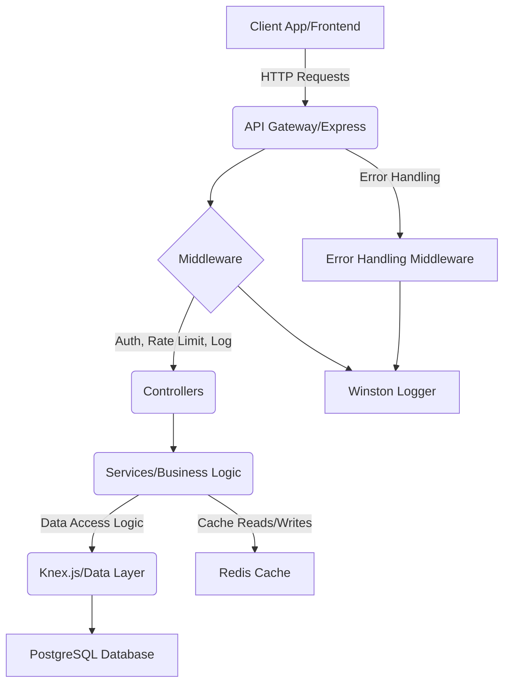

# Payment Processing System

A comprehensive, production-ready payment processing system built with Node.js (Express), PostgreSQL, and Redis. This project aims to demonstrate a full-scale backend application, adhering to best practices for architecture, security, testing, and deployment, with a strong focus on core programming logic and algorithm design, as aligned with ALX Software Engineering precourse materials.

## Features

*   **User Management**: Registration, login, user profiles (CRUD).
*   **Account Management**: Create and manage financial accounts for users.
*   **Transaction Management**: Core logic for debit, credit, fees, refunds. Atomicity ensured via database transactions.
*   **Payment Processing**: High-level API for initiating, capturing (simplified), and refunding payments, including idempotency.
*   **Authentication & Authorization**: JWT-based authentication, role-based authorization (`user`, `admin`).
*   **Data Validation**: Robust input validation using Joi.
*   **Error Handling**: Centralized error handling middleware with custom `ApiError`.
*   **Logging**: Structured logging with Winston for development and production environments.
*   **Caching**: Redis integration for frequently accessed data (e.g., user profiles, account details).
*   **Rate Limiting**: Protects API endpoints from abuse and brute-force attacks.
*   **Database**: PostgreSQL with Knex.js for migrations and seeding.
*   **Containerization**: Docker and Docker Compose for easy setup and deployment.
*   **CI/CD**: GitHub Actions workflow for automated testing and deployment.
*   **Testing**: Unit, Integration, and API tests using Jest and Supertest, with performance testing outlines using K6.
*   **Documentation**: Comprehensive README, API documentation (Swagger/OpenAPI), and architecture overview.

## Technologies Used

*   **Backend**: Node.js, Express.js
*   **Database**: PostgreSQL
*   **ORM/Query Builder**: Knex.js
*   **Caching**: Redis
*   **Authentication**: JSON Web Tokens (JWT), Bcrypt.js
*   **Validation**: Joi
*   **Logging**: Winston
*   **Rate Limiting**: `express-rate-limit`
*   **Containerization**: Docker, Docker Compose
*   **Testing**: Jest, Supertest, K6 (for performance)
*   **Documentation**: Swagger/OpenAPI
*   **CI/CD**: GitHub Actions

## Architecture Overview

The system follows a layered architecture:

1.  **Client Layer (Frontend)**: A simple HTML/JS client demonstrates interaction with the API.
2.  **API Layer (Controllers & Routes)**: Express.js handles incoming HTTP requests, validates inputs, and delegates to services.
    *   **Middleware**: Handles cross-cutting concerns like authentication, authorization, logging, error handling, and rate limiting.
3.  **Business Logic Layer (Services)**: Contains the core business rules and data manipulation logic. This layer interacts with the Data Access Layer. Key payment algorithms for balance updates, transaction status transitions, and idempotency are implemented here.
4.  **Data Access Layer (Knex.js)**: Abstracts database interactions, providing methods to perform CRUD operations on entities.
5.  **Database Layer (PostgreSQL & Redis)**:
    *   **PostgreSQL**: Primary data store for users, accounts, and transactions, ensuring data integrity and durability.
    *   **Redis**: In-memory data store used for caching frequently accessed data to improve performance.


```mermaid
graph TD
    A[Client App/Frontend] -->|HTTP Requests| B(API Gateway/Express)
    B --> C{Middleware}
    C -->|Auth, Rate Limit, Log| D(Controllers)
    D --> E(Services/Business Logic)
    E -->|Data Access Logic| F(Knex.js/Data Layer)
    F --> G[PostgreSQL Database]
    E -- Cache Reads/Writes --> H[Redis Cache]
    C --> I[Winston Logger]
    B -- Error Handling --> J[Error Handling Middleware]
    J --> I
```

## Setup and Installation

### Prerequisites

*   Node.js (v18 or higher)
*   npm (v8 or higher)
*   Docker and Docker Compose
*   PostgreSQL client (optional, for direct DB access)
*   Redis client (optional, for direct Redis access)

### 1. Clone the repository

```bash
git clone https://github.com/your-username/payment-processing-system.git
cd payment-processing-system
```

### 2. Environment Variables

Create a `.env` file in the root directory by copying from `.env.example`:

```bash
cp .env.example .env
```

Edit the `.env` file with your desired configurations. **Crucially, change `JWT_SECRET` to a strong, unique value for production.**

```ini
# .env
# ... (see .env.example for full content)
JWT_SECRET=your_strong_random_jwt_secret_here
DB_USER=myuser
DB_PASSWORD=mypassword
DB_NAME=my_payment_db
REDIS_PASSWORD=  # Leave empty if no password, or set a strong one
# ...
```

### 3. Install Dependencies

```bash
npm install
```

### 4. Database Setup (using Docker Compose)

Start the PostgreSQL and Redis containers using Docker Compose:

```bash
docker-compose up -d db redis
```

This will start the `db` and `redis` services in detached mode.

### 5. Run Migrations and Seeds

Once the database container is running, apply the database migrations and seed initial data:

```bash
npm run db:migrate
npm run db:seed
```

**Note**: If you want to reset your database at any point (e.g., for development), you can use:
`npm run db:reset` (this rolls back, migrates, and seeds).

### 6. Start the Application

You can start the application directly or via Docker Compose.

**Option A: Run Directly (for development)**

```bash
npm run dev
```

This will start the application with `nodemon`, which automatically restarts the server on code changes. The API will be available at `http://localhost:3000`.

**Option B: Run via Docker Compose (recommended for testing/production simulation)**

```bash
docker-compose up -d app
```

This builds the `app` Docker image (if not already built) and starts the container. The API will be available at `http://localhost:3000`.

To stop all services:
```bash
docker-compose down
```

## API Documentation (Swagger)

Once the application is running, you can access the interactive API documentation at:
`http://localhost:3000/api-docs`

This provides detailed information about all available endpoints, request/response schemas, and allows you to test the API directly from your browser.

## Testing

The project includes comprehensive tests covering unit, integration, and API aspects.

### Running Tests

```bash
npm test                # Runs all tests
npm run test:unit       # Runs unit tests only
npm run test:integration # Runs integration tests only
npm run test:api        # Runs API tests only
npm run coverage        # Runs all tests and generates a coverage report
```

**Note on Testing Environment:**
*   Tests use a separate PostgreSQL database configured in `knexfile.js` under the `test` environment (`payment_processor_test_db`).
*   The `npm test` script automatically runs migrations and seeds for the test database before executing tests and attempts to clean up.
*   Ensure your `.env` contains `DB_USER_TEST`, `DB_PASSWORD_TEST`, `DB_NAME_TEST`, and `DB_PORT_TEST` (defaults to 5433).

### Performance Testing (K6)

A basic K6 script (`k6-performance-test.js`) is provided to outline performance testing.
To run K6 tests:

1.  **Install K6**: Follow instructions at [k6.io](https://k6.io/docs/getting-started/installation/).
2.  **Create `test_data/users.json`**: For K6 to log in users, create this file with valid user credentials (e.g., your seeded admin user).

    ```json
    // test_data/users.json
    [
      {
        "email": "admin@example.com",
        "password": "adminpassword"
      },
      {
        "email": "john.doe@example.com",
        "password": "userpassword"
      }
    ]
    ```
3.  **Run the test**:
    ```bash
    k6 run k6-performance-test.js
    ```

## Deployment Guide

### Using Docker and Docker Compose

The provided `Dockerfile` and `docker-compose.yml` facilitate containerized deployment.

1.  **Build the Docker image**:
    ```bash
    docker build -t payment-processor-app .
    ```
    (Or let `docker-compose up --build` handle it)

2.  **Ensure production `.env` variables**: For production, ensure `NODE_ENV=production` and all `DB_HOST_PROD`, `DB_USER_PROD`, `REDIS_HOST`, etc. are correctly set to your production database and Redis instances. **Never expose sensitive credentials directly in Dockerfile; use environment variables or Docker secrets.**

3.  **Deploy with Docker Compose**:
    ```bash
    docker-compose -f docker-compose.prod.yml up -d
    ```
    *(You might want a separate `docker-compose.prod.yml` that doesn't mount local volumes and uses specific production configurations/images.)*

4.  **Database Setup on Production**:
    Connect to your production database server and run migrations. This should typically be done *before* the application starts using the DB.
    ```bash
    # Example for a remote server, adjust as necessary
    ssh user@your-prod-server "cd /path/to/app && npm run db:migrate"
    ```

### CI/CD with GitHub Actions

The `.github/workflows/ci.yml` file provides a basic CI/CD pipeline:

*   **Build and Test**: On every push to `main` or `develop` (and PRs), it builds the Docker image, spins up a test PostgreSQL database, runs migrations/seeds, and executes all tests (unit, integration, API).
    *   **Secrets**: You'll need to configure GitHub Secrets for `DB_USER_TEST`, `DB_PASSWORD_TEST`, `DB_NAME_TEST`, and `JWT_SECRET` in your GitHub repository settings.
*   **Deploy**: If the tests pass and the push is to the `main` branch, it proceeds to an example deployment step. This step:
    *   Logs into Docker Hub (requires `DOCKER_USERNAME` and `DOCKER_PASSWORD` secrets).
    *   Builds and pushes the Docker image to Docker Hub with `latest` and `commit-sha` tags.
    *   Includes a placeholder for deploying to your production server (e.g., via SSH, Kubernetes, etc.). **This part requires significant customization for your actual deployment environment.**

## Additional Notes

*   **Security**:
    *   **Secrets Management**: Always use environment variables or a dedicated secrets management system (e.g., Vault, AWS Secrets Manager) for sensitive data in production.
    *   **Input Validation**: Joi is used, but ensure all inputs are thoroughly validated at the API boundaries.
    *   **Hashing**: Passwords are (and should always be) securely hashed using `bcryptjs`.
    *   **SQL Injection**: Knex.js queries are generally safe against SQL injection, but avoid raw SQL concatenation with user inputs.
*   **Scalability**:
    *   **Stateless API**: The application is designed to be stateless, allowing for horizontal scaling of the Node.js instances.
    *   **Database Scaling**: PostgreSQL can be scaled with read replicas or sharding (more complex).
    *   **Caching**: Redis offloads database reads for frequently accessed data.
*   **Observability**:
    *   **Logging**: Winston provides structured logging. Integrate with a log aggregation system (ELK stack, Splunk, DataDog) in production.
    *   **Monitoring**: Integrate with APM tools (e.g., New Relic, Prometheus/Grafana) for performance and health monitoring.
*   **Idempotency**: Implemented for payment initiation using a `reference_id` (representing an idempotency key) to prevent duplicate transactions if a client retries a request.
*   **Transaction Atomicity**: Database transactions (`db.transaction`) are used in critical financial operations to ensure that all steps either succeed or fail together, maintaining data consistency.
*   **Concurrency**: Row-level locking (`.forUpdate()`) is used in financial operations to prevent race conditions during balance updates.

---

### **API Documentation (swagger.json)**

```json