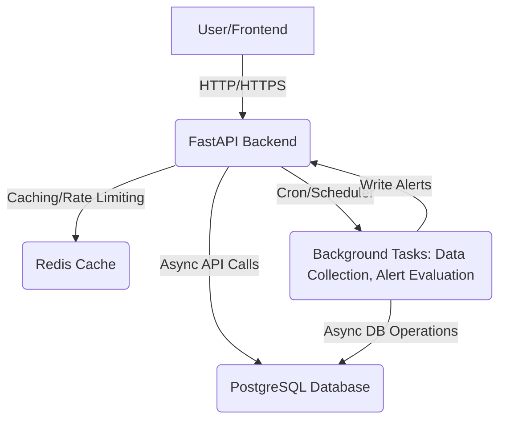

# Performance Monitoring System - Architecture Documentation

This document outlines the architecture and design of the Performance Monitoring System, detailing its components and their interactions.

## 1. High-Level Architecture

The system follows a typical microservice-oriented or layered architecture, leveraging Docker and Docker Compose for deployment.



**Key Components:**

*   **FastAPI Backend**: The core application, providing RESTful API endpoints, handling business logic, authentication, and orchestrating background tasks.
*   **PostgreSQL Database**: Persistent storage for all application data (users, services, metrics, alerts).
*   **Redis Cache**: Used for API caching (e.g., frequently accessed lists) and rate limiting.
*   **Background Tasks (APScheduler)**: In-process scheduler within the FastAPI application for periodic operations like simulating metric data collection and evaluating alert rules.
*   **Frontend (Basic HTML/JS)**: A simple client-side application that interacts with the FastAPI backend to visualize data and manage resources.

## 2. Detailed Component Breakdown

### 2.1. FastAPI Backend

*   **Framework**: FastAPI (Python)
*   **Web Server**: Uvicorn (managed by `docker-compose` `command`)

#### Sub-Components:

1.  **API Endpoints (`app/api/v1/endpoints/`)**:
    *   Defines the RESTful interface for `users`, `services`, `metric_types`, `metric_records`, `alert_rules`, and `alert_notifications`.
    *   Uses Pydantic schemas for request body validation and response serialization.
    *   Dependency Injection is heavily used for database sessions and authentication/authorization.
2.  **Authentication & Authorization (`app/auth/`, `app/api/deps.py`)**:
    *   **JWT (JSON Web Tokens)**: Used for stateless authentication. Users receive an access token upon successful login.
    *   **Password Hashing**: `passlib` with `bcrypt` is used for securely storing user passwords.
    *   **OAuth2PasswordBearer**: FastAPI's built-in OAuth2 scheme to extract tokens.
    *   **Role-Based Access Control (RBAC)**: Implemented via `get_current_active_user` and `get_current_active_admin` dependencies to restrict access to certain endpoints.
3.  **CRUD Operations (`app/crud/`)**:
    *   A generic `CRUDBase` class provides common database operations (create, read, update, delete).
    *   Specific CRUD classes (e.g., `CRUDUser`) extend `CRUDBase` for model-specific logic (e.g., password hashing during user creation, fetching by email).
    *   Uses SQLAlchemy's ORM for asynchronous database interactions.
4.  **Database Models (`app/models/`)**:
    *   SQLAlchemy declarative models defining the database schema (tables, columns, relationships).
    *   Includes `User`, `Service`, `MetricType`, `MetricRecord`, `AlertRule`, `AlertNotification`.
    *   `Base` model provides common fields like `id`, `created_at`, `updated_at`.
5.  **Pydantic Schemas (`app/schemas/`)**:
    *   Defines data structures for API request bodies and response models.
    *   Ensures data validation and clear API contracts.
    *   Separation of concerns between database models and API data structures.
6.  **Core Utilities (`app/core/`)**:
    *   **Configuration (`config.py`)**: Manages application settings loaded from environment variables (`.env`).
    *   **Database (`database.py`)**: Initializes SQLAlchemy engine and async session makers.
    *   **Logging (`logger.py`)**: Configures `Loguru` for structured and flexible logging.
    *   **Exceptions (`exceptions.py`)**: Custom exception classes for specific error conditions.
7.  **Middleware (`app/middleware/`)**:
    *   **CustomExceptionHandlerMiddleware**: Catches and handles various exceptions (FastAPI's `HTTPException`, Pydantic `ValidationError`, custom exceptions, generic `Exception`) to return consistent JSON error responses.
    *   **CORS Middleware**: Configures Cross-Origin Resource Sharing based on settings.
8.  **Services/Business Logic (`app/services/`)**:
    *   **`data_collector.py`**: Simulates external systems sending metric data. Generates random metric values for existing services and metric types.
    *   **`alert_evaluator.py`**: Core logic for evaluating active alert rules against the latest metric records. Creates `AlertNotification` entries when conditions are met. **Note**: Uses `eval()` for condition string which requires careful input validation in a real-world scenario.
9.  **Background Tasks (`app/tasks/`)**:
    *   **APScheduler**: An asynchronous scheduler (`AsyncIOScheduler`) embedded within the FastAPI application.
    *   Schedules `simulate_data_collection` and `evaluate_alert_rules` to run at configured intervals.
    *   Ensures tasks run in the background without blocking the main API thread.

### 2.2. PostgreSQL Database

*   **ORM**: SQLAlchemy 2.0 (async)
*   **Driver**: `asyncpg`
*   **Migrations**: Alembic
*   **Schema**:
    *   `users`: Stores user credentials and roles.
    *   `services`: Stores information about monitored applications/systems.
    *   `metric_types`: Defines categories of metrics (e.g., CPU, Memory, Latency).
    *   `metric_records`: Stores time-series performance data points.
    *   `alert_rules`: Defines conditions for triggering alerts.
    *   `alert_notifications`: Records instances when alert rules are violated.
*   **Indexes**: Applied to frequently queried columns (e.g., `email` for users, `name` for services/metric types, `service_id`, `metric_type_id`, `timestamp` for metric records).

### 2.3. Redis Cache

*   **Client**: `redis-py` (`aioredis` for async operations)
*   **Usage**:
    *   **FastAPI-Cache**: Caches responses for idempotent GET requests (e.g., listing services, metric types) to reduce database load and improve response times.
    *   **FastAPI-Limiter**: Implements rate limiting on API endpoints (e.g., `POST /metric_records`) to protect against abuse.

### 2.4. Frontend (Basic HTML/JS)

*   **Technology**: Pure HTML, CSS, JavaScript (using `fetch` API).
*   **Purpose**: Provides a minimal interactive dashboard for logging in, viewing services with live metrics, and managing alerts. It demonstrates how to consume the backend API.
*   **Dynamic Updates**: Polls the backend API periodically to refresh dashboard and alerts data.

## 3. Data Flow

1.  **User Interaction**:
    *   Frontend sends login/signup requests.
    *   Frontend sends CRUD requests for services, rules, etc.
    *   Frontend fetches dashboard data (services with latest metrics) and alert notifications.
2.  **Metric Ingestion (Simulated)**:
    *   `data_collector.py` (background task) periodically generates random metric values.
    *   It creates `MetricRecordCreate` schemas and persists them via `crud_metric_record`.
3.  **Alert Evaluation**:
    *   `alert_evaluator.py` (background task) periodically retrieves all active `AlertRule`s.
    *   For each rule, it fetches the latest `MetricRecord` for the associated `service_id` and `metric_type_id`.
    *   It evaluates the rule's `condition` string against the metric `value`.
    *   If a condition is met and no active notification exists, a new `AlertNotification` is created via `crud_alert_notification`.
    *   If a condition is no longer met, existing unresolved `AlertNotification`s for that rule are marked as resolved.
4.  **Data Storage and Retrieval**:
    *   All persistent data is stored in **PostgreSQL**.
    *   API endpoints query the database via `CRUD` operations and SQLAlchemy models.
    *   Caching layer (Redis) intercepts read requests for configured endpoints, returning cached data if available and valid.

## 4. Deployment Strategy

*   **Docker Compose**: Used for local development and simplified single-host deployment. It orchestrates the `backend`, `db`, and `redis` services.
*   **Health Checks**: Defined in `docker-compose.yml` to ensure services are ready before the backend attempts to connect.
*   **Init Commands**: The `backend` service's `command` in `docker-compose.yml` includes `alembic upgrade head` and `python scripts/seed_data.py` to ensure the database is set up and populated on startup.

## 5. Security Considerations

*   **JWT for Authentication**: Provides a secure, stateless way to verify user identity.
*   **Bcrypt for Password Hashing**: Industry-standard secure password storage.
*   **Role-Based Access Control**: Prevents unauthorized access to sensitive endpoints.
*   **Environment Variables**: Sensitive information (database credentials, secret keys) is stored in `.env` and accessed via `pydantic-settings`, not hardcoded.
*   **CORS**: Configurable to restrict access to trusted frontend origins.
*   **Rate Limiting**: Mitigates brute-force attacks and resource exhaustion.
*   **`eval()` for Alert Conditions**: This is a known security risk. In a truly production-hardened system, `eval()` would be replaced by a safer expression parser (e.g., `numexpr`, `ast.literal_eval` with custom logic, or a domain-specific language for conditions) or by predefined structured alert conditions to prevent arbitrary code execution. For this project, it's used for demonstration with the caveat of needing further hardening.

## 6. Future Enhancements

*   **Advanced Frontend**: Replace the basic HTML/JS with a modern SPA framework (React, Vue, Angular) for a richer user experience, charting, and real-time updates (WebSockets).
*   **Notifications**: Implement actual notification mechanisms (email, Slack, PagerDuty) for alert notifications.
*   **Scalability**:
    *   Separate background workers (e.g., Celery) from the main FastAPI process for long-running tasks.
    *   Database connection pooling, read replicas.
    *   Load balancing for multiple FastAPI instances.
*   **Monitoring**: Integrate with external monitoring tools (Prometheus, Grafana) for deeper insights into the application itself.
*   **Audit Logging**: Detailed logging of sensitive actions.
*   **Metric Aggregation**: Implement functionality to aggregate raw metric data over time (e.g., hourly averages, daily sums).
*   **Dynamic Alerting**: More complex alert rule conditions (e.g., trends, baselines, multi-metric rules).
*   **TLS/SSL**: Encrypt communication in production environments.

This architecture provides a solid foundation for a robust performance monitoring system, with clear separation of concerns and adherence to modern best practices.
```

#### `docs/deployment.md`
```markdown