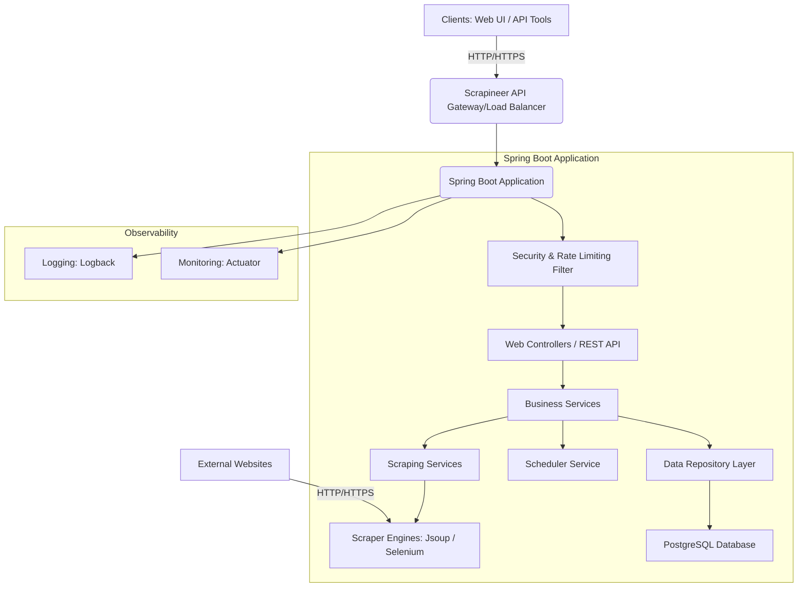

```markdown
# Scrapineer Architecture Documentation

This document describes the architectural overview, component breakdown, and data flow of the Scrapineer system.

## 1. High-Level Architecture

Scrapineer is designed as a modular, layered RESTful application following microservice principles (though deployed as a monolith for simplicity in this example) to provide a robust and scalable web scraping platform. It leverages Spring Boot's ecosystem for rapid development and enterprise features.



**Key Principles:**

*   **Layered Architecture:** Clear separation of concerns (Presentation, Business Logic, Data Access).
*   **API-First Design:** All interactions primarily through a RESTful API.
*   **Asynchronous Processing:** Scraping jobs run in background threads to avoid blocking API requests.
*   **Security:** JWT-based authentication and role-based authorization.
*   **Scalability:** Designed to be horizontally scalable, using a stateless API and externalized database.
*   **Resilience:** Comprehensive error handling, retries (conceptual for scraping), and robust logging.

## 2. Component Breakdown

### 2.1. Core Application (Spring Boot)

The application is structured into several logical modules/packages within `com.alx.scrapineer`:

*   **`ScrapineerApplication.java`**: The main entry point for the Spring Boot application.
*   **`api`**:
    *   **`controller`**: REST controllers exposing API endpoints (`AuthController`, `ScrapingTargetController`, `ScrapingJobController`, `HomeController`).
    *   **`dto`**: Data Transfer Objects for API request/response payloads (`AuthRequest`, `ScrapingTargetDto`, etc.).
    *   **`exception`**: Custom exceptions and `GlobalExceptionHandler` for centralized error handling.
*   **`common`**: Cross-cutting concerns and shared utilities.
    *   **`config`**: Spring configurations (`AppConfig`, `WebSecurityConfig`, `WebMvcConfig`).
    *   **`security`**: JWT-related classes (`JwtUtil`, `JwtAuthenticationFilter`, `UserPrincipal`, etc.).
    *   **`util`**: General utility classes (`RateLimitInterceptor`, etc.).
*   **`data`**: Database interaction layer.
    *   **`entity`**: JPA entities (`User`, `ScrapingTarget`, `ScrapingJob`, `ScrapingResult`, `CssSelector`).
    *   **`repository`**: Spring Data JPA repositories for CRUD operations (`UserRepository`, `ScrapingTargetRepository`, etc.).
*   **`scheduler`**: Handles scheduled tasks.
    *   **`ScrapingJobScheduler`**: Periodically checks and triggers `SCHEDULED` jobs based on CRON expressions.
*   **`scraper`**: Core web scraping logic.
    *   **`engine`**: `ScraperEngine` interface for pluggable scraping strategies (`JsoupScraperEngine`).
    *   **`strategy`**: Implementations of `ScraperEngine` (e.g., `JsoupScraperEngine`).
    *   **`service`**: `ScrapingOrchestrationService` manages the lifecycle of a single scraping run, updating job status and storing results.
*   **`service`**: Business logic services.
    *   **`AuthService`**: User registration and authentication.
    *   **`ScrapingTargetService`**: Manages CRUD for scraping targets.
    *   **`ScrapingJobService`**: Manages CRUD and execution initiation for scraping jobs.
    *   **`ScrapingResultService`**: Manages retrieval of scraping results.

### 2.2. Database Layer (PostgreSQL with Flyway)

*   **PostgreSQL:** Chosen for its robustness, reliability, and JSONB support for `extracted_data`.
*   **Flyway:** Manages database schema migrations. SQL scripts are in `config/flyway`. This ensures schema changes are version-controlled and applied consistently across environments.
*   **Schema:** `users`, `scraping_targets`, `css_selectors`, `scraping_jobs`, `scraping_results` tables are defined to store all application data. Indexes are added for query optimization.

### 2.3. External Services & Integrations

*   **External Websites:** The targets for scraping. Interaction is handled by `ScraperEngine` implementations.
*   **Docker Hub:** Used for storing and distributing Docker images of the application.
*   **GitHub Actions:** For automated CI/CD pipeline.

## 3. Data Flow

1.  **User Registration/Login:**
    *   Client sends `POST /api/auth/register` or `POST /api/auth/login`.
    *   `AuthController` -> `AuthService`.
    *   `AuthService` interacts with `UserRepository` to create/verify user.
    *   `AuthService` uses `PasswordEncoder` to hash/verify passwords.
    *   `AuthService` uses `JwtUtil` to generate a JWT token.
    *   Token is returned to client.

2.  **API Request (Authenticated):**
    *   Client sends request with `Authorization: Bearer <token>`.
    *   `JwtAuthenticationFilter` intercepts, validates token using `JwtUtil`, and sets Spring Security context.
    *   `RateLimitInterceptor` checks and enforces rate limits.
    *   Request proceeds to appropriate `Controller` (e.g., `ScrapingTargetController`).
    *   `Controller` calls relevant `Service` (e.g., `ScrapingTargetService`).
    *   `Service` interacts with `Repository` (e.g., `ScrapingTargetRepository`) to perform CRUD on entities.
    *   `ScrapingTargetMapping` converts entities to DTOs for response.
    *   Response is returned to client.

3.  **Scraping Job Creation/Execution:**
    *   **Creation:** Client `POST /api/jobs` to create a new job.
        *   `ScrapingJobController` -> `ScrapingJobService`.
        *   `ScrapingJobService` validates job details, fetches `ScrapingTarget` via `ScrapingTargetRepository`, and saves `ScrapingJob` via `ScrapingJobRepository`.
        *   If `scheduleCron` is provided, `ScrapingJobScheduler` calculates `nextRunAt`.
    *   **Scheduled Execution:**
        *   `ScrapingJobScheduler` runs periodically (`@Scheduled`).
        *   Queries `ScrapingJobRepository` for `SCHEDULED` jobs where `nextRunAt` is in the past.
        *   For each due job:
            *   Updates `nextRunAt` to the next scheduled time.
            *   Calls `ScrapingOrchestrationService.executeScrapingJob()` asynchronously (`@Async`).
    *   **Manual Execution:** Client `POST /api/jobs/{id}/start`.
        *   `ScrapingJobController` -> `ScrapingJobService`.
        *   `ScrapingJobService` performs validation.
        *   Calls `ScrapingOrchestrationService.executeScrapingJob()` asynchronously.
    *   **`executeScrapingJob` Flow:**
        *   Sets job `status` to `RUNNING`, saves to `jobRepository`.
        *   Selects appropriate `ScraperEngine` (e.g., `JsoupScraperEngine`).
        *   Calls `scraperEngine.scrape(target)`.
        *   Upon completion/failure:
            *   Creates `ScrapingResult` with `extractedData` (or `errorMessage`).
            *   Saves `ScrapingResult` to `resultRepository`.
            *   Updates final job `status` (COMPLETED/FAILED) and saves to `jobRepository`.

4.  **Result Retrieval:**
    *   Client `GET /api/jobs/{jobId}/results` or `GET /api/jobs/results/{resultId}`.
    *   `ScrapingJobController` -> `ScrapingResultService`.
    *   `ScrapingResultService` queries `ScrapingResultRepository` (with pagination/filtering).
    *   `ScrapingTargetMapping` converts entities to DTOs.
    *   Results are returned to client.

## 4. Scalability and Performance Considerations

*   **Stateless API:** JWT-based authentication ensures the application servers don't need to maintain session state, simplifying horizontal scaling.
*   **Asynchronous Scraping:** Offloading scraping tasks to a dedicated thread pool prevents the main API threads from being blocked, improving responsiveness. For very high load, this could be externalized to a message queue and separate worker services.
*   **Database Indexing:** Flyway scripts include necessary indexes (`idx_jobs_status_next_run`, `idx_results_timestamp`) to optimize common queries.
*   **Connection Pooling:** HikariCP is used by default with Spring Boot for efficient database connection management.
*   **Caching:** `Caffeine` (in-memory) is used for frequently accessed read-heavy operations (e.g., fetching targets/jobs/results), reducing database load. For multi-instance deployments, an external cache like Redis would be preferred.
*   **Rate Limiting:** Protects the API from excessive requests, ensuring stability.
*   **Dockerization:** Facilitates easy deployment and scaling using container orchestration platforms (Kubernetes, ECS).

## 5. Security Considerations

*   **Authentication:** JWT for secure user authentication.
*   **Authorization:** Role-based access control (`@PreAuthorize`) protects API endpoints.
*   **Password Hashing:** `BCryptPasswordEncoder` is used to store passwords securely.
*   **Secret Management:** JWT secret and database credentials are externalized to environment variables in production, never hardcoded.
*   **Input Validation:** `@Valid` annotations and manual checks prevent common injection and data integrity issues.
*   **Error Handling:** `GlobalExceptionHandler` prevents sensitive information from leaking in error responses.
*   **HTTPS:** Assumed to be configured at the API Gateway/Load Balancer level in production.

This architecture provides a solid foundation for a production-ready web scraping system, focusing on modularity, security, and performance.
```