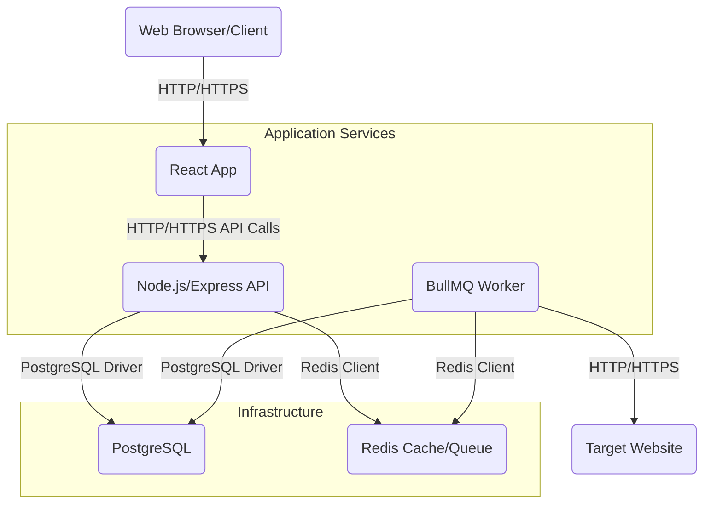
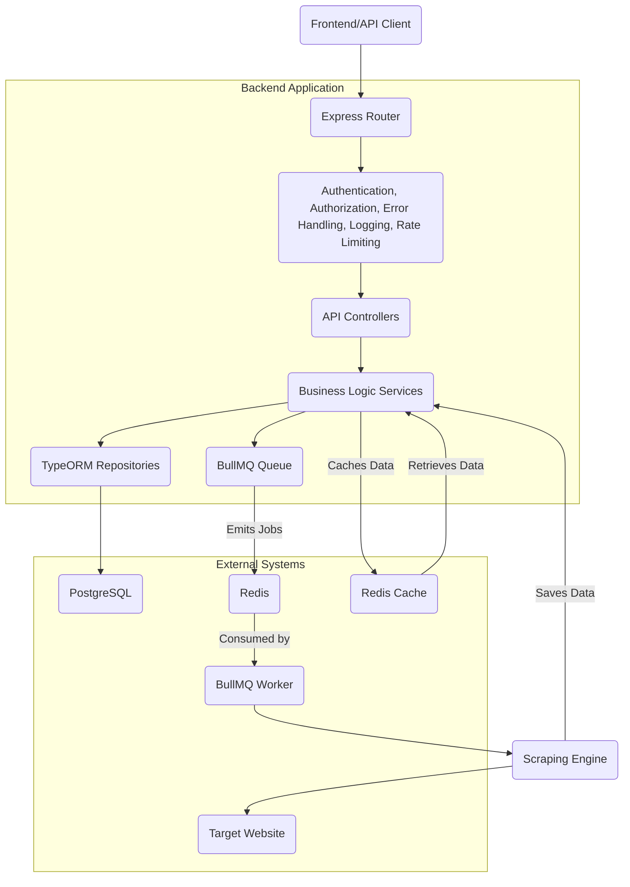
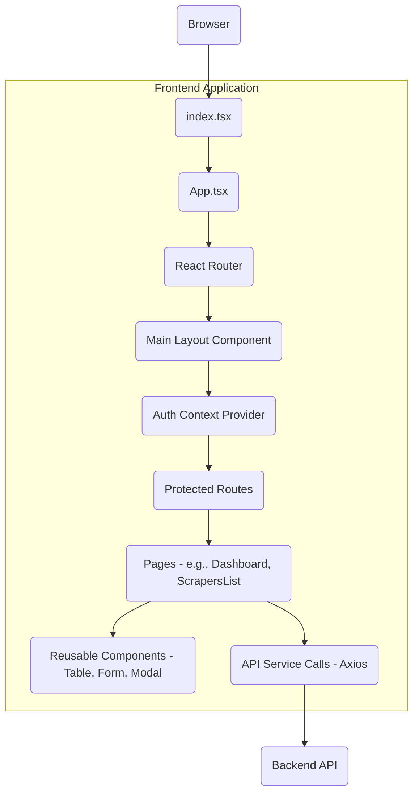

# ScrapeFlow: Architecture Documentation

This document outlines the architectural design of the ScrapeFlow system, providing an overview of its components, their interactions, and the underlying technologies.

## Table of Contents

1.  [High-Level Architecture](#1-high-level-architecture)
2.  [Backend Architecture](#2-backend-architecture)
    *   [API Layer (Express.js)](#api-layer-expressjs)
    *   [Business Logic Layer (Services)](#business-logic-layer-services)
    *   [Data Access Layer (TypeORM)](#data-access-layer-typeorm)
    *   [Background Processing (BullMQ)](#background-processing-bullmq)
    *   [Scraping Engine](#scraping-engine)
    *   [Middleware & Utilities](#middleware--utilities)
3.  [Frontend Architecture](#3-frontend-architecture)
    *   [Component-Based Structure](#component-based-structure)
    *   [State Management](#state-management)
    *   [API Integration](#api-integration)
4.  [Database Schema](#4-database-schema)
5.  [Data Flow](#5-data-flow)
6.  [Scalability & Resilience](#6-scalability--resilience)
7.  [Security Considerations](#7-security-considerations)
8.  [Monitoring & Logging](#8-monitoring--logging)

## 1. High-Level Architecture

ScrapeFlow follows a typical client-server architecture with a clear separation of concerns:



**Key Components:**
*   **Frontend (React App)**: The user interface for interacting with the system.
*   **Backend (Node.js/Express API)**: The core application logic, RESTful API, authentication, and orchestration of scraping tasks.
*   **Database (PostgreSQL)**: Stores application data (users, scrapers, jobs) and extracted scrape results.
*   **Redis**: Used for caching, rate limiting, and as a message broker for BullMQ (job queue).
*   **Scraping Worker (BullMQ Worker)**: A separate process (or set of processes) that pulls scraping jobs from the Redis queue and executes them.
*   **Target Websites**: The external websites that are being scraped.

## 2. Backend Architecture

The backend is built with Node.js and TypeScript, following a layered, modular design.



### API Layer (Express.js)

*   **Routers**: Define API endpoints and map them to controller methods. Uses Express's Router for modularity.
*   **Controllers**: Handle incoming HTTP requests, validate input, call appropriate service methods, and send HTTP responses. Minimal logic, primarily request/response handling.

### Business Logic Layer (Services)

*   **Services**: Encapsulate the core business logic. Each service corresponds to a domain entity (e.g., `UserService`, `ScraperService`, `ScrapeJobService`).
*   Responsible for data manipulation, complex validations, and orchestrating interactions between different components (e.g., saving data to DB, enqueueing jobs).

### Data Access Layer (TypeORM)

*   **Entities**: Define the database schema using TypeORM decorators.
*   **Repositories**: Provide methods for interacting with the database (CRUD operations) for specific entities.
*   **Migrations**: Manage database schema evolution in a version-controlled manner.

### Background Processing (BullMQ)

*   **Queue**: A BullMQ `Queue` instance used by services to add scraping tasks.
*   **Worker**: A BullMQ `Worker` process (separate from the API server) that connects to the same Redis instance, fetches jobs from the queue, and executes the `ScrapingEngine`.
*   **Job Management**: BullMQ handles job retries, concurrency, and job status, ensuring reliable background execution.

### Scraping Engine

*   A dedicated service (`scrapingEngine.ts`) that implements the actual web scraping logic.
*   Receives a `Scraper` definition (URL, selectors, pagination config) as input.
*   Uses libraries like `cheerio` (for static HTML parsing) or `puppeteer` (for JavaScript-rendered pages) to fetch and parse web content.
*   Handles pagination, data extraction based on CSS selectors, and basic error recovery during scraping.
*   Stores extracted data and updates job status in the database.

### Middleware & Utilities

*   **Authentication Middleware**: Verifies JWT tokens and attaches user information to the request object.
*   **Authorization Middleware**: Checks user roles/permissions against required roles for specific routes.
*   **Error Handling Middleware**: Catches and processes application errors, sending consistent error responses.
*   **Logging Middleware**: Logs incoming requests and other important application events using Winston.
*   **Rate Limiting Middleware**: Protects API endpoints from excessive requests using `express-rate-limit` backed by Redis.
*   **Caching Service**: A Redis client wrapper for caching frequently accessed data.
*   **JWT Utilities**: Functions for generating and verifying JWT tokens.

## 3. Frontend Architecture

The frontend is a single-page application (SPA) built with React and TypeScript, following a component-based design.



### Component-Based Structure

*   **`pages/`**: Top-level components representing distinct views or routes (e.g., `LoginPage`, `DashboardPage`, `ScrapersListPage`).
*   **`components/`**: Reusable UI components (e.g., `Button`, `Input`, `Table`, `Modal`, `ScraperForm`). These are stateless or receive props.
*   **`layout/`**: Components defining the overall application structure (e.g., header, sidebar, footer).

### State Management

*   **React Context API**: Used for global state management, particularly for authentication (`AuthProvider`) and potentially for theme settings.
*   **Local Component State**: For UI-specific state within components.
*   **Query/Mutation Libraries**: For more complex data fetching and caching (e.g., React Query or SWR could be integrated, though not explicitly shown in initial code).

### API Integration

*   **`api/`**: Contains service functions that wrap Axios calls to the backend API. This centralizes API logic and makes it reusable.
*   **Error Handling**: Global Axios interceptors can be used to handle API errors uniformly (e.g., redirect on 401, display toast on other errors).

## 4. Database Schema

The PostgreSQL database stores the following key entities:

*   **`User`**: User authentication and authorization (username, email, password_hash, role).
*   **`Scraper`**: Definitions of web scraping configurations (name, start\_url, selectors\_config (JSONB), pagination\_config (JSONB), user_id).
*   **`ScrapeJob`**: Instances of executed or scheduled scraping tasks (scraper_id, user_id, status, timestamps, log, extracted_count).
*   **`ScrapedData`**: The actual data extracted by a `ScrapeJob` (scrape_job_id, scraper_id, data (JSONB)).

**Relationships:**
*   `User` has many `Scrapers`
*   `User` has many `ScrapeJobs`
*   `Scraper` has many `ScrapeJobs`
*   `Scraper` has many `ScrapedData`
*   `ScrapeJob` has many `ScrapedData`

**Query Optimization:**
*   **Indexing**: Foreign key columns (`user_id`, `scraper_id`, `scrape_job_id`) are indexed to speed up joins and lookups.
*   **JSONB**: Using `jsonb` type for `selectors_config`, `pagination_config`, and `data` allows for flexible, schemaless storage of varying data structures, and also supports indexing for querying within JSON documents if needed (e.g., GIN indexes).
*   **Pagination**: API endpoints fetching lists of data (e.g., `ScrapedData`, `ScrapeJobs`) implement offset-based or cursor-based pagination to prevent loading excessive amounts of data into memory.

## 5. Data Flow

1.  **User defines a Scraper**:
    *   Frontend sends `POST /api/scrapers` request.
    *   Backend validates, saves `Scraper` entity to PostgreSQL.
2.  **User triggers a Scrape Job**:
    *   Frontend sends `POST /api/scrape-jobs/trigger/:scraperId` request.
    *   Backend creates a `ScrapeJob` record with status `PENDING` and enqueues a job into the BullMQ queue (Redis).
3.  **Scraping Worker processes job**:
    *   BullMQ Worker picks up the job from Redis.
    *   Worker fetches `Scraper` details from PostgreSQL.
    *   Worker initiates the `ScrapingEngine`.
    *   `ScrapingEngine` makes HTTP requests to the target website, extracts data.
    *   For each extracted data item, `ScrapingEngine` saves `ScrapedData` to PostgreSQL.
    *   `ScrapingEngine` updates `ScrapeJob` status (e.g., `RUNNING`, then `COMPLETED`/`FAILED`) and `extracted_count` in PostgreSQL.
4.  **User views Scrape Job status/results**:
    *   Frontend sends `GET /api/scrape-jobs/:id` or `GET /api/scraped-data?jobId=:id`.
    *   Backend retrieves data from PostgreSQL.
    *   Backend may retrieve cached data from Redis if available.
    *   Frontend displays job status, logs, and extracted data.

## 6. Scalability & Resilience

*   **Stateless Backend**: The Express API server is stateless, allowing for easy horizontal scaling by running multiple instances behind a load balancer.
*   **Distributed Queue (BullMQ/Redis)**: Decouples job initiation from job execution. New scraping jobs can be added quickly, and a pool of workers can process them concurrently. Workers can be scaled independently.
*   **Containerization (Docker)**: Enables consistent environments across development, testing, and production. Docker Compose facilitates multi-service local development, and Kubernetes/ECS/etc. can manage production deployments.
*   **Database (PostgreSQL)**: Can be scaled vertically (larger instance) or horizontally (read replicas, sharding for very large scale).
*   **Caching (Redis)**: Reduces load on the database by serving frequently requested data from memory.
*   **Error Handling & Retries**: BullMQ provides built-in mechanisms for retrying failed jobs, improving resilience. The scraping engine also has internal error handling for transient network issues.

## 7. Security Considerations

*   **Authentication (JWT)**: Secure user authentication using industry-standard JSON Web Tokens.
*   **Authorization (RBAC)**: Role-Based Access Control ensures users only access resources they are authorized for (e.g., admins vs. regular users, resource owners).
*   **Password Hashing (bcrypt)**: Passwords are never stored in plain text, always hashed with `bcryptjs`.
*   **Input Validation (Joi)**: All API inputs are rigorously validated to prevent injection attacks and ensure data integrity.
*   **CORS**: Configured to allow requests only from trusted frontend origins.
*   **Helmet**: A collection of Express middleware to set various HTTP headers for enhanced security (e.g., XSS protection, MIME type sniffing prevention).
*   **Rate Limiting**: Protects against brute-force attacks and denial-of-service attempts by limiting request frequency.
*   **Environment Variables**: Sensitive information (database credentials, JWT secret) is stored in environment variables, not hardcoded.
*   **SQL Injection Prevention**: TypeORM's ORM capabilities abstract away direct SQL queries, preventing common SQL injection vulnerabilities.

## 8. Monitoring & Logging

*   **Winston**: Used for structured logging of application events, API requests, and errors. Logs include timestamps, log levels, and contextual information.
*   **BullMQ UI**: A separate UI (e.g., Arena) can be used to monitor the state of the BullMQ queues and jobs.
*   **Health Checks**: Docker Compose includes health checks for services (PostgreSQL, Redis) to ensure they are operational. Application-level health endpoints (`/health`) could be added for more granular checks.
*   **Metrics**: Prometheus/Grafana could be integrated to collect and visualize application metrics (e.g., API response times, job processing rates, error rates).
```