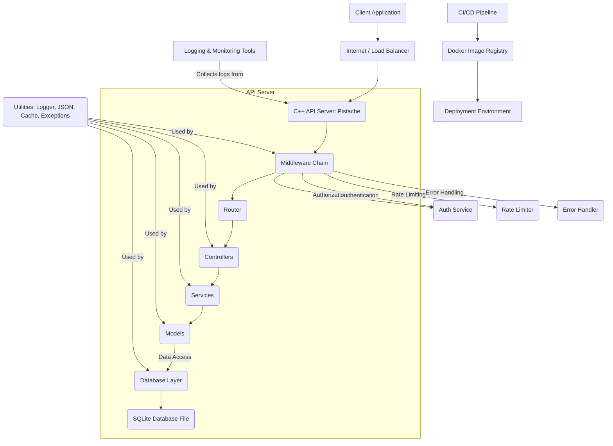

# Architecture Documentation: Task Management System

This document describes the high-level architecture of the C++ Task Management API system, focusing on its structure, components, and how they interact.

## 1. Overview

The system is a RESTful API backend for managing tasks, built using C++ and designed for robustness, scalability, and maintainability. It follows a layered architectural pattern, separating concerns into distinct modules and components.

## 2. High-Level Diagram



## 3. Core Components

### 3.1. C++ API Server (`HttpRestServer`)
*   **Technology**: [Pistache](https://pistache.io/)
*   **Description**: The entry point for all HTTP requests. It initializes the Pistache HTTP endpoint, registers routes, and sets up the middleware chain.
*   **Responsibilities**:
    *   Listening for incoming HTTP requests.
    *   Dispatching requests through the middleware chain and to the appropriate controllers.
    *   Managing server lifecycle (start, shutdown).

### 3.2. Middleware Layer
A chain of functions that process incoming requests before they reach the main controller logic, and potentially outgoing responses.

*   **`ErrorHandler`**:
    *   **Description**: Catches exceptions thrown anywhere in the request processing pipeline and transforms them into standardized JSON error responses with appropriate HTTP status codes.
    *   **Responsibility**: Centralized error handling, consistent API error feedback.
*   **`RateLimiter`**:
    *   **Description**: Implements a fixed-window counter algorithm to limit the number of requests from a client within a specific time frame (e.g., by IP address).
    *   **Responsibility**: Protects against abuse and denial-of-service attacks.
*   **`JwtMiddleware`**:
    *   **Description**: Intercepts requests to protected routes, extracts and verifies JWT tokens, and injects authenticated user information (ID, username, role) into the request context. Also enforces role-based authorization.
    *   **Responsibility**: Handles authentication and authorization for protected resources.

### 3.3. Routing (`Pistache::Rest::Router`)
*   **Description**: Maps incoming HTTP requests (method + path) to specific controller functions.
*   **Responsibility**: Directs traffic to the correct handler.

### 3.4. Controllers (`AuthController`, `TaskController`)
*   **Description**: The first point of contact for a request after the middleware chain. They handle HTTP-specific logic.
*   **Responsibilities**:
    *   Parsing request parameters (path, query, body).
    *   Validating input data.
    *   Delegating business logic to services.
    *   Formatting HTTP responses (JSON, status codes).
    *   `AuthController`: Handles user registration and login.
    *   `TaskController`: Manages CRUD operations for tasks.

### 3.5. Services (`AuthService`)
*   **Description**: Encapsulate the core business logic, independent of the HTTP layer. Controllers call services to perform application-specific operations.
*   **Responsibilities**:
    *   Implementing business rules and workflows.
    *   Interacting with models for data persistence.
    *   Hashing passwords, generating/verifying JWTs (`AuthService`).

### 3.6. Models (`User`, `Task`)
*   **Description**: Represent the data entities in the application and their associated data access logic. Often referred to as "Active Record" pattern in this context.
*   **Responsibilities**:
    *   Defining data structure and validation rules for `User` and `Task` objects.
    *   Providing static methods for basic CRUD operations (create, find, update, delete) against the database for their respective entities.
    *   Converting between database rows (`DbRow`) and application objects.

### 3.7. Database Layer (`DatabaseManager`)
*   **Technology**: [SQLite3](https://www.sqlite.org/index.html) with a C++ wrapper / direct C API calls.
*   **Description**: Manages the application's interaction with the persistent data store.
*   **Responsibilities**:
    *   Establishing and closing database connections.
    *   Executing raw SQL queries (both DDL and DML).
    *   Providing prepared statement functionality for secure and efficient queries.
    *   Handling database-specific error reporting.
    *   Ensuring thread-safe database access (via mutexes).
    *   **Migrations**: C++-based scripts to evolve the database schema.
    *   **Seeders**: C++-based scripts to populate the database with initial data.

### 3.8. Utilities (`Logger`, `JsonUtil`, `Exceptions`, `Cache`)
*   **Description**: Shared helper classes and functions used across various layers of the application.
*   **Responsibilities**:
    *   `Logger`: Centralized logging to console and file with different severity levels.
    *   `JsonUtil`: Helpers for JSON parsing, serialization, and field extraction.
    *   `Exceptions`: Custom exception hierarchy for structured error reporting within the application.
    *   `Cache`: Simple in-memory key-value cache with expiration for frequently accessed data.

## 4. Data Flow

1.  **Request**: A client sends an HTTP request to the API server.
2.  **Server Entry**: The `HttpRestServer` receives the request.
3.  **Middleware Chain**: The request passes through an ordered chain of middleware:
    *   `ErrorHandler` (wraps subsequent calls to catch exceptions)
    *   `RateLimiter` (checks and enforces request limits)
    *   `JwtMiddleware` (authenticates and authorizes the user, injecting `AuthContext` into the request)
4.  **Routing**: The `Router` matches the request's method and path to a specific controller endpoint.
5.  **Controller Execution**: The assigned controller function:
    *   Parses the request body/parameters.
    *   Performs basic validation.
    *   Retrieves authenticated user info from `AuthContext`.
    *   Calls one or more service methods to perform business logic.
6.  **Service Logic**: The service method:
    *   Executes core business rules.
    *   Interacts with `Models` (e.g., `User::find_by_username`, `Task::create`).
7.  **Model-Database Interaction**: Model methods (e.g., `User::create`, `Task::update`) use the `DatabaseManager` to execute SQL queries.
8.  **Database Operation**: `DatabaseManager` interacts with the SQLite database file.
9.  **Response Generation**: Data flows back up:
    *   From `Database` to `Models`.
    *   From `Models` to `Services`.
    *   From `Services` to `Controllers`.
    *   The `Controller` formats the final JSON response.
10. **Response Sending**: The `Controller` sends the HTTP response back through the middleware chain (e.g., `ErrorHandler` might format any final exceptions) and `HttpRestServer` sends it to the client.

## 5. Security Considerations

*   **Authentication**: JWT-based for stateless authentication.
*   **Authorization**: Role-based access control implemented via middleware and within controllers.
*   **Password Hashing**: Placeholder hashing function is used; in production, a strong, one-way hashing algorithm like Argon2 or BCrypt would be integrated.
*   **SQL Injection**: Prevented by using parameterized prepared statements (`execute_query_prepared`, `execute_non_query_prepared`).
*   **Rate Limiting**: Protects against brute-force attacks and DDoS.
*   **Environment Variables**: Sensitive information (JWT secret, database credentials) are loaded from environment variables (or `.env` in dev) and not hardcoded.

## 6. Scalability and Performance

*   **Concurrency**: Pistache handles multiple concurrent HTTP connections using a thread pool.
*   **Database**: SQLite is suitable for small to medium-sized applications or for local development. For high-scale production, a separate database server (e.g., PostgreSQL, MySQL) would be integrated, requiring a different C++ database connector (e.g., `libpqxx` for PostgreSQL). The `DatabaseManager` interface would largely remain the same, abstracting the underlying DB.
*   **Caching**: A simple in-memory cache is used to reduce database load for frequently accessed read-heavy data. For larger-scale caching, external solutions like Redis would be employed.
*   **Statelessness**: JWTs enable stateless authentication, making the API server horizontally scalable.
*   **Load Balancing**: The API is designed to run behind a load balancer (e.g., Nginx, Kubernetes ingress) to distribute traffic across multiple instances.

## 7. Development and Deployment

*   **Build System**: CMake is used for managing the C++ build process and external dependencies.
*   **Containerization**: Docker is used to package the application and its dependencies into isolated containers, ensuring consistent environments across development, testing, and production.
*   **CI/CD**: GitHub Actions pipeline automates building, testing, and can be extended for deployment, ensuring code quality and rapid iteration.

## 8. Future Enhancements

*   **ORM**: Integrate a more feature-rich C++ ORM for more complex database interactions.
*   **Advanced Caching**: Replace simple in-memory cache with an external distributed cache (e.g., Redis).
*   **Metrics & Monitoring**: Integrate with Prometheus/Grafana for detailed application metrics and dashboards.
*   **Distributed Tracing**: Add support for OpenTelemetry for tracing requests across microservices.
*   **Advanced Logging**: Integrate with a log management system (e.g., ELK stack) for centralized log aggregation and analysis.
*   **Input Validation**: Use a dedicated C++ validation library for more complex input schema validation.
*   **Background Jobs**: Integrate with a message queue (e.g., RabbitMQ, Kafka) for asynchronous processing of long-running tasks.
```