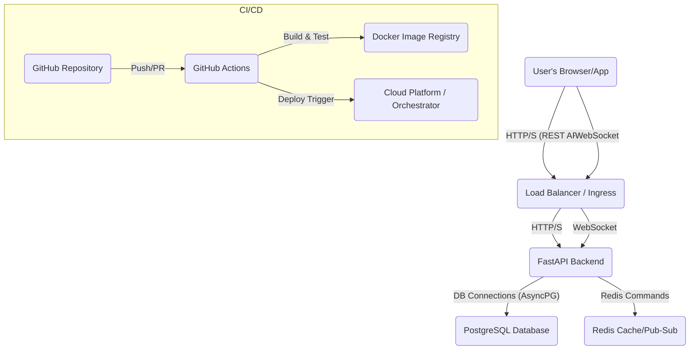

```markdown
# Real-time Chat Application Architecture

This document outlines the high-level architecture of the real-time chat application, detailing its main components, their interactions, and the underlying technologies.

## 1. High-Level Overview

The system follows a typical microservice-like architecture, separating the backend API, real-time WebSocket server (integrated with the backend), and a single-page application (SPA) frontend. A robust database (PostgreSQL) and an in-memory data store (Redis) provide persistence and caching/messaging capabilities.



## 2. Component Breakdown

### 2.1. Frontend (React + TypeScript)

-   **Technology**: React 18, TypeScript, Vite, React Router DOM, Axios, native WebSocket API.
-   **Purpose**: Provides the user interface for interacting with the chat application.
-   **Key Responsibilities**:
    -   User registration and login.
    -   Displaying list of chats (groups/DMs).
    -   Displaying chat messages in real-time.
    -   Sending new messages to the backend.
    -   Managing authentication state (JWT tokens).
    -   Connecting to the WebSocket server for real-time updates.
-   **Interaction**: Communicates with the Backend Service via REST API (for authentication, chat/message history) and WebSocket (for live message updates).

### 2.2. Backend (FastAPI)

-   **Technology**: Python 3.11, FastAPI, SQLAlchemy (AsyncIO), Pydantic, Uvicorn/Gunicorn.
-   **Purpose**: Serves as the application's API and real-time communication hub.
-   **Key Responsibilities**:
    -   **REST API**: Handles all CRUD operations for users, chats, and messages.
    -   **Authentication**: JWT token generation, validation, and user session management.
    -   **Business Logic**: Processes user requests, interacts with the database, and enforces application rules.
    -   **Real-time Communication**: Manages WebSocket connections, broadcasting messages to relevant chat participants.
    -   **Middleware**: Implements logging, error handling, and rate limiting.
-   **Interaction**:
    -   Communicates with the Frontend via HTTP (REST) and WebSockets.
    -   Persists data to PostgreSQL via SQLAlchemy.
    -   Uses Redis for caching and possibly Pub/Sub (though currently direct WS management is implemented).

### 2.3. Database (PostgreSQL)

-   **Technology**: PostgreSQL 15.
-   **Purpose**: Stores all persistent application data.
-   **Schema**:
    -   `users`: User profiles (id, username, email, hashed_password, created_at, updated_at).
    -   `chats`: Chat room definitions (id, name, is_group, created_at, updated_at).
    -   `chat_members`: Junction table for many-to-many relationship between users and chats (id, chat_id, user_id, joined_at).
    -   `messages`: Individual chat messages (id, chat_id, owner_id, content, created_at, updated_at).
-   **Interaction**: Accessed exclusively by the Backend Service using SQLAlchemy.

### 2.4. Cache/Message Broker (Redis)

-   **Technology**: Redis 7.
-   **Purpose**: Used for high-speed data access, rate limiting, and potentially Pub/Sub messaging.
-   **Key Responsibilities**:
    -   **Rate Limiting**: Stores request counts per IP address to prevent API abuse.
    -   **Caching**: Can be extended to cache frequently accessed data (e.g., user online status, chat presence).
    -   **(Future) Pub/Sub**: Could be used to scale WebSocket broadcasting across multiple backend instances.
-   **Interaction**: Accessed by the Backend Service.

### 2.5. Docker & Docker Compose

-   **Technology**: Docker, Docker Compose.
-   **Purpose**: Containerization of all services for consistent development and deployment environments.
-   **Key Responsibilities**:
    -   Packaging each service (backend, frontend, db, redis) into isolated containers.
    -   Defining service dependencies and networking.
    -   Managing volumes for persistent data (PostgreSQL, Redis).
    -   Automating setup (migrations, seeding) on service startup.

### 2.6. CI/CD (GitHub Actions)

-   **Technology**: GitHub Actions.
-   **Purpose**: Automates the build, test, and (optionally) deployment process.
-   **Key Responsibilities**:
    -   **Linting**: Ensures code quality and style consistency (Black, Flake8 for Python; ESLint for TypeScript).
    -   **Testing**: Runs unit and integration tests for both backend and frontend.
    -   **Build Checks**: Verifies that the frontend can be built for production.
    -   **(Future) Deployment**: Triggers deployment to a staging/production environment upon successful checks.

## 3. Data Flow and Communication

1.  **Authentication**:
    -   Frontend sends `POST /api/v1/auth/register` or `POST /api/v1/auth/token` requests to the Backend.
    -   Backend authenticates user, generates a JWT token, and stores user in PostgreSQL.
    -   Frontend stores the JWT token locally (e.g., `localStorage`).

2.  **Chat Interaction (REST)**:
    -   Frontend sends authenticated `GET /api/v1/chats/` to retrieve user's chats.
    -   Frontend sends authenticated `GET /api/v1/messages/chat/{chat_id}` to retrieve historical messages.
    -   Frontend sends authenticated `POST /api/v1/chats/` to create a new chat.

3.  **Real-time Messaging (WebSocket)**:
    -   When a user selects a chat, the Frontend establishes a WebSocket connection to `ws://localhost:8000/ws/{chat_id}` including the JWT token as a query parameter.
    -   The Backend's WebSocket endpoint authenticates the user using the token and adds the WebSocket connection to its `ConnectionManager` for the specified `chat_id`.
    -   Frontend sends `POST /api/v1/messages/?chat_id={chat_id}` with message content to the Backend.
    -   Backend processes the message:
        1.  Persists the message to PostgreSQL.
        2.  Uses the `WebSocketManager` to broadcast the new message data (as JSON) to *all* active WebSocket connections subscribed to `chat_id`.
    -   Frontend's WebSocket client receives the broadcasted message and updates the UI in real-time.

4.  **Error Handling**:
    -   Backend middleware catches exceptions, logs them, and returns standardized JSON error responses.
    -   Frontend handles API errors using `react-toastify` for user feedback.

5.  **Rate Limiting**:
    -   Backend `RateLimitMiddleware` (or `FastAPILimiter`) inspects incoming requests, uses Redis to track request counts per IP, and blocks requests exceeding limits.

## 4. Scalability Considerations

-   **Database**: PostgreSQL can be scaled vertically (more powerful hardware) or horizontally (read replicas, sharding).
-   **Backend (FastAPI)**: FastAPI applications are inherently asynchronous and performant. Multiple instances can run behind a load balancer. For WebSocket scaling across multiple instances, a shared message broker like Redis Pub/Sub would be crucial for the `WebSocketManager` to broadcast messages globally.
-   **Frontend**: A stateless SPA can be easily hosted on CDNs.
-   **Redis**: Can be deployed in a cluster for high availability and performance.

This architecture provides a solid foundation for a modern real-time chat application, emphasizing modularity, testability, and deployability.
```