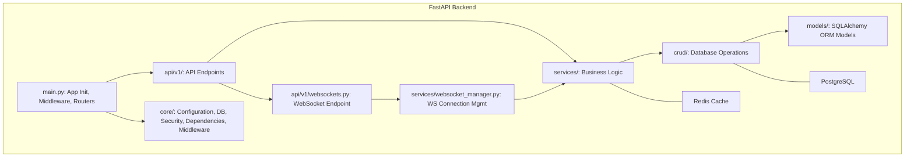
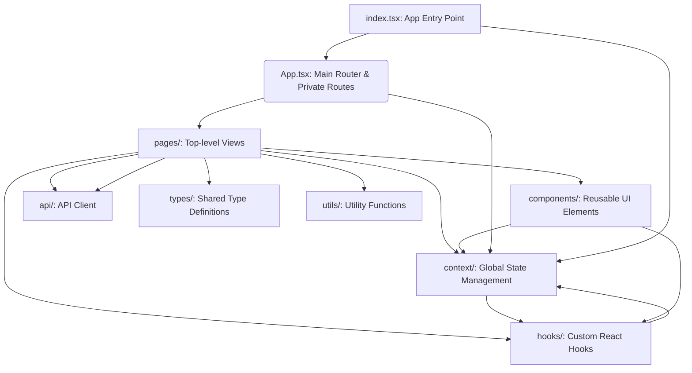

```markdown
# Real-Time Chat Application - Architecture Document

## 1. High-Level Architecture

The Real-Time Chat Application follows a **Microservice-oriented Architecture** with a clear separation of concerns between the frontend and backend, enabling independent development, deployment, and scaling. It leverages **WebSockets** for real-time communication, a cornerstone for any chat application.

```mermaid
graph TD
    A[Client Applications (Web Browser)] -->|HTTP/REST| B(FastAPI Backend API)
    A -->|WebSocket (WS)| D(FastAPI WebSocket Endpoint)
    B -->|Database Access| E[PostgreSQL Database]
    B -->|Caching/Rate Limiting| F[Redis Cache]
    D -->|Internal Communication/State| F
    E -->|Persistent Data Storage| G(Disk/Volume)
    F -->|In-Memory Data Storage| G
    H[Admin/Monitoring Tools] --> B
```

### Key Components:

*   **Client Applications (Frontend)**: A single-page application (SPA) built with React and TypeScript, running in web browsers. It interacts with the backend via RESTful HTTP requests for CRUD operations and maintains persistent connections via WebSockets for real-time updates.
*   **FastAPI Backend API**: The core application logic, built with Python's FastAPI framework. It exposes RESTful API endpoints for user management, chat room management, and message sending. It also hosts the WebSocket endpoint.
*   **PostgreSQL Database**: A robust relational database used for persistent storage of user data, chat room configurations, messages, and relationships. SQLAlchemy is used as the Object-Relational Mapper (ORM).
*   **Redis Cache**: An in-memory data store used for two primary purposes:
    *   **Caching**: Storing frequently accessed data to reduce database load and improve response times.
    *   **Rate Limiting**: Tracking request counts to prevent API abuse.
    *   **WebSocket Management**: Potentially storing WebSocket session data (though in this basic version, `WebSocketManager` handles in-memory).

## 2. Detailed Backend Architecture

The FastAPI backend is structured into several logical modules, promoting modularity and maintainability.



### Modules Breakdown:

*   **`main.py`**: The entry point of the FastAPI application. It sets up the FastAPI instance, integrates middleware (CORS, logging, error handling), initializes the database and Redis, and registers API routers.
*   **`core/`**: Contains foundational components:
    *   `config.py`: Loads environment variables and provides application settings.
    *   `db.py`: Configures the SQLAlchemy engine and session management for asynchronous operations.
    *   `security.py`: Handles password hashing (Bcrypt) and JWT token creation/validation.
    *   `dependencies.py`: Provides reusable dependency injection functions (e.g., database session, current authenticated user).
    *   `middleware.py`: Custom HTTP middleware for logging and global exception handling.
*   **`models/`**: Defines the SQLAlchemy ORM models, representing the database schema (e.g., `User`, `ChatRoom`, `Message`, `UserRoomAssociation`).
*   **`schemas/`**: Defines Pydantic models for data validation and serialization/deserialization of API request/response bodies. This ensures consistent data structures.
*   **`crud/`**: Implements Create, Read, Update, Delete (CRUD) operations for database models. It abstracts direct database interactions from the business logic. `CRUDBase` provides generic functionality.
*   **`services/`**: Contains the core business logic. These services orchestrate interactions between CRUD operations, security utilities, and the WebSocket manager. Examples include `AuthService` (user registration/login) and `ChatService` (room/message management).
*   **`api/v1/endpoints/`**: Defines the RESTful API endpoints for specific resources (e.g., `auth.py`, `users.py`, `chat_rooms.py`, `messages.py`). Each endpoint uses dependencies to get database sessions, authenticated users, and interacts with the services layer.
*   **`api/v1/websockets.py`**: The dedicated WebSocket endpoint that handles new WebSocket connections, authenticates users via tokens in query parameters, and integrates with the `WebSocketManager`.
*   **`services/websocket_manager.py`**: Manages active WebSocket connections. It tracks which users are connected to which rooms and facilitates broadcasting messages to specific rooms or individual users.
*   **`tests/`**: Contains unit and integration tests to ensure code quality and correctness.
*   **`scripts/`**: Utility scripts (e.g., `seed_db.py` for populating initial data).
*   **`alembic/`**: Directory for database migration scripts using Alembic.

## 3. Frontend Architecture

The React/TypeScript frontend is structured using standard React best practices.



### Modules Breakdown:

*   **`index.tsx`**: The main entry point of the React application, rendering the root `App` component within `BrowserRouter` and `AuthProvider`.
*   **`App.tsx`**: Defines the main routing structure, including public and private routes. It wraps the entire application with `AuthProvider` and `WebSocketProvider`.
*   **`pages/`**: Contains top-level components that represent different pages or views of the application (e.g., `LoginPage`, `RegisterPage`, `HomePage`, `ChatPage`).
*   **`components/`**: Houses reusable UI components (e.g., `AuthForm`, `RoomList`, `ChatHeader`, `MessageBubble`, `MessageList`, `ChatInput`, `UserList`).
*   **`context/`**: Manages global state using React Context API:
    *   `AuthContext.tsx`: Manages user authentication state (login, logout, current user, JWT token).
    *   `WebSocketContext.tsx`: Manages WebSocket connection state, incoming messages, and provides functions to connect/disconnect.
*   **`hooks/`**: Custom React hooks to abstract component logic and state management (e.g., `useAuth` for accessing auth context, `useWebSocket` for WebSocket interactions).
*   **`api/`**: Contains `axiosInstance.ts` for configuring Axios with base URL, request/response interceptors (e.g., for attaching JWT token), and error handling.
*   **`types/`**: Defines TypeScript interfaces and types for consistent data structures across the frontend (e.g., `User`, `ChatRoom`, `Message`, `AuthState`, `WebSocketMessageType`).
*   **`utils/`**: General utility functions (e.g., `auth.ts` for handling local storage operations for tokens/user info).
*   **`App.css` / `index.css` / `tailwind.config.js`**: Styling and Tailwind CSS configuration.

## 4. Data Flow (Authentication)

1.  **User registers/logs in**: Frontend sends `POST /api/v1/auth/register` or `POST /api/v1/auth/token` (form data) to FastAPI.
2.  **FastAPI (`auth.py`)**:
    *   For registration, `AuthService` hashes the password and creates a new `User` in PostgreSQL via `CRUDUser`.
    *   For login, `AuthService` authenticates user against hashed password in PostgreSQL via `CRUDUser`, then generates a JWT token using `security.py`.
3.  **FastAPI responds**: Returns `UserPublic` (for register) or `Token` (for login) to the frontend.
4.  **Frontend**: Stores the JWT token in local storage. After successful login, it fetches the full `User` profile using `GET /api/v1/users/me` and stores it in `AuthContext`.

## 5. Data Flow (Real-time Messaging)

1.  **User navigates to a chat room**: Frontend renders `ChatPage`.
2.  **Frontend (`ChatPage` -> `useWebSocket`)**:
    *   On `ChatPage` mount, it calls `useWebSocket().connect(roomId, token)`.
    *   A WebSocket connection is initiated to `ws://backend-url/api/v1/ws?room_id=<id>&token=<jwt>`.
3.  **FastAPI (`websockets.py`)**:
    *   The WebSocket endpoint receives the connection.
    *   The `get_user_from_websocket_token` dependency authenticates the user using the JWT token and verifies they are a member of the requested `room_id`.
    *   If successful, `WebSocketManager.connect()` registers the WebSocket connection.
    *   A system message ("User X has joined") is broadcast to the room.
4.  **User sends a message**: Frontend sends `POST /api/v1/messages/{room_id}` with message `content` to FastAPI.
5.  **FastAPI (`messages.py` -> `ChatService`)**:
    *   `ChatService.send_message()` first verifies the user is a member of the room.
    *   It then saves the message to PostgreSQL via `CRUDMessage`.
    *   Finally, it calls `WebSocketManager.broadcast_to_room()` to send the message JSON to all active WebSockets connected to that `room_id`.
6.  **WebSockets broadcast**:
    *   `WebSocketManager` iterates through registered WebSockets for the room and `send_text()` the message JSON.
7.  **Frontend (`useWebSocket`)**:
    *   The `newWs.onmessage` handler receives the message JSON.
    *   It parses the message and adds it to the `messages` state in `WebSocketContext`.
    *   `MessageList` component (subscribed to `messages`) re-renders, displaying the new message instantly.

This architecture ensures a clear separation of concerns, scalability, and maintainability, crucial for an enterprise-grade application.
```