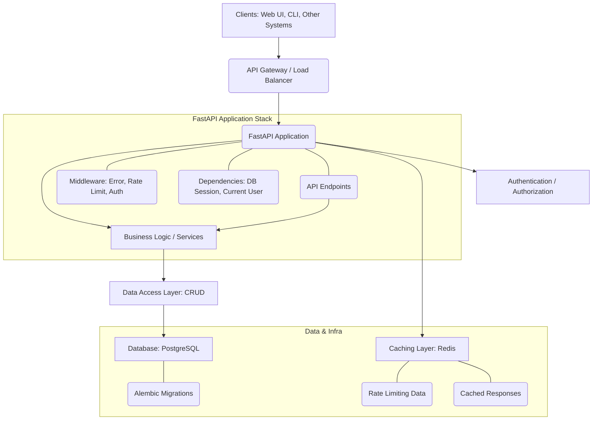

# Architecture Documentation

This document describes the architectural overview of the ML-Utilities-System, outlining its components, their interactions, and the design principles adopted.

## 1. High-Level Architecture

The system follows a typical **layered microservice-oriented architecture**, with a clear separation of concerns to enhance scalability, maintainability, and fault tolerance.

## 2. Component Breakdown

### 2.1. Clients
*   **Web UI**: A basic, server-side rendered Jinja2 template with vanilla JavaScript for demonstration purposes. In a production scenario, this would typically be a Single Page Application (SPA) built with frameworks like React, Vue, or Angular, consuming the RESTful API.
*   **CLI / Other Systems**: Any other client that needs to interact with the ML workflow management, such as ML pipelines, CI/CD tools, or data scientists' scripts.

### 2.2. API Gateway / Load Balancer
(Implicitly outside the application code, but critical in production)
*   Handles routing, traffic distribution, SSL termination, and potentially basic security policies before requests reach the FastAPI application. Examples: Nginx, AWS ALB, Kubernetes Ingress.

### 2.3. FastAPI Application (`ml-utils-app`)
The core backend service, built with Python FastAPI.

*   **`main.py`**: The entry point, responsible for:
    *   Initializing the FastAPI app.
    *   Registering API routers.
    *   Mounting static files and configuring templates.
    *   Setting up application-wide middleware.
    *   Managing application lifecycle (startup/shutdown for DB and Redis connections, initial superuser creation).
*   **`app/api/v1/endpoints`**:
    *   Defines the RESTful API endpoints for `users`, `auth`, `datasets`, `ml_models`, and `experiments`.
    *   Each file corresponds to a resource or domain.
    *   Uses FastAPI's dependency injection for database sessions, authentication, and authorization.
    *   Handles request parsing, validation (via Pydantic schemas), and calls the appropriate business logic.
*   **`app/core`**: Contains foundational components and utilities for the application.
    *   **`config.py`**: Manages environment variables and application settings (e.g., database credentials, secret keys, cache settings). Uses `pydantic-settings` for robust configuration.
    *   **`database.py`**: Configures the SQLAlchemy asynchronous engine and session factory for PostgreSQL. Provides `get_db` dependency for consistent session management.
    *   **`security.py`**: Handles password hashing (bcrypt) and JSON Web Token (JWT) creation/validation.
    *   **`deps.py`**: Defines FastAPI dependencies for injecting a database session, validating JWT tokens, and enforcing user roles (active user, superuser).
    *   **`middleware.py`**: Implements custom FastAPI middleware for:
        *   **Error Handling**: Catches exceptions and returns standardized JSON error responses.
        *   **Rate Limiting**: Protects endpoints from excessive requests using Redis.
        *   **Request Logging/Performance**: Adds processing time headers.
    *   **`cache.py`**: Provides an asynchronous Redis client (`redis-py`) for interacting with the caching layer. Includes functions for setting, getting, and invalidating cache entries.
    *   **`errors.py`**: Custom exception classes for domain-specific errors (e.g., `NotFoundException`, `DuplicateEntryException`).
*   **`app/schemas`**:
    *   Pydantic models defining the data structure for API requests and responses (e.g., `UserCreate`, `Dataset`, `Token`).
    *   Ensures data validation, serialization, and clear API contracts.
*   **`app/crud`**:
    *   **`base.py`**: A generic `CRUDBase` class providing standard CRUD operations (get, get_multi, create, update, remove) for any SQLAlchemy model.
    *   **Specific CRUD modules (`user.py`, `dataset.py`, etc.)**: Extend `CRUDBase` with domain-specific query methods (e.g., `get_by_email` for users, `get_by_name` for datasets).
    *   Abstracts direct database interactions from the API endpoints and business logic.
*   **`app/services`**: (Currently minimal but designed for expansion)
    *   Holds complex business logic that might involve interactions with multiple CRUD objects or external services. E.g., a service for triggering ML model retraining, data preprocessing, or integrating with other ML platforms.
*   **`app/models`**:
    *   SQLAlchemy ORM models defining the database tables (e.g., `User`, `Dataset`, `MLModel`, `Experiment`).
    *   Specifies table names, columns, data types, relationships, and indices.

### 2.4. Database (`PostgreSQL`)
*   **Persistent Storage**: PostgreSQL is chosen for its robustness, reliability, and support for structured (relational) and semi-structured (JSONB for hyperparameters/metrics) data.
*   **Alembic (`alembic/`)**:
    *   Manages database schema migrations, allowing for version-controlled and incremental changes to the database structure.
    *   `alembic.ini`: Configuration file for Alembic.
    *   `alembic/env.py`: Script that configures how Alembic interacts with the database.
    *   `alembic/versions/`: Directory containing migration scripts.

### 2.5. Caching Layer (`Redis`)
*   **In-Memory Data Store**: Redis is used for fast data retrieval.
*   **Use Cases**:
    *   **API Response Caching**: Caches results of read-heavy API endpoints (e.g., listing datasets, models) to reduce database load and improve response times.
    *   **Rate Limiting**: Stores per-IP request counts to enforce rate limits.

## 3. Data Flow

1.  **Request**: A client sends an HTTP request to an API endpoint (e.g., `GET /api/v1/datasets`).
2.  **Middleware**: The request passes through various middleware:
    *   **Rate Limiting**: Checks if the client's IP has exceeded the allowed request limit using Redis.
    *   **Authentication**: `SessionMiddleware` (for basic UI) and JWT validation for API endpoints.
    *   **Process Time**: Adds `X-Process-Time` header.
    *   **Exception Handling**: Wraps the request to catch and standardize errors.
3.  **Dependency Injection**: FastAPI injects dependencies (e.g., `AsyncSession` from `get_db`, `User` from `get_current_active_user`).
4.  **Endpoint Handler**: The endpoint function receives validated input (via Pydantic schemas).
    *   It might first check the Redis cache for a pre-computed response.
    *   If no cache hit, it calls the appropriate CRUD operation or service method.
5.  **Business Logic / CRUD**: Interacts with the database via SQLAlchemy ORM models.
    *   Executes database queries, handles data manipulation.
    *   If data is modified, it invalidates relevant cache entries in Redis.
6.  **Database**: Processes SQL queries, stores/retrieves data.
7.  **Response**: Data is returned through the layers, serialized by Pydantic schemas, and potentially cached in Redis before being sent back to the client.

## 4. Design Principles

*   **Separation of Concerns**: Each component and layer has a distinct responsibility, promoting modularity and easier maintenance.
*   **Asynchronous Programming**: FastAPI, `asyncpg`, and SQLAlchemy's async capabilities enable non-blocking I/O, improving concurrency and throughput.
*   **Dependency Injection**: Used extensively in FastAPI to manage resources (DB sessions, current user) and facilitate testing.
*   **Data Validation & Serialization**: Pydantic schemas ensure robust input validation and consistent output formatting.
*   **Statelessness**: The API is largely stateless, leveraging JWT for authentication, which simplifies horizontal scaling.
*   **Containerization**: Docker and Docker Compose provide consistent environments for development, testing, and production.
*   **Extensibility**: The modular design allows for easy addition of new features (e.g., more ML workflow steps, new services) without major refactoring.
*   **Observability**: Integrated logging, and potential for monitoring/tracing, to understand system behavior in production.

This architecture provides a solid foundation for a scalable and maintainable ML Utilities System, ready for enterprise-grade applications.