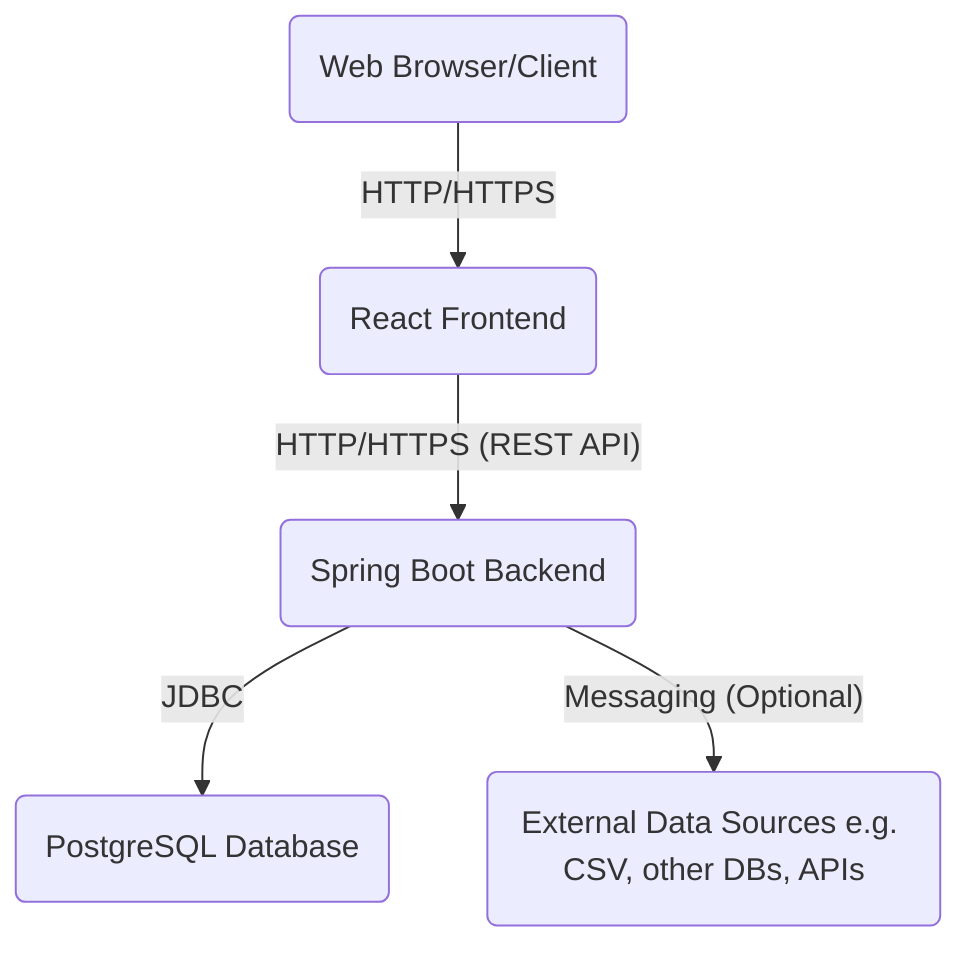

```markdown
# VizFlow: Architecture Documentation

This document describes the high-level architecture, key components, and data flow of the VizFlow Data Visualization System.

## 1. High-Level Overview

VizFlow adopts a microservice-lite, layered architecture designed for scalability, maintainability, and security. It consists of a decoupled frontend, a robust Spring Boot backend, and a PostgreSQL database.



## 2. Component Breakdown

### 2.1. Frontend (React Application)

*   **Role**: Provides the interactive user interface for creating, managing, and viewing visualizations and dashboards.
*   **Key Responsibilities**:
    *   User authentication and session management (stores JWT).
    *   Displaying lists of data sources, datasets, visualizations, and dashboards.
    *   Forms for creating and editing entities.
    *   Rendering interactive charts using libraries like ECharts.
    *   Routing and navigation.
*   **Technologies**: React, React Router, Axios, ECharts.

### 2.2. Backend (Spring Boot Application)

*   **Role**: The brain of the application, handling all business logic, data processing, security, and persistence.
*   **Key Modules/Layers**:
    *   **Controllers (`com.alx.vizflow.controller`)**:
        *   Exposes RESTful API endpoints (e.g., `/api/auth`, `/api/datasets`, `/api/dashboards`).
        *   Handles HTTP requests, request validation, and marshaling DTOs.
        *   Routes requests to appropriate services.
        *   Integrated with Springdoc-OpenAPI for automatic API documentation (Swagger UI).
    *   **Services (`com.alx.vizflow.service`)**:
        *   Contains the core business logic (e.g., `UserService` for user management, `DatasetService` for data fetching and transformation).
        *   Orchestrates operations across multiple repositories.
        *   Applies domain rules and performs complex data manipulations (e.g., `DatasetService.applyTransformations` involves filtering, aggregation, renaming logic).
        *   Implements caching (`@Cacheable`, `@CacheEvict`) for performance.
        *   Handles authorization checks via `@PreAuthorize`.
    *   **Repositories (`com.alx.vizflow.repository`)**:
        *   Spring Data JPA interfaces for data access operations (CRUD) on specific entities.
        *   Abstracts database interactions.
    *   **Models (`com.alx.vizflow.model`)**:
        *   JPA Entities representing the database schema (e.g., `User`, `DataSource`, `Dataset`, `Visualization`, `Dashboard`, `Role`).
        *   Includes relationships and lifecycle callbacks (`@PrePersist`, `@PreUpdate`).
    *   **DTOs (`com.alx.vizflow.dto`)**:
        *   Data Transfer Objects used for request/response payloads to decouple API contracts from internal entity structures.
    *   **Security (`com.alx.vizflow.config.SecurityConfig`, `com.alx.vizflow.filter.JwtAuthFilter`, `com.alx.vizflow.service.JwtService`, `com.alx.vizflow.service.UserDetailsServiceImpl`)**:
        *   Implements JWT-based authentication for stateless API security.
        *   Uses `BCryptPasswordEncoder` for secure password storage.
        *   Defines security filters and authorization rules.
    *   **Error Handling (`com.alx.vizflow.exception.GlobalExceptionHandler`)**:
        *   Centralized exception handling using `@ControllerAdvice` to provide consistent and informative error responses.
    *   **Rate Limiting (`com.alx.vizflow.filter.RateLimitingFilter`)**:
        *   A custom `OncePerRequestFilter` to limit incoming requests based on IP address, preventing abuse.
    *   **Configuration (`com.alx.vizflow.config`)**:
        *   Configures Spring Security, caching, OpenAPI documentation, etc.
*   **Technologies**: Java 17, Spring Boot, Spring Data JPA, Spring Security, Lombok, Guava RateLimiter, Caffeine, Springdoc-OpenAPI, Maven.

### 2.3. Database (PostgreSQL)

*   **Role**: Stores all persistent application data.
*   **Key Data**:
    *   User accounts and roles.
    *   Configurations for external data sources.
    *   Dataset definitions (query, schema, transformation logic).
    *   Visualization configurations (chart type, display options).
    *   Dashboard layouts and associated visualizations.
*   **Schema Management**:
    *   **Flyway**: Used for managing database migrations, ensuring controlled and versioned schema evolution. `V1__initial_schema.sql` creates the core tables, `V2__add_sample_data.sql` populates initial roles and an admin user.
*   **Query Optimization**:
    *   Indexes are defined on frequently queried columns (e.g., `users.username`, `users.email`, foreign keys) to improve read performance.
    *   Careful design of SQL queries (or ORM usage) in the service layer to prevent N+1 issues and inefficient joins.
*   **Technologies**: PostgreSQL 15, Flyway.

## 3. Data Flow Example: Fetching Dashboard Data

1.  **Frontend Request**: User navigates to a dashboard. Frontend sends an `HTTP GET` request to `/api/dashboards/{dashboardId}`.
2.  **Backend Controller**: `DashboardController` receives the request.
    *   Authenticates the user via JWT filter.
    *   Authorizes access using `@PreAuthorize`.
    *   Calls `DashboardService.getDashboardById()`.
3.  **Dashboard Service**: `DashboardService` fetches the `Dashboard` entity from `DashboardRepository`.
    *   It also fetches associated `Visualization` entities and their linked `Dataset` entities.
4.  **Backend Controller (Processing Visualizations)**: For each `Visualization` in the dashboard:
    *   The `DashboardController` (or a helper service) iterates and makes internal calls to `VisualizationService`.
    *   `VisualizationService` then calls `DatasetService.getDatasetData(datasetId)`.
5.  **Dataset Service (Core Logic - ALX Focus)**:
    *   `getDatasetData(datasetId)`:
        *   **`fetchRawData(datasetId)`**: Retrieves the `Dataset` and its associated `DataSource`. Based on `DataSource.type` (e.g., "POSTGRES", "CSV", "API"), it dynamically connects to the external data source (e.g., using JDBC, HTTP client) and executes `Dataset.queryOrTable`. Returns raw data (e.g., `List<Map<String, Object>>`).
        *   **`applyTransformations(datasetId, rawData)`**: Uses `Dataset.transformationLogic` (a JSON string) to apply transformations.
            *   **Parsing**: Parses the `transformationLogic` JSON into a structured object (e.g., `{"filters": [...], "aggregations": [...]}`).
            *   **Filtering (Algorithm Design)**: Iterates through the `filters` (e.g., `{"column": "sales", "operator": ">", "value": 1000}`). For each row in `rawData`, it applies the filter condition (e.g., `row.get("sales") > 1000`). This involves type-safe comparisons and potentially string operations.
            *   **Aggregation (Algorithm Design)**: If `aggregations` are present (e.g., `{"column": "revenue", "type": "SUM", "groupBy": ["month"]}`), it groups `rawData` by the specified `groupBy` columns and applies the aggregation function (SUM, AVG, COUNT, etc.) to the `column`. This requires iterative processing or stream-based reduction logic.
            *   **Renaming**: Applies column renames if specified.
        *   Returns the transformed data.
6.  **Backend Response**: The `DashboardController` aggregates the processed data for all visualizations and the dashboard layout, sending it back to the frontend as a comprehensive JSON response.
7.  **Frontend Rendering**: The React frontend receives the JSON, parses the `layoutConfig` to arrange visualizations, and then uses the processed data for each visualization to render interactive charts using ECharts.

## 4. Security Considerations

*   **Authentication**: JWT for stateless API authentication. Tokens are signed with a strong secret.
*   **Authorization**: Spring Security's `@PreAuthorize` annotations are used for method-level access control based on user roles (`ROLE_ADMIN`, `ROLE_EDITOR`, `ROLE_USER`).
*   **Password Hashing**: BCrypt algorithm is used for storing user passwords securely.
*   **Input Validation**: `jakarta.validation` annotations are used on DTOs to prevent malformed requests and injection attacks.
*   **CORS**: Configured to allow requests only from trusted frontend origins.
*   **Rate Limiting**: IP-based rate limiting to mitigate brute-force attacks and resource exhaustion.
*   **Secrets Management**: Environment variables (`.env`, Docker secrets) for sensitive information like JWT secret and database credentials.

## 5. Scalability and Performance

*   **Stateless Backend**: JWT authentication allows the backend to be stateless, making it easy to scale horizontally by running multiple instances.
*   **Database Indexing**: Strategic use of database indexes to speed up common queries.
*   **Caching**: Spring Cache with Caffeine is used to cache frequently accessed data (e.g., user details, dataset definitions) reducing database load.
*   **Efficient Data Processing**: The `DatasetService` is designed to process data efficiently using Java Stream API for transformations, crucial for handling larger datasets.
*   **Docker Containerization**: Facilitates easy deployment and scaling in container orchestration platforms (Kubernetes).

## 6. Future Enhancements

*   **Support for more Data Sources**: Integration with S3 (CSV/Parquet), MongoDB, Google BigQuery, Snowflake, etc.
*   **Advanced Data Transformations**: More complex UDFs (User-Defined Functions), window functions, time-series analysis.
*   **Real-time Data**: Integration with Kafka or other streaming platforms for real-time dashboards.
*   **Query Optimization Techniques**: More sophisticated query builders for SQL sources, caching of query results.
*   **Multi-tenancy**: Support for multiple organizations with isolated data.
*   **Alerting**: Define thresholds and send notifications based on data changes.
*   **Advanced Security**: Row-level security for data access, audit logging.
*   **Frontend**: More chart types, drag-and-drop dashboard builder, advanced filtering on dashboards.
```